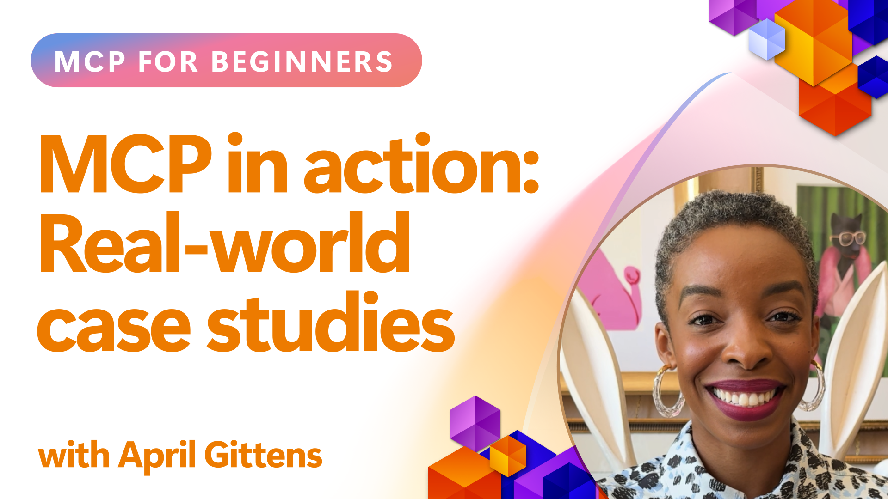

# MCP in Action: Real-World Case Studies

_(Click the image above to view video of this lesson)_

The Model Context Protocol (MCP) is transforming how AI applications interact with data, tools, and services. This section presents real-world case studies that demonstrate practical applications of MCP in various enterprise scenarios.

## Overview

This section showcases concrete examples of MCP implementations, highlighting how organizations are leveraging this protocol to solve complex business challenges. By examining these case studies, you'll gain insights into the versatility, scalability, and practical benefits of MCP in real-world scenarios.

## Key Learning Objectives

By exploring these case studies, you will:

- Understand how MCP can be applied to solve specific business problems
- Learn about different integration patterns and architectural approaches
- Recognize best practices for implementing MCP in enterprise environments
- Gain insights into the challenges and solutions encountered in real-world implementations
- Identify opportunities to apply similar patterns in your own projects

## Featured Case Studies

### 1. [Azure AI Travel Agents – Reference Implementation](./travelagentsample.md)

This case study examines Microsoft's comprehensive reference solution that demonstrates how to build a multi-agent, AI-powered travel planning application using MCP, Azure OpenAI, and Azure AI Search. The project showcases:

- Multi-agent orchestration through MCP
- Enterprise data integration with Azure AI Search
- Secure, scalable architecture using Azure services
- Extensible tooling with reusable MCP components
- Conversational user experience powered by Azure OpenAI

The architecture and implementation details provide valuable insights into building complex, multi-agent systems with MCP as the coordination layer.

### 2. [Updating Azure DevOps Items from YouTube Data](./UpdateADOItemsFromYT.md)

This case study demonstrates a practical application of MCP for automating workflow processes. It shows how MCP tools can be used to:

- Extract data from online platforms (YouTube)
- Update work items in Azure DevOps systems
- Create repeatable automation workflows
- Integrate data across disparate systems

This example illustrates how even relatively simple MCP implementations can provide significant efficiency gains by automating routine tasks and improving data consistency across systems.

### 3. [Real-Time Documentation Retrieval with MCP](./docs-mcp/README.md)

This case study guides you through connecting a Python console client to a Model Context Protocol (MCP) server to retrieve and log real-time, context-aware Microsoft documentation. You'll learn how to:

- Connect to an MCP server using a Python client and the official MCP SDK
- Use streaming HTTP clients for efficient, real-time data retrieval
- Call documentation tools on the server and log responses directly to the console
- Integrate up-to-date Microsoft documentation into your workflow without leaving the terminal

The chapter includes a hands-on assignment, a minimal working code sample, and links to additional resources for deeper learning. See the full walkthrough and code in the linked chapter to understand how MCP can transform documentation access and developer productivity in console-based environments.

### 4. [Interactive Study Plan Generator Web App with MCP](./docs-mcp/README.md)

This case study demonstrates how to build an interactive web application using Chainlit and the Model Context Protocol (MCP) to generate personalized study plans for any topic. Users can specify a subject (such as "AI-900 certification") and a study duration (e.g., 8 weeks), and the app will provide a week-by-week breakdown of recommended content. Chainlit enables a conversational chat interface, making the experience engaging and adaptive.

- Conversational web app powered by Chainlit
- User-driven prompts for topic and duration
- Week-by-week content recommendations using MCP
- Real-time, adaptive responses in a chat interface

The project illustrates how conversational AI and MCP can be combined to create dynamic, user-driven educational tools in a modern web environment.

### 5. [In-Editor Docs with MCP Server in VS Code](./docs-mcp/README.md)

This case study demonstrates how you can bring Microsoft Learn Docs directly into your VS Code environment using the MCP server—no more switching browser tabs! You'll see how to:

- Instantly search and read docs inside VS Code using the MCP panel or command palette
- Reference documentation and insert links directly into your README or course markdown files
- Use GitHub Copilot and MCP together for seamless, AI-powered documentation and code workflows
- Validate and enhance your documentation with real-time feedback and Microsoft-sourced accuracy
- Integrate MCP with GitHub workflows for continuous documentation validation

The implementation includes:

- Example `.vscode/mcp.json` configuration for easy setup
- Screenshot-based walkthroughs of the in-editor experience
- Tips for combining Copilot and MCP for maximum productivity

This scenario is ideal for course authors, documentation writers, and developers who want to stay focused in their editor while working with docs, Copilot, and validation tools—all powered by MCP.

### 6. [APIM MCP Server Creation](./apimsample.md)

This case study provides a step-by-step guide on how to create an MCP server using Azure API Management (APIM). It covers:

- Setting up an MCP server in Azure API Management
- Exposing API operations as MCP tools
- Configuring policies for rate limiting and security
- Testing the MCP server using Visual Studio Code and GitHub Copilot

This example illustrates how to leverage Azure's capabilities to create a robust MCP server that can be used in various applications, enhancing the integration of AI systems with enterprise APIs.

## Conclusion

These case studies highlight the versatility and practical applications of the Model Context Protocol in real-world scenarios. From complex multi-agent systems to targeted automation workflows, MCP provides a standardized way to connect AI systems with the tools and data they need to deliver value.

By studying these implementations, you can gain insights into architectural patterns, implementation strategies, and best practices that can be applied to your own MCP projects. The examples demonstrate that MCP is not just a theoretical framework but a practical solution to real business challenges.

## Additional Resources

- [Azure AI Travel Agents GitHub Repository](https://github.com/Azure-Samples/azure-ai-travel-agents)
- [Azure DevOps MCP Tool](https://github.com/microsoft/azure-devops-mcp)
- [Playwright MCP Tool](https://github.com/microsoft/playwright-mcp)
- [Microsoft Docs MCP Server](https://github.com/MicrosoftDocs/mcp)
- [MCP Community Examples](https://github.com/microsoft/mcp)

Next: Hands on Lab [Streamlining AI Workflows: Building an MCP Server with AI Toolkit](../10-StreamliningAIWorkflowsBuildingAnMCPServerWithAIToolkit/README.md)
