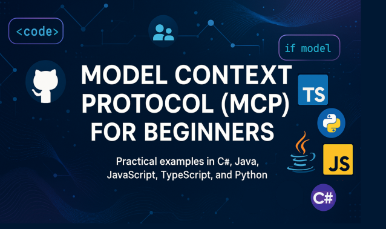

# Model Context Protocol (MCP) Curriculum

This open-source curriculum is designed to teach the concepts and fundamentals of the Model Context Protocol (MCP), with practical examples in C#, Java, JavaScript, TypeScript, and Python.

## Official Resources

- [MCP Documentation](https://modelcontextprotocol.io/) - Guides and tutorials
- [MCP Specification](https://spec.modelcontextprotocol.io/) - Protocol details
- [GitHub Repository](https://github.com/modelcontextprotocol) - Official code and SDKs

## Curriculum Structure

### [Introduction](./00-Introduction/README.md)
- Overview of MCP and its purpose
- Importance of standardizing AI model interactions
- Real-world applications and benefits

### [Core Concepts](./01-CoreConcepts/README.md)
- Client-server architecture in MCP
- Key components of the MCP ecosystem
- Communication mechanisms

### [Security](./02-Security/readme.md)
- Security risks inherent in the MCP specification
- Controls that can be implemented to reduce security risks

### [Getting Started](./03-GettingStarted/README.md)
- Setting up MCP environments
- Building basic MCP servers and clients
- Exploring pre-built integrations
- **MCP Calculator Example**:

  
<strong>Calculator Sample Implementations</strong>

  - [C# Calculator Server](./03-GettingStarted/samples/csharp/README.md)
  - [Java Calculator Server](./03-GettingStarted/samples/java/calculator/README.md)
  - [JavaScript Calculator Server](./03-GettingStarted/samples/javascript/README.md)
  - [Python Calculator Server](./03-GettingStarted/samples/python/mcp_calculator_server.py)
  - [TypeScript Calculator Server](./03-GettingStarted/samples/typescript/README.md)

  
### [Practical Implementation](./04-PracticalImplementation/README.md)
- Using SDKs across languages (C#, Java, JavaScript, TypeScript, Python)
- Debugging and testing MCP servers
- Creating reusable prompt templates and workflows
- **MCP Advanced Calculator Example**:

  
<strong>Advanced Sample Implementations</strong>

  - [C# Sample](./04-PracticalImplementation/samples/csharp/README.md)
  - [Java Sample](./04-PracticalImplementation/samples/java/containerapp/README.md)
  - [JavaScript Sample](./04-PracticalImplementation/samples/javascript/README.md)
  - [Python Sample](./04-PracticalImplementation/samples/python/mcp_sample.py)
  - [TypeScript Sample](./04-PracticalImplementation/samples/typescript/README.md)

### [Advanced Topics](./05-AdvancedTopics/README.md)
- Multi-modal integration and scalability
- Security best practices
- Integration with enterprise applications

### [Community Contributions](./06-CommunityContributions/README.md)
- Contributing to MCP development
- Engaging with the community
- Best practices for collaboration

### [Lessons from Early Adoption](./07-CaseStudies/README.md)
- Real-world MCP implementations
- Hands-on projects to build MCP-based solutions
- Future directions for MCP technology

### [Best Practices](./08-BestPractices/README.md)
- Performance optimization techniques
- Scalable MCP architecture design
- Error handling and resiliency patterns
- Testing MCP

### [Case Studies](./09-CaseStudy/Readme.md)
- In-depth real-world MCP solution breakdowns
- Reference architectures and implementation patterns
- Step-by-step explanations and diagrams for practical learning

## Prerequisites

- Basic programming knowledge in at least one of: C#, Java, or Python
- Familiarity with API concepts and client-server architectures
- Understanding of AI/ML fundamentals (helpful but not required)

## How to Use This Curriculum

Each lesson contains:
1. Theoretical content explaining MCP concepts
2. Code examples in .NET, Java, and Python
3. Practical exercises to reinforce learning
4. Additional resources for further exploration

## License

This curriculum is provided under the MIT License. See the [LICENSE](./LICENSE) file for details.

## Contributing

This project welcomes contributions and suggestions.  Most contributions require you to agree to a
Contributor License Agreement (CLA) declaring that you have the right to, and actually do, grant us
the rights to use your contribution. For details, visit <https://cla.opensource.microsoft.com>.

When you submit a pull request, a CLA bot will automatically determine whether you need to provide
a CLA and decorate the PR appropriately (e.g., status check, comment). Simply follow the instructions
provided by the bot. You will only need to do this once across all repos using our CLA.

This project has adopted the [Microsoft Open Source Code of Conduct](https://opensource.microsoft.com/codeofconduct/).
For more information see the [Code of Conduct FAQ](https://opensource.microsoft.com/codeofconduct/faq/) or
contact [opencode@microsoft.com](mailto:opencode@microsoft.com) with any additional questions or comments.

## Trademarks

This project may contain trademarks or logos for projects, products, or services. Authorized use of Microsoft
trademarks or logos is subject to and must follow
[Microsoft's Trademark & Brand Guidelines](https://www.microsoft.com/legal/intellectualproperty/trademarks/usage/general).
Use of Microsoft trademarks or logos in modified versions of this project must not cause confusion or imply Microsoft sponsorship.
Any use of third-party trademarks or logos is subject to those third-parties' policies.
