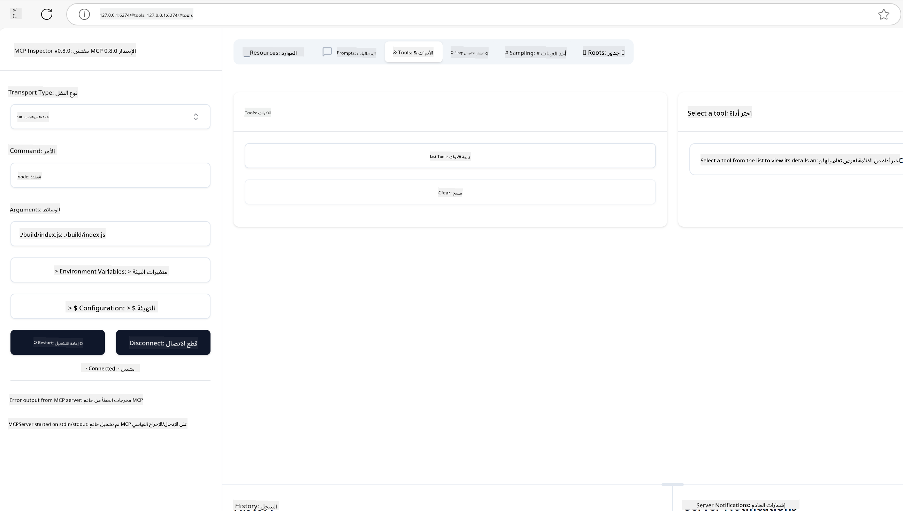
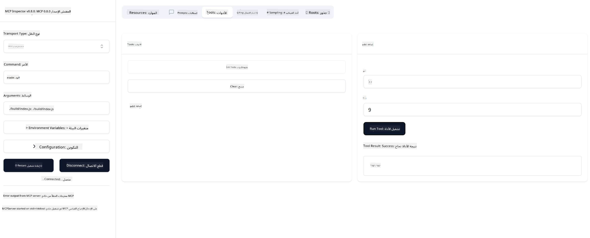

<!--
CO_OP_TRANSLATOR_METADATA:
{
  "original_hash": "d90651bcd1df019768921d531653638a",
  "translation_date": "2025-06-12T23:02:37+00:00",
  "source_file": "03-GettingStarted/01-first-server/README.md",
  "language_code": "ar"
}
-->
### -2- إنشاء مشروع

الآن بعد أن قمت بتثبيت SDK الخاص بك، دعنا ننشئ مشروعًا في الخطوة التالية:

### -3- إنشاء ملفات المشروع

### -4- كتابة كود الخادم

### -5- إضافة أداة و مورد

أضف أداة و مورد عن طريق إضافة الكود التالي:

### -6- الكود النهائي

دعنا نضيف الكود الأخير الذي نحتاجه حتى يبدأ الخادم:

### -7- اختبار الخادم

ابدأ الخادم باستخدام الأمر التالي:

### -8- التشغيل باستخدام المفتش

المفتش هو أداة رائعة يمكنها تشغيل الخادم الخاص بك وتتيح لك التفاعل معه حتى تتمكن من اختبار عمله. دعنا نبدأه:

> [!NOTE]
> قد يبدو مختلفًا في حقل "الأمر" لأنه يحتوي على الأمر لتشغيل الخادم باستخدام بيئة التشغيل الخاصة بك

يجب أن ترى واجهة المستخدم التالية:

1. اتصل بالخادم عن طريق اختيار زر الاتصال  
   بمجرد اتصالك بالخادم، يجب أن ترى الآن ما يلي:

   

2. اختر "الأدوات" و "listTools"، يجب أن ترى ظهور "Add"، اختر "Add" واملأ قيم المعلمات.

   يجب أن ترى الاستجابة التالية، أي نتيجة من أداة "add":

   

تهانينا، لقد تمكنت من إنشاء وتشغيل خادمك الأول!

### SDKs الرسمية

يوفر MCP SDKs رسمية لعدة لغات:
- [C# SDK](https://github.com/modelcontextprotocol/csharp-sdk) - تتم صيانته بالتعاون مع مايكروسوفت
- [Java SDK](https://github.com/modelcontextprotocol/java-sdk) - تتم صيانته بالتعاون مع Spring AI
- [TypeScript SDK](https://github.com/modelcontextprotocol/typescript-sdk) - التنفيذ الرسمي لـ TypeScript
- [Python SDK](https://github.com/modelcontextprotocol/python-sdk) - التنفيذ الرسمي لـ Python
- [Kotlin SDK](https://github.com/modelcontextprotocol/kotlin-sdk) - التنفيذ الرسمي لـ Kotlin
- [Swift SDK](https://github.com/modelcontextprotocol/swift-sdk) - تتم صيانته بالتعاون مع Loopwork AI
- [Rust SDK](https://github.com/modelcontextprotocol/rust-sdk) - التنفيذ الرسمي لـ Rust

## النقاط الرئيسية

- إعداد بيئة تطوير MCP بسيط باستخدام SDKs الخاصة بكل لغة
- بناء خوادم MCP يتطلب إنشاء وتسجيل أدوات مع مخططات واضحة
- الاختبار وتصحيح الأخطاء ضروريان لتنفيذ MCP موثوق

## عينات

- [Java Calculator](../samples/java/calculator/README.md)
- [.Net Calculator](../../../../03-GettingStarted/samples/csharp)
- [JavaScript Calculator](../samples/javascript/README.md)
- [TypeScript Calculator](../samples/typescript/README.md)
- [Python Calculator](../../../../03-GettingStarted/samples/python)

## المهمة

أنشئ خادم MCP بسيط مع أداة من اختيارك:
1. نفذ الأداة في اللغة التي تفضلها (.NET، Java، Python، أو JavaScript).
2. عرّف معلمات الإدخال وقيم الإرجاع.
3. شغّل أداة المفتش للتأكد من أن الخادم يعمل كما هو متوقع.
4. اختبر التنفيذ مع مدخلات مختلفة.

## الحل

[الحل](./solution/README.md)

## موارد إضافية

- [بناء وكلاء باستخدام Model Context Protocol على Azure](https://learn.microsoft.com/azure/developer/ai/intro-agents-mcp)
- [MCP عن بُعد مع Azure Container Apps (Node.js/TypeScript/JavaScript)](https://learn.microsoft.com/samples/azure-samples/mcp-container-ts/mcp-container-ts/)
- [وكيل .NET OpenAI MCP](https://learn.microsoft.com/samples/azure-samples/openai-mcp-agent-dotnet/openai-mcp-agent-dotnet/)

## ما التالي

التالي: [البدء مع عملاء MCP](/03-GettingStarted/02-client/README.md)

**إخلاء مسؤولية**:  
تمت ترجمة هذا المستند باستخدام خدمة الترجمة الآلية [Co-op Translator](https://github.com/Azure/co-op-translator). بينما نسعى جاهدين للدقة، يرجى العلم أن الترجمات الآلية قد تحتوي على أخطاء أو عدم دقة. يجب اعتبار المستند الأصلي بلغته الأصلية المصدر الرسمي والمعتمد. للمعلومات الحساسة أو الهامة، يُنصح بالاعتماد على الترجمة المهنية البشرية. نحن غير مسؤولين عن أي سوء فهم أو تفسير ناتج عن استخدام هذه الترجمة.