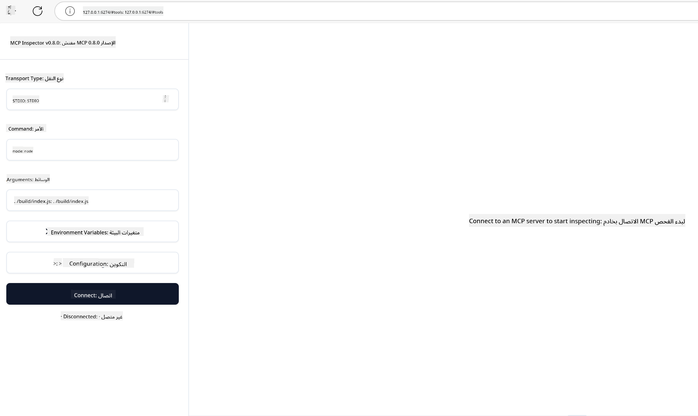

<!--
CO_OP_TRANSLATOR_METADATA:
{
  "original_hash": "d730cbe43a8efc148677fdbc849a7d5e",
  "translation_date": "2025-06-02T16:53:21+00:00",
  "source_file": "03-GettingStarted/01-first-server/README.md",
  "language_code": "ar"
}
-->
### -2- إنشاء مشروع

الآن بعد أن قمت بتثبيت SDK الخاص بك، دعنا ننتقل إلى إنشاء مشروع جديد:

### -3- إنشاء ملفات المشروع

### -4- كتابة كود الخادم

### -5- إضافة أداة و مورد

أضف أداة و مورد من خلال إضافة الكود التالي:

### -6- الكود النهائي

دعنا نضيف الكود الأخير الذي نحتاجه ليتمكن الخادم من البدء:

### -7- اختبار الخادم

ابدأ تشغيل الخادم باستخدام الأمر التالي:

### -8- التشغيل باستخدام المفتش

المفتش هو أداة رائعة يمكنها تشغيل الخادم الخاص بك وتتيح لك التفاعل معه حتى تتمكن من اختبار عمله. لنبدأ تشغيله:

> [!NOTE]
> قد يبدو مختلفًا في حقل "الأمر" لأنه يحتوي على الأمر لتشغيل الخادم مع بيئة التشغيل الخاصة بك.

يجب أن ترى واجهة المستخدم التالية:

1. اتصل بالخادم عن طريق اختيار زر Connect  
   بمجرد الاتصال بالخادم، يجب أن ترى ما يلي:

   

2. اختر "Tools" ثم "listTools"، سترى خيار "Add" يظهر، اختر "Add" واملأ قيم المعلمات.

   سترى الاستجابة التالية، وهي نتيجة لأداة "add":

   

تهانينا، لقد تمكنت من إنشاء وتشغيل خادمك الأول!

### SDKs الرسمية

يوفر MCP SDKs رسمية لعدة لغات:
- [C# SDK](https://github.com/modelcontextprotocol/csharp-sdk) - يتم صيانته بالتعاون مع مايكروسوفت
- [Java SDK](https://github.com/modelcontextprotocol/java-sdk) - يتم صيانته بالتعاون مع Spring AI
- [TypeScript SDK](https://github.com/modelcontextprotocol/typescript-sdk) - التنفيذ الرسمي لـ TypeScript
- [Python SDK](https://github.com/modelcontextprotocol/python-sdk) - التنفيذ الرسمي لـ Python
- [Kotlin SDK](https://github.com/modelcontextprotocol/kotlin-sdk) - التنفيذ الرسمي لـ Kotlin
- [Swift SDK](https://github.com/modelcontextprotocol/swift-sdk) - يتم صيانته بالتعاون مع Loopwork AI
- [Rust SDK](https://github.com/modelcontextprotocol/rust-sdk) - التنفيذ الرسمي لـ Rust

## النقاط الرئيسية

- إعداد بيئة تطوير MCP سهل باستخدام SDKs الخاصة بكل لغة
- بناء خوادم MCP يتضمن إنشاء وتسجيل أدوات مع مخططات واضحة
- الاختبار وتصحيح الأخطاء ضروريان لضمان موثوقية تطبيقات MCP

## أمثلة

- [آلة حاسبة جافا](../samples/java/calculator/README.md)
- [آلة حاسبة .Net](../../../../03-GettingStarted/samples/csharp)
- [آلة حاسبة جافا سكريبت](../samples/javascript/README.md)
- [آلة حاسبة TypeScript](../samples/typescript/README.md)
- [آلة حاسبة بايثون](../../../../03-GettingStarted/samples/python)

## التمرين

قم بإنشاء خادم MCP بسيط مع أداة من اختيارك:
1. نفذ الأداة باللغة التي تفضلها (.NET، Java، Python، أو JavaScript).
2. عرّف معلمات الإدخال وقيم الإرجاع.
3. شغّل أداة المفتش للتأكد من أن الخادم يعمل كما هو متوقع.
4. اختبر التنفيذ مع مدخلات متنوعة.

## الحل

[الحل](./solution/README.md)

## موارد إضافية

- [مستودع MCP على GitHub](https://github.com/microsoft/mcp-for-beginners)

## ما التالي

التالي: [البدء مع عملاء MCP](/03-GettingStarted/02-client/README.md)

**تنويه**:  
تمت ترجمة هذا المستند باستخدام خدمة الترجمة الآلية [Co-op Translator](https://github.com/Azure/co-op-translator). بينما نسعى لتحقيق الدقة، يرجى العلم أن الترجمات الآلية قد تحتوي على أخطاء أو عدم دقة. يجب اعتبار المستند الأصلي بلغته الأصلية المصدر المعتمد. للمعلومات الحساسة، يُنصح بالاعتماد على الترجمة المهنية البشرية. نحن غير مسؤولين عن أي سوء فهم أو تفسير ناتج عن استخدام هذه الترجمة.