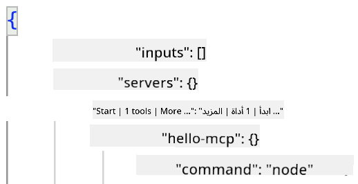

<!--
CO_OP_TRANSLATOR_METADATA:
{
  "original_hash": "54e9ffc5dba01afcb8880a9949fd1881",
  "translation_date": "2025-07-04T15:39:09+00:00",
  "source_file": "03-GettingStarted/04-vscode/README.md",
  "language_code": "ar"
}
-->
دعونا نتحدث أكثر عن كيفية استخدام الواجهة المرئية في الأقسام القادمة.

## النهج

إليك كيف نحتاج إلى التعامل مع هذا على مستوى عالٍ:

- تكوين ملف للعثور على خادم MCP الخاص بنا.
- بدء/الاتصال بالخادم المذكور ليعرض قدراته.
- استخدام هذه القدرات من خلال واجهة GitHub Copilot Chat.

رائع، الآن بعد أن فهمنا سير العمل، دعونا نجرب استخدام خادم MCP عبر Visual Studio Code من خلال تمرين.

## التمرين: استهلاك خادم

في هذا التمرين، سنقوم بتكوين Visual Studio Code للعثور على خادم MCP الخاص بك بحيث يمكن استخدامه من خلال واجهة GitHub Copilot Chat.

### -0- خطوة تمهيدية، تفعيل اكتشاف خوادم MCP

قد تحتاج إلى تفعيل اكتشاف خوادم MCP.

1. اذهب إلى `File -> Preferences -> Settings` في Visual Studio Code.

2. ابحث عن "MCP" وقم بتمكين `chat.mcp.discovery.enabled` في ملف settings.json.

### -1- إنشاء ملف التكوين

ابدأ بإنشاء ملف تكوين في جذر مشروعك، ستحتاج إلى ملف يسمى MCP.json ووضعه في مجلد يسمى .vscode. يجب أن يبدو كالتالي:

```text
.vscode
|-- mcp.json
```

بعد ذلك، لنرَ كيف يمكننا إضافة إدخال خادم.

### -2- تكوين خادم

أضف المحتوى التالي إلى *mcp.json*:

```json
{
    "inputs": [],
    "servers": {
       "hello-mcp": {
           "command": "node",
           "args": [
               "build/index.js"
           ]
       }
    }
}
```

في المثال البسيط أعلاه، كيفية بدء خادم مكتوب بـ Node.js، بالنسبة لبيئات التشغيل الأخرى، حدد الأمر المناسب لبدء الخادم باستخدام `command` و `args`.

### -3- بدء الخادم

الآن بعد أن أضفت إدخالًا، دعنا نبدأ الخادم:

1. حدد موقع إدخالك في *mcp.json* وتأكد من وجود أيقونة "تشغيل":

    

2. انقر على أيقونة "تشغيل"، يجب أن ترى أيقونة الأدوات في GitHub Copilot Chat تزداد بعدد الأدوات المتاحة. إذا نقرت على أيقونة الأدوات هذه، سترى قائمة بالأدوات المسجلة. يمكنك تحديد/إلغاء تحديد كل أداة حسب ما إذا كنت تريد من GitHub Copilot استخدامها كسياق:

  

3. لتشغيل أداة، اكتب موجهًا تعرف أنه سيتطابق مع وصف إحدى أدواتك، على سبيل المثال موجه مثل "أضف 22 إلى 1":

  

  يجب أن ترى ردًا يقول 23.

## المهمة

حاول إضافة إدخال خادم إلى ملف *mcp.json* الخاص بك وتأكد من قدرتك على بدء/إيقاف الخادم. تأكد أيضًا من قدرتك على التواصل مع الأدوات على خادمك عبر واجهة GitHub Copilot Chat.

## الحل

[الحل](./solution/README.md)

## النقاط الرئيسية

النقاط المستفادة من هذا الفصل هي كالتالي:

- Visual Studio Code هو عميل رائع يتيح لك استهلاك عدة خوادم MCP وأدواتها.
- واجهة GitHub Copilot Chat هي الطريقة التي تتفاعل بها مع الخوادم.
- يمكنك طلب مدخلات من المستخدم مثل مفاتيح API التي يمكن تمريرها إلى خادم MCP عند تكوين إدخال الخادم في ملف *mcp.json*.

## عينات

- [حاسبة جافا](../samples/java/calculator/README.md)
- [حاسبة .Net](../../../../03-GettingStarted/samples/csharp)
- [حاسبة جافا سكريبت](../samples/javascript/README.md)
- [حاسبة تايب سكريبت](../samples/typescript/README.md)
- [حاسبة بايثون](../../../../03-GettingStarted/samples/python)

## موارد إضافية

- [وثائق Visual Studio](https://code.visualstudio.com/docs/copilot/chat/mcp-servers)

## ما التالي

- التالي: [إنشاء خادم SSE](../05-sse-server/README.md)

**إخلاء المسؤولية**:  
تمت ترجمة هذا المستند باستخدام خدمة الترجمة الآلية [Co-op Translator](https://github.com/Azure/co-op-translator). بينما نسعى لتحقيق الدقة، يرجى العلم أن الترجمات الآلية قد تحتوي على أخطاء أو عدم دقة. يجب اعتبار المستند الأصلي بلغته الأصلية المصدر الموثوق به. للمعلومات الهامة، يُنصح بالاعتماد على الترجمة البشرية المهنية. نحن غير مسؤولين عن أي سوء فهم أو تفسير ناتج عن استخدام هذه الترجمة.