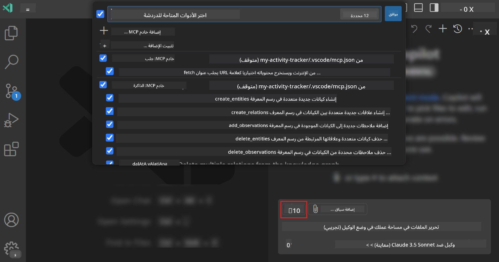
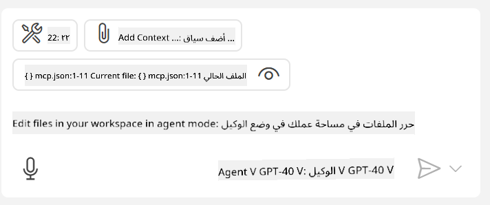
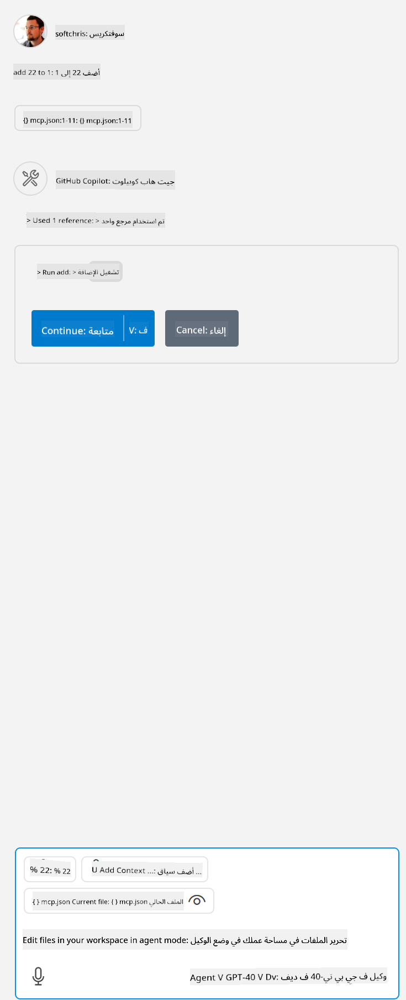

<!--
CO_OP_TRANSLATOR_METADATA:
{
  "original_hash": "8ea28e5e566edd5969337fd0b191ba3f",
  "translation_date": "2025-07-16T23:39:27+00:00",
  "source_file": "03-GettingStarted/04-vscode/README.md",
  "language_code": "ar"
}
-->
# استهلاك خادم من وضع GitHub Copilot Agent

يمكن لـ Visual Studio Code و GitHub Copilot العمل كعميل واستهلاك خادم MCP. قد تتساءل لماذا نرغب في ذلك؟ حسنًا، هذا يعني أن أي ميزات يمتلكها خادم MCP يمكن الآن استخدامها من داخل بيئة التطوير الخاصة بك. تخيل، على سبيل المثال، إضافة خادم MCP الخاص بـ GitHub، مما يتيح لك التحكم في GitHub عبر الأوامر النصية بدلاً من كتابة أوامر محددة في الطرفية. أو تخيل أي شيء بشكل عام يمكن أن يحسن تجربة المطور لديك ويتم التحكم فيه بواسطة اللغة الطبيعية. هل بدأت ترى الفائدة الآن؟

## نظرة عامة

تغطي هذه الدرس كيفية استخدام Visual Studio Code ووضع GitHub Copilot Agent كعميل لخادم MCP الخاص بك.

## أهداف التعلم

بنهاية هذا الدرس، ستكون قادرًا على:

- استهلاك خادم MCP عبر Visual Studio Code.
- تشغيل القدرات مثل الأدوات عبر GitHub Copilot.
- تكوين Visual Studio Code للعثور على خادم MCP الخاص بك وإدارته.

## الاستخدام

يمكنك التحكم في خادم MCP الخاص بك بطريقتين مختلفتين:

- واجهة المستخدم، سترى كيف يتم ذلك لاحقًا في هذا الفصل.
- الطرفية، من الممكن التحكم في الأمور من الطرفية باستخدام الأمر `code`:

  لإضافة خادم MCP إلى ملف تعريف المستخدم الخاص بك، استخدم خيار سطر الأوامر --add-mcp، وقدم تكوين الخادم بصيغة JSON على الشكل {\"name\":\"server-name\",\"command\":...}.

  ```
  code --add-mcp "{\"name\":\"my-server\",\"command\": \"uvx\",\"args\": [\"mcp-server-fetch\"]}"
  ```

### لقطات شاشة





دعونا نتحدث أكثر عن كيفية استخدام الواجهة المرئية في الأقسام التالية.

## النهج

إليك كيف نحتاج إلى التعامل مع هذا على مستوى عالٍ:

- تكوين ملف للعثور على خادم MCP الخاص بنا.
- بدء التشغيل/الاتصال بالخادم المذكور ليعرض قدراته.
- استخدام هذه القدرات من خلال واجهة GitHub Copilot Chat.

رائع، الآن بعد أن فهمنا التسلسل، دعنا نجرب استخدام خادم MCP عبر Visual Studio Code من خلال تمرين.

## تمرين: استهلاك خادم

في هذا التمرين، سنقوم بتكوين Visual Studio Code للعثور على خادم MCP الخاص بك بحيث يمكن استخدامه من خلال واجهة GitHub Copilot Chat.

### -0- خطوة تمهيدية، تفعيل اكتشاف خادم MCP

قد تحتاج إلى تفعيل اكتشاف خوادم MCP.

1. اذهب إلى `File -> Preferences -> Settings` في Visual Studio Code.

1. ابحث عن "MCP" وقم بتمكين `chat.mcp.discovery.enabled` في ملف settings.json.

### -1- إنشاء ملف التكوين

ابدأ بإنشاء ملف تكوين في جذر مشروعك، ستحتاج إلى ملف يسمى MCP.json ووضعه في مجلد يسمى .vscode. يجب أن يبدو كالتالي:

```text
.vscode
|-- mcp.json
```

بعد ذلك، لنرَ كيف يمكننا إضافة إدخال خادم.

### -2- تكوين خادم

أضف المحتوى التالي إلى *mcp.json*:

```json
{
    "inputs": [],
    "servers": {
       "hello-mcp": {
           "command": "node",
           "args": [
               "build/index.js"
           ]
       }
    }
}
```

في المثال البسيط أعلاه، كيفية بدء خادم مكتوب بـ Node.js، بالنسبة لبيئات التشغيل الأخرى، حدد الأمر الصحيح لبدء الخادم باستخدام `command` و `args`.

### -3- بدء الخادم

الآن بعد أن أضفت إدخالًا، دعنا نبدأ الخادم:

1. حدد موقع الإدخال الخاص بك في *mcp.json* وتأكد من وجود أيقونة "تشغيل":

    

1. انقر على أيقونة "تشغيل"، يجب أن ترى أيقونة الأدوات في GitHub Copilot Chat تزداد بعدد الأدوات المتاحة. إذا نقرت على أيقونة الأدوات، سترى قائمة بالأدوات المسجلة. يمكنك تحديد/إلغاء تحديد كل أداة حسب ما إذا كنت تريد أن يستخدمها GitHub Copilot كسياق:

  

1. لتشغيل أداة، اكتب أمرًا نصيًا تعرف أنه يتطابق مع وصف إحدى أدواتك، على سبيل المثال أمر مثل "add 22 to 1":

  

  يجب أن ترى ردًا يقول 23.

## المهمة

حاول إضافة إدخال خادم إلى ملف *mcp.json* الخاص بك وتأكد من قدرتك على بدء/إيقاف الخادم. تأكد أيضًا من قدرتك على التواصل مع الأدوات على خادمك عبر واجهة GitHub Copilot Chat.

## الحل

[الحل](./solution/README.md)

## النقاط الرئيسية

النقاط المستفادة من هذا الفصل هي:

- Visual Studio Code هو عميل رائع يتيح لك استهلاك عدة خوادم MCP وأدواتها.
- واجهة GitHub Copilot Chat هي الطريقة التي تتفاعل بها مع الخوادم.
- يمكنك طلب مدخلات من المستخدم مثل مفاتيح API التي يمكن تمريرها إلى خادم MCP عند تكوين إدخال الخادم في ملف *mcp.json*.

## عينات

- [حاسبة جافا](../samples/java/calculator/README.md)
- [حاسبة .Net](../../../../03-GettingStarted/samples/csharp)
- [حاسبة جافا سكريبت](../samples/javascript/README.md)
- [حاسبة تايب سكريبت](../samples/typescript/README.md)
- [حاسبة بايثون](../../../../03-GettingStarted/samples/python)

## موارد إضافية

- [وثائق Visual Studio](https://code.visualstudio.com/docs/copilot/chat/mcp-servers)

## ما التالي

- التالي: [إنشاء خادم SSE](../05-sse-server/README.md)

**إخلاء المسؤولية**:  
تمت ترجمة هذا المستند باستخدام خدمة الترجمة الآلية [Co-op Translator](https://github.com/Azure/co-op-translator). بينما نسعى لتحقيق الدقة، يرجى العلم أن الترجمات الآلية قد تحتوي على أخطاء أو عدم دقة. يجب اعتبار المستند الأصلي بلغته الأصلية المصدر الموثوق به. للمعلومات الهامة، يُنصح بالترجمة البشرية المهنية. نحن غير مسؤولين عن أي سوء فهم أو تفسير ناتج عن استخدام هذه الترجمة.