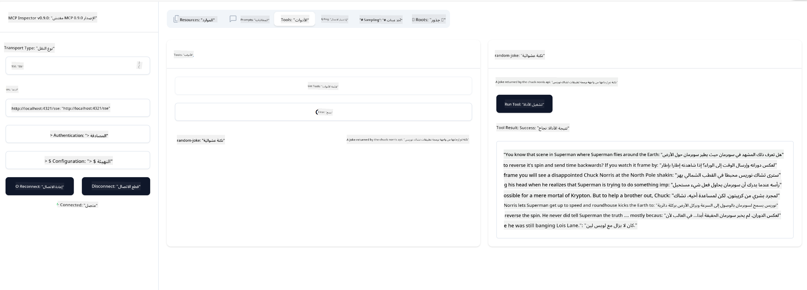

<!--
CO_OP_TRANSLATOR_METADATA:
{
  "original_hash": "64645691bf0985f1760b948123edf269",
  "translation_date": "2025-06-13T10:41:41+00:00",
  "source_file": "03-GettingStarted/05-sse-server/README.md",
  "language_code": "ar"
}
-->
الآن بعد أن عرفنا المزيد عن SSE، دعونا نبني خادم SSE بعد ذلك.

## التمرين: إنشاء خادم SSE

لإنشاء خادمنا، نحتاج إلى تذكر أمرين:

- نحتاج إلى استخدام خادم ويب لعرض نقاط النهاية للاتصال والرسائل.
- بناء خادمنا كما نفعل عادةً باستخدام الأدوات، الموارد والمطالبات عندما كنا نستخدم stdio.

### -1- إنشاء مثيل للخادم

لإنشاء خادمنا، نستخدم نفس الأنواع كما هو الحال مع stdio. ومع ذلك، بالنسبة للنقل، نحتاج إلى اختيار SSE.

---

دعونا نضيف المسارات اللازمة بعد ذلك.

### -2- إضافة المسارات

دعونا نضيف المسارات التي تتعامل مع الاتصال والرسائل الواردة:

---

دعونا نضيف قدرات للخادم بعد ذلك.

### -3- إضافة قدرات الخادم

الآن بعد أن عرفنا كل شيء خاص بـ SSE، دعونا نضيف قدرات الخادم مثل الأدوات، المطالبات والموارد.

---

يجب أن يبدو كودك الكامل كالتالي:

---

رائع، لدينا خادم يستخدم SSE، دعونا نجربه الآن.

## التمرين: تصحيح خادم SSE باستخدام Inspector

Inspector هو أداة رائعة رأيناها في درس سابق [إنشاء خادمك الأول](/03-GettingStarted/01-first-server/README.md). لنرى إذا كان بإمكاننا استخدام Inspector هنا أيضًا:

### -1- تشغيل Inspector

لتشغيل Inspector، يجب أولاً أن يكون لديك خادم SSE يعمل، فلنفعل ذلك الآن:

1. تشغيل الخادم

---

1. تشغيل Inspector

    > ![NOTE]
    > قم بتشغيل هذا في نافذة طرفية منفصلة عن تلك التي يعمل فيها الخادم. لاحظ أيضًا، أنك بحاجة لتعديل الأمر أدناه ليتناسب مع عنوان URL الذي يعمل عليه خادمك.

    ```sh
    npx @modelcontextprotocol/inspector --cli http://localhost:8000/sse --method tools/list
    ```

    تشغيل Inspector يبدو نفسه في جميع بيئات التشغيل. لاحظ كيف أننا بدلاً من تمرير مسار إلى خادمنا وأمر لبدء الخادم، نمرر عنوان URL حيث يعمل الخادم ونحدد أيضًا مسار `/sse`.

### -2- تجربة الأداة

اتصل بالخادم باختيار SSE من القائمة المنسدلة واملأ حقل URL حيث يعمل خادمك، على سبيل المثال http:localhost:4321/sse. الآن اضغط على زر "Connect". كما في السابق، اختر قائمة الأدوات، اختر أداة وقدم القيم المطلوبة. يجب أن ترى نتيجة مثل الصورة أدناه:



رائع، يمكنك العمل مع Inspector، دعنا نرى كيف يمكننا العمل مع Visual Studio Code بعد ذلك.

## المهمة

حاول بناء خادمك مع المزيد من القدرات. راجع [هذه الصفحة](https://api.chucknorris.io/) لإضافة أداة تستدعي API، أنت تقرر كيف يجب أن يبدو الخادم. استمتع :)

## الحل

[الحل](./solution/README.md) هذا حل ممكن مع كود يعمل.

## النقاط الرئيسية

النقاط التي يجب أخذها من هذا الفصل هي كالتالي:

- SSE هو نوع النقل الثاني المدعوم بجانب stdio.
- لدعم SSE، تحتاج إلى إدارة الاتصالات الواردة والرسائل باستخدام إطار ويب.
- يمكنك استخدام كل من Inspector وVisual Studio Code لاستهلاك خادم SSE، تمامًا كما هو الحال مع خوادم stdio. لاحظ كيف يختلف الأمر قليلاً بين stdio وSSE. بالنسبة لـ SSE، تحتاج إلى تشغيل الخادم بشكل منفصل ثم تشغيل أداة Inspector. بالنسبة لأداة Inspector، هناك بعض الاختلافات أيضًا حيث تحتاج إلى تحديد عنوان URL.

## عينات

- [حاسبة جافا](../samples/java/calculator/README.md)
- [حاسبة .Net](../../../../03-GettingStarted/samples/csharp)
- [حاسبة جافا سكريبت](../samples/javascript/README.md)
- [حاسبة تايب سكريبت](../samples/typescript/README.md)
- [حاسبة بايثون](../../../../03-GettingStarted/samples/python)

## موارد إضافية

- [SSE](https://developer.mozilla.org/en-US/docs/Web/API/Server-sent_events)

## ماذا بعد

- التالي: [البث عبر HTTP مع MCP (HTTP قابل للبث)](/03-GettingStarted/06-http-streaming/README.md)

**إخلاء المسؤولية**:  
تمت ترجمة هذا المستند باستخدام خدمة الترجمة الآلية [Co-op Translator](https://github.com/Azure/co-op-translator). بينما نسعى جاهدين لتحقيق الدقة، يرجى العلم أن الترجمات الآلية قد تحتوي على أخطاء أو عدم دقة. يجب اعتبار المستند الأصلي بلغته الأصلية المصدر المعتمد. للمعلومات الهامة، يُنصح بالترجمة البشرية الاحترافية. نحن غير مسؤولين عن أي سوء فهم أو تفسير ناتج عن استخدام هذه الترجمة.