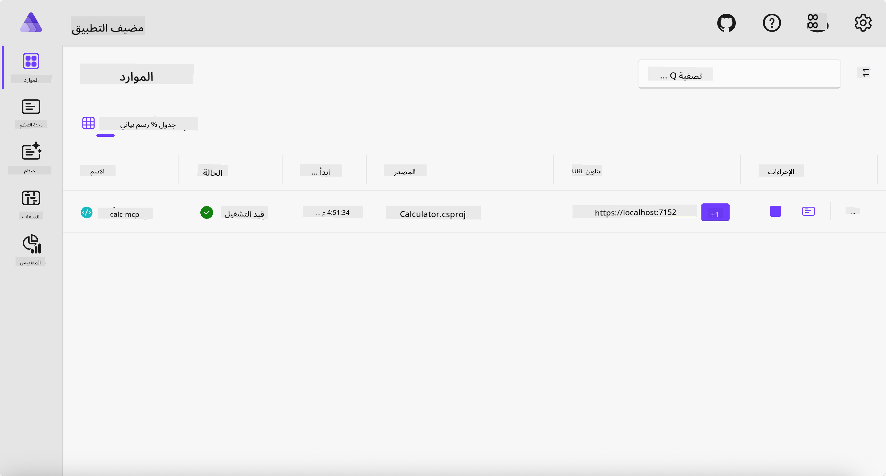
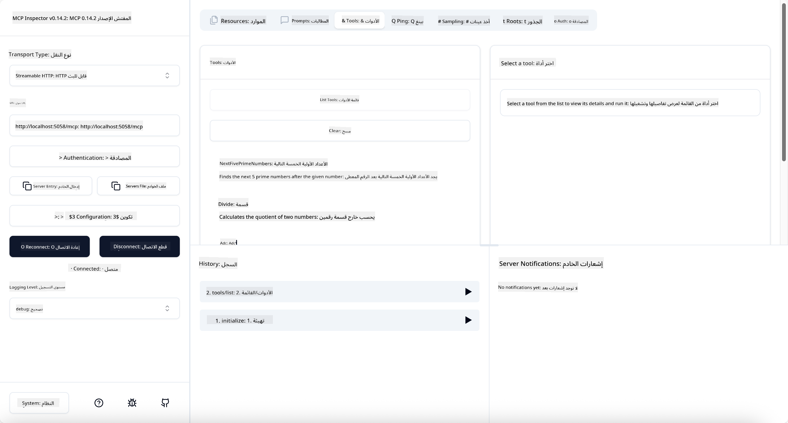

<!--
CO_OP_TRANSLATOR_METADATA:
{
  "original_hash": "0bc7bd48f55f1565f1d95ccb2c16f728",
  "translation_date": "2025-06-18T07:46:42+00:00",
  "source_file": "04-PracticalImplementation/samples/csharp/README.md",
  "language_code": "ar"
}
-->
# مثال

يُظهر المثال السابق كيفية استخدام مشروع .NET محلي مع النوع `stdio`، وكيفية تشغيل الخادم محليًا داخل حاوية. هذه طريقة جيدة في العديد من الحالات. ومع ذلك، قد يكون من المفيد تشغيل الخادم عن بُعد، مثل بيئة السحابة. هنا يأتي دور النوع `http`.

عند النظر إلى الحل في مجلد `04-PracticalImplementation`، قد يبدو أكثر تعقيدًا من المثال السابق. لكن في الواقع، ليس كذلك. إذا نظرت عن كثب إلى المشروع `src/Calculator`، سترى أنه يحتوي على نفس الشيفرة تقريبًا كما في المثال السابق. الاختلاف الوحيد هو أننا نستخدم مكتبة مختلفة `ModelContextProtocol.AspNetCore` للتعامل مع طلبات HTTP. كما قمنا بتغيير الطريقة `IsPrime` لتصبح خاصة، فقط لإظهار أنه يمكنك وجود طرق خاصة في الشيفرة الخاصة بك. بقية الشيفرة هي نفسها كما من قبل.

المشاريع الأخرى هي من [.NET Aspire](https://learn.microsoft.com/dotnet/aspire/get-started/aspire-overview). وجود .NET Aspire في الحل يحسن تجربة المطور أثناء التطوير والاختبار ويساعد في الرصد. ليس من الضروري تشغيل الخادم، لكنه من الممارسات الجيدة وجوده في الحل الخاص بك.

## تشغيل الخادم محليًا

1. من VS Code (مع امتداد C# DevKit)، انتقل إلى مجلد `04-PracticalImplementation/samples/csharp`.
2. نفذ الأمر التالي لتشغيل الخادم:

   ```bash
    dotnet watch run --project ./src/AppHost
   ```

3. عندما يفتح متصفح الويب لوحة تحكم .NET Aspire، لاحظ عنوان URL الخاص بـ `http`. يجب أن يكون شيئًا مثل `http://localhost:5058/`.

   

## اختبار Streamable HTTP باستخدام MCP Inspector

إذا كان لديك Node.js إصدار 22.7.5 أو أحدث، يمكنك استخدام MCP Inspector لاختبار الخادم الخاص بك.

ابدأ تشغيل الخادم ونفذ الأمر التالي في الطرفية:

```bash
npx @modelcontextprotocol/inspector http://localhost:5058
```



- اختر `Streamable HTTP` as the Transport type.
- In the Url field, enter the URL of the server noted earlier, and append `/mcp`. يجب أن يكون `http` (وليس `https`) something like `http://localhost:5058/mcp`.
- select the Connect button.

A nice thing about the Inspector is that it provide a nice visibility on what is happening.

- Try listing the available tools
- Try some of them, it should works just like before.

## Test MCP Server with GitHub Copilot Chat in VS Code

To use the Streamable HTTP transport with GitHub Copilot Chat, change the configuration of the `calc-mcp` الخادم الذي تم إنشاؤه سابقًا ليبدو هكذا:

```jsonc
// .vscode/mcp.json
{
  "servers": {
    "calc-mcp": {
      "type": "http",
      "url": "http://localhost:5058/mcp"
    }
  }
}
```

قم ببعض الاختبارات:

- اطلب "3 أعداد أولية بعد 6780". لاحظ كيف سيستخدم Copilot الأدوات الجديدة `NextFivePrimeNumbers` ويعيد فقط أول 3 أعداد أولية.
- اطلب "7 أعداد أولية بعد 111"، لترى ماذا يحدث.
- اطلب "جون لديه 24 مصاصة ويريد توزيعها كلها على أولاده الثلاثة. كم عدد المصاصات التي يحصل عليها كل طفل؟"، لترى ماذا يحدث.

## نشر الخادم على Azure

لنشر الخادم على Azure ليتمكن المزيد من الأشخاص من استخدامه.

من الطرفية، انتقل إلى المجلد `04-PracticalImplementation/samples/csharp` ونفذ الأمر التالي:

```bash
azd up
```

عند انتهاء النشر، يجب أن ترى رسالة مثل هذه:


انسخ عنوان URL واستخدمه في MCP Inspector وفي GitHub Copilot Chat.

```jsonc
// .vscode/mcp.json
{
  "servers": {
    "calc-mcp": {
      "type": "http",
      "url": "https://calc-mcp.gentleriver-3977fbcf.australiaeast.azurecontainerapps.io/mcp"
    }
  }
}
```

## ماذا بعد؟

جربنا أنواع نقل مختلفة وأدوات اختبار متعددة. كما نشرنا خادم MCP الخاص بك على Azure. ولكن ماذا لو كان خادمنا يحتاج إلى الوصول إلى موارد خاصة؟ مثل قاعدة بيانات أو API خاصة؟ في الفصل القادم، سنرى كيف يمكننا تحسين أمان الخادم الخاص بنا.

**تنويه**:  
تمت ترجمة هذا المستند باستخدام خدمة الترجمة الآلية [Co-op Translator](https://github.com/Azure/co-op-translator). بينما نسعى لتحقيق الدقة، يرجى العلم أن الترجمات الآلية قد تحتوي على أخطاء أو عدم دقة. يجب اعتبار المستند الأصلي بلغته الأصلية المصدر الموثوق به. للمعلومات الهامة، يُنصح بالاعتماد على الترجمة البشرية المهنية. نحن غير مسؤولين عن أي سوء فهم أو تفسير ناتج عن استخدام هذه الترجمة.