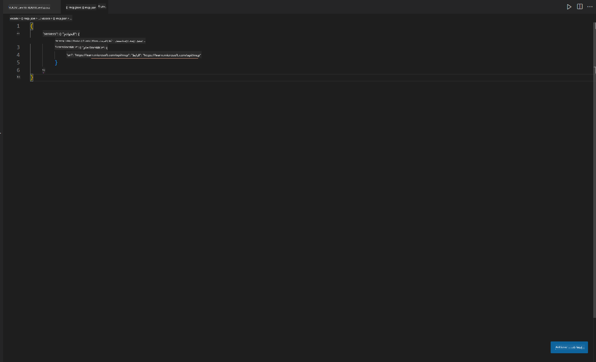
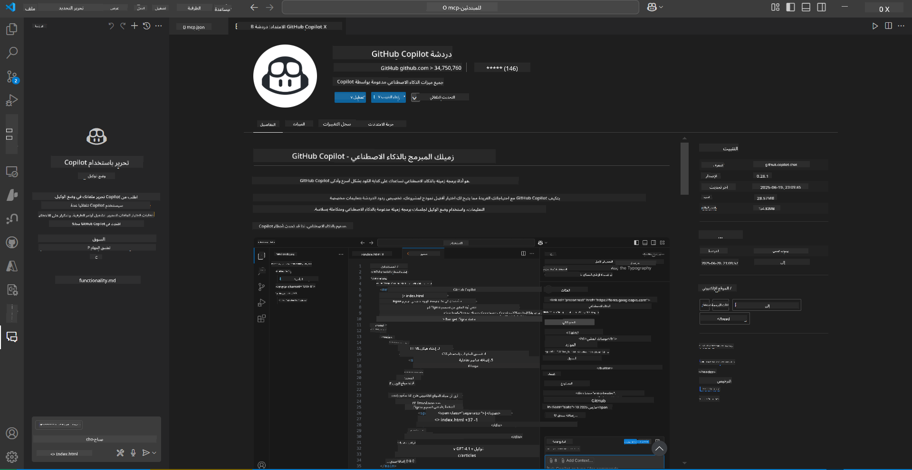
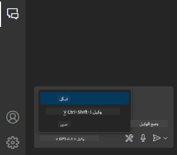
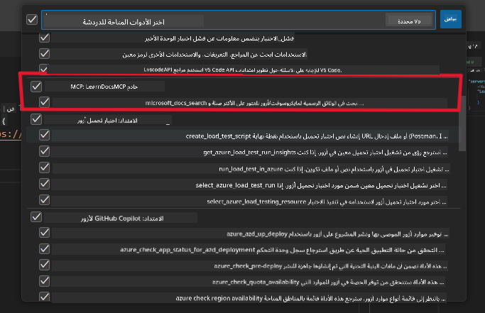
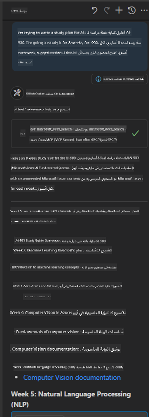
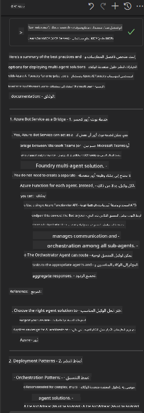

<!--
CO_OP_TRANSLATOR_METADATA:
{
  "original_hash": "db532b1ec386c9ce38c791653dc3c881",
  "translation_date": "2025-06-21T14:34:58+00:00",
  "source_file": "09-CaseStudy/docs-mcp/solution/scenario3/README.md",
  "language_code": "ar"
}
-->
# السيناريو 3: الوثائق داخل المحرر مع خادم MCP في VS Code

## نظرة عامة

في هذا السيناريو، ستتعلم كيفية جلب مستندات Microsoft Learn مباشرة إلى بيئة Visual Studio Code الخاصة بك باستخدام خادم MCP. بدلاً من التنقل المستمر بين علامات تبويب المتصفح للبحث عن الوثائق، يمكنك الوصول إلى الوثائق الرسمية والبحث فيها والإشارة إليها داخل المحرر نفسه. هذه الطريقة تسهل سير عملك، تحافظ على تركيزك، وتمكنك من التكامل السلس مع أدوات مثل GitHub Copilot.

- ابحث واقرأ الوثائق داخل VS Code دون مغادرة بيئة البرمجة.
- أشر إلى الوثائق وأدرج الروابط مباشرة في ملفات README أو ملفات الدورة التدريبية.
- استخدم GitHub Copilot وMCP معًا للحصول على سير عمل سلس مدعوم بالذكاء الاصطناعي.

## أهداف التعلم

بحلول نهاية هذا الفصل، ستفهم كيفية إعداد واستخدام خادم MCP داخل VS Code لتعزيز سير عمل التوثيق والتطوير الخاص بك. ستتمكن من:

- تكوين مساحة العمل لاستخدام خادم MCP للبحث عن الوثائق.
- البحث وإدراج الوثائق مباشرة من داخل VS Code.
- دمج قوة GitHub Copilot وMCP لسير عمل أكثر إنتاجية مدعوم بالذكاء الاصطناعي.

هذه المهارات ستساعدك على الحفاظ على تركيزك، تحسين جودة الوثائق، وزيادة إنتاجيتك كمطور أو كاتب تقني.

## الحل

للوصول إلى الوثائق داخل المحرر، ستتبع سلسلة من الخطوات التي تدمج خادم MCP مع VS Code وGitHub Copilot. هذا الحل مثالي لمؤلفي الدورات، كتاب الوثائق، والمطورين الذين يرغبون في الحفاظ على تركيزهم داخل المحرر أثناء العمل مع الوثائق وCopilot.

- أضف بسرعة روابط مرجعية إلى README أثناء كتابة دورة أو توثيق مشروع.
- استخدم Copilot لتوليد الكود وMCP للعثور فورًا على الوثائق ذات الصلة والاستشهاد بها.
- حافظ على تركيزك داخل المحرر وزد من إنتاجيتك.

### دليل خطوة بخطوة

للبدء، اتبع هذه الخطوات. يمكنك إضافة لقطة شاشة من مجلد الأصول لكل خطوة لتوضيح العملية بصريًا.

1. **أضف تكوين MCP:**
   في جذر مشروعك، أنشئ ملف `.vscode/mcp.json` وأضف التكوين التالي:
   ```json
   {
     "servers": {
       "LearnDocsMCP": {
         "url": "https://learn.microsoft.com/api/mcp"
       }
     }
   }
   ```
   يخبر هذا التكوين VS Code كيفية الاتصال بـ [`Microsoft Learn Docs MCP server`](https://github.com/MicrosoftDocs/mcp).
   
   
    
2. **افتح لوحة دردشة GitHub Copilot:**
   إذا لم تكن قد قمت بتثبيت امتداد GitHub Copilot، انتقل إلى عرض الإضافات في VS Code وقم بتثبيته. يمكنك تنزيله مباشرة من [Visual Studio Code Marketplace](https://marketplace.visualstudio.com/items?itemName=GitHub.copilot-chat). بعد ذلك، افتح لوحة دردشة Copilot من الشريط الجانبي.

   

3. **قم بتمكين وضع الوكيل وتحقق من الأدوات:**
   في لوحة دردشة Copilot، قم بتمكين وضع الوكيل.

   

   بعد تمكين وضع الوكيل، تحقق من ظهور خادم MCP كأحد الأدوات المتاحة. هذا يضمن أن وكيل Copilot يمكنه الوصول إلى خادم الوثائق لجلب المعلومات ذات الصلة.
   
   

4. **ابدأ دردشة جديدة واطرح استفسارات على الوكيل:**
   افتح دردشة جديدة في لوحة دردشة Copilot. يمكنك الآن طرح استفساراتك المتعلقة بالوثائق على الوكيل. سيستخدم الوكيل خادم MCP لجلب وعرض مستندات Microsoft Learn ذات الصلة مباشرة في المحرر.

   - *"أحاول كتابة خطة دراسة للموضوع X. سأدرسه لمدة 8 أسابيع، لكل أسبوع، اقترح لي المحتوى الذي يجب أن أدرسه."*

   

5. **الاستعلامات الحية:**

   > لنأخذ استعلامًا حيًا من قسم [#get-help](https://discord.gg/D6cRhjHWSC) في Discord الخاص بـ Azure AI Foundry ([عرض الرسالة الأصلية](https://discord.com/channels/1113626258182504448/1385498306720829572)):
   
   *"أبحث عن إجابات حول كيفية نشر حل متعدد الوكلاء باستخدام وكلاء الذكاء الاصطناعي المطورين على Azure AI Foundry. أرى أنه لا توجد طريقة نشر مباشرة، مثل قنوات Copilot Studio. فما هي الطرق المختلفة لنشر هذا الحل ليتمكن مستخدمو المؤسسات من التفاعل وإنجاز العمل؟ هناك العديد من المقالات والمدونات التي تقول إنه يمكننا استخدام خدمة Azure Bot للقيام بهذا العمل والتي يمكن أن تعمل كجسر بين MS Teams ووكلاء Azure AI Foundry، فهل سينجح هذا إذا قمت بإعداد بوت Azure يتصل بوكيل المنسق على Azure AI Foundry عبر Azure function لأداء التنسيق، أم أحتاج لإنشاء Azure function لكل وكيل ذكاء اصطناعي جزء من الحل متعدد الوكلاء للقيام بالتنسيق في إطار عمل البوت؟ أي اقتراحات أخرى مرحب بها."*

   

   سيرد الوكيل بروابط وملخصات وثائقية ذات صلة، يمكنك إدراجها مباشرة في ملفات markdown الخاصة بك أو استخدامها كمرجع في الكود.

### استعلامات نموذجية

إليك بعض الاستعلامات التي يمكنك تجربتها. ستوضح هذه الاستعلامات كيف يمكن لخادم MCP وCopilot العمل معًا لتوفير توثيق فوري وذكي ومرجعية سياقية دون مغادرة VS Code:

- "أرني كيفية استخدام مشغلات Azure Functions."
- "أدرج رابطًا إلى الوثائق الرسمية لـ Azure Key Vault."
- "ما هي أفضل الممارسات لتأمين موارد Azure؟"
- "ابحث عن بدء سريع لخدمات Azure AI."

ستوضح هذه الاستعلامات كيف يمكن لخادم MCP وCopilot العمل معًا لتوفير توثيق فوري وذكي ومرجعية سياقية دون مغادرة VS Code.

---

**إخلاء المسؤولية**:  
تمت ترجمة هذا المستند باستخدام خدمة الترجمة الآلية [Co-op Translator](https://github.com/Azure/co-op-translator). بينما نسعى لتحقيق الدقة، يرجى العلم أن الترجمات الآلية قد تحتوي على أخطاء أو عدم دقة. يجب اعتبار المستند الأصلي بلغته الأصلية المصدر الموثوق به. للمعلومات الهامة، يُنصح بالترجمة البشرية الاحترافية. نحن غير مسؤولين عن أي سوء فهم أو تفسير ناتج عن استخدام هذه الترجمة.