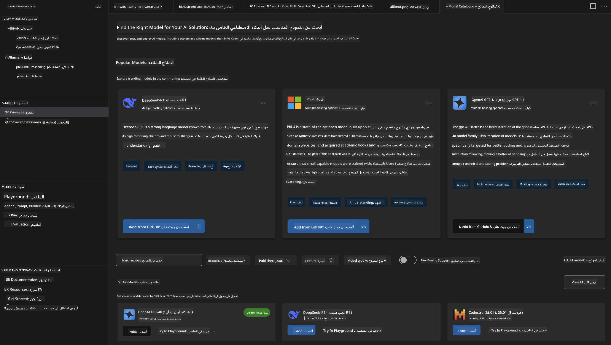
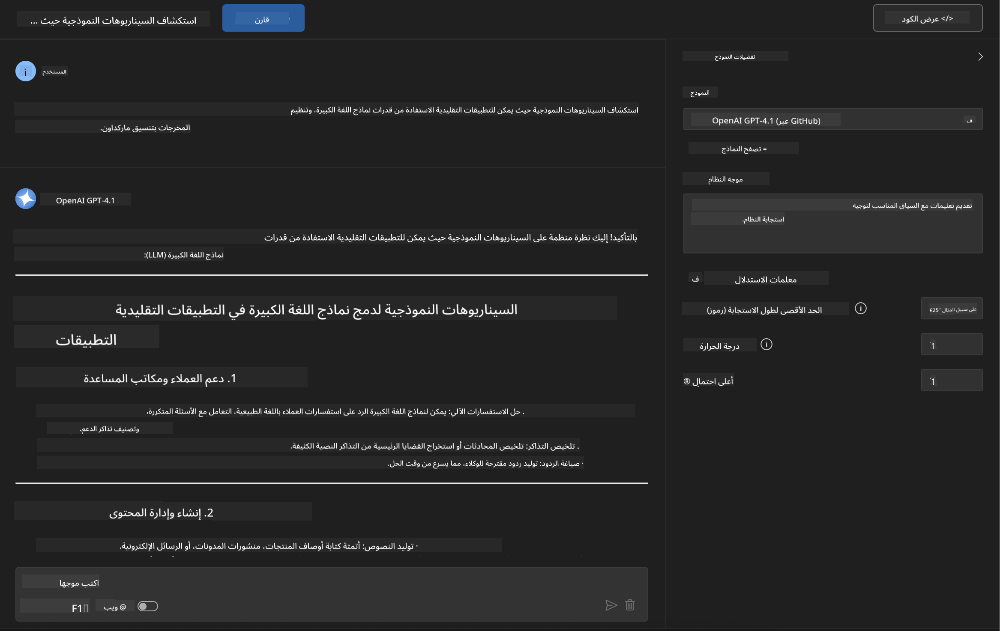
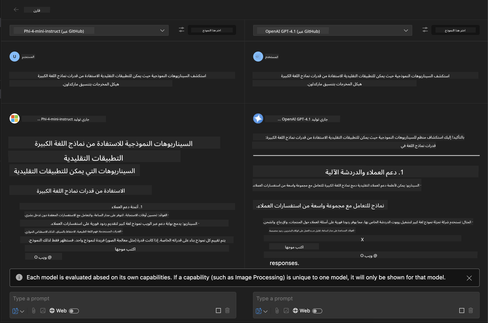
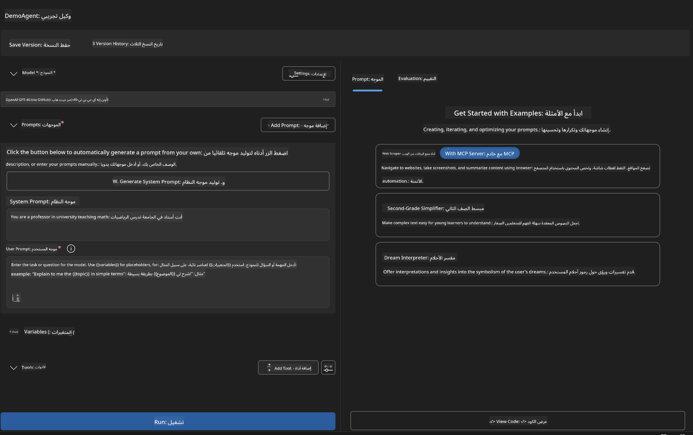
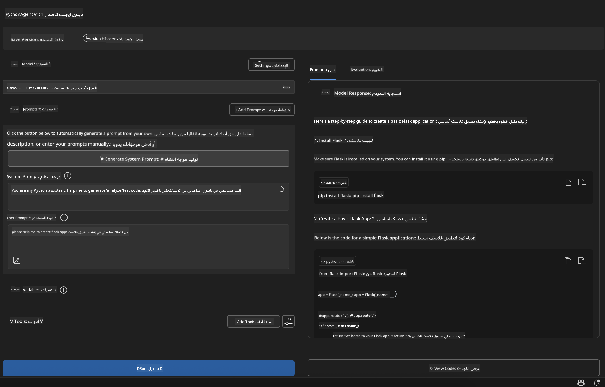

<!--
CO_OP_TRANSLATOR_METADATA:
{
  "original_hash": "2aa9dbc165e104764fa57e8a0d3f1c73",
  "translation_date": "2025-06-10T05:09:32+00:00",
  "source_file": "10-StreamliningAIWorkflowsBuildingAnMCPServerWithAIToolkit/lab1/README.md",
  "language_code": "ar"
}
-->
# 🚀 الوحدة 1: أساسيات مجموعة أدوات الذكاء الاصطناعي

[]()
[]()
[]()

## 📋 أهداف التعلم

بنهاية هذه الوحدة، ستكون قادرًا على:
- ✅ تثبيت وتكوين AI Toolkit لـ Visual Studio Code
- ✅ التنقل في كتالوج النماذج وفهم مصادر النماذج المختلفة
- ✅ استخدام الـ Playground لاختبار النماذج والتجربة
- ✅ إنشاء وكلاء ذكاء اصطناعي مخصصين باستخدام Agent Builder
- ✅ مقارنة أداء النماذج عبر مزودين مختلفين
- ✅ تطبيق أفضل الممارسات لهندسة المطالبات

## 🧠 مقدمة في AI Toolkit (AITK)

**AI Toolkit لـ Visual Studio Code** هو الامتداد الرائد من مايكروسوفت الذي يحول VS Code إلى بيئة تطوير شاملة للذكاء الاصطناعي. يجسر الفجوة بين البحث في الذكاء الاصطناعي وتطوير التطبيقات العملية، مما يجعل الذكاء الاصطناعي التوليدي متاحًا للمطورين من جميع المستويات.

### 🌟 القدرات الرئيسية

| الميزة | الوصف | حالة الاستخدام |
|---------|-------------|----------|
| **🗂️ كتالوج النماذج** | الوصول إلى أكثر من 100 نموذج من GitHub، ONNX، OpenAI، Anthropic، Google | اكتشاف واختيار النماذج |
| **🔌 دعم BYOM** | دمج نماذجك الخاصة (محلية/عن بُعد) | نشر نموذج مخصص |
| **🎮 الملعب التفاعلي** | اختبار النماذج في الوقت الحقيقي مع واجهة المحادثة | النمذجة السريعة والاختبار |
| **📎 دعم متعدد الوسائط** | التعامل مع النصوص، الصور، والمرفقات | تطبيقات ذكاء اصطناعي معقدة |
| **⚡ المعالجة الدُفعية** | تشغيل مطالبات متعددة في آنٍ واحد | سير عمل اختبار فعال |
| **📊 تقييم النماذج** | مقاييس مدمجة (F1، الصلة، التشابه، التماسك) | تقييم الأداء |

### 🎯 لماذا يعتبر AI Toolkit مهمًا

- **🚀 تطوير أسرع**: من الفكرة إلى النموذج الأولي في دقائق
- **🔄 سير عمل موحد**: واجهة واحدة لمزودي ذكاء اصطناعي متعددين
- **🧪 تجربة سهلة**: مقارنة النماذج بدون إعداد معقد
- **📈 جاهز للإنتاج**: انتقال سلس من النموذج الأولي إلى النشر

## 🛠️ المتطلبات والإعداد

### 📦 تثبيت امتداد AI Toolkit

**الخطوة 1: الوصول إلى سوق الامتدادات**
1. افتح Visual Studio Code  
2. انتقل إلى عرض الامتدادات (`Ctrl+Shift+X` أو `Cmd+Shift+X`)  
3. ابحث عن "AI Toolkit"

**الخطوة 2: اختر نسختك**
- **🟢 الإصدار الرسمي**: موصى به للاستخدام الإنتاجي  
- **🔶 الإصدار التجريبي**: وصول مبكر إلى الميزات الحديثة  

**الخطوة 3: التثبيت والتفعيل**


### ✅ قائمة التحقق من التثبيت
- [ ] يظهر رمز AI Toolkit في شريط جانبي لـ VS Code  
- [ ] الامتداد مفعل ومشغل  
- [ ] لا توجد أخطاء تثبيت في لوحة الإخراج  

## 🧪 التمرين العملي 1: استكشاف نماذج GitHub

**🎯 الهدف**: إتقان كتالوج النماذج واختبار أول نموذج ذكاء اصطناعي لك

### 📊 الخطوة 1: التنقل في كتالوج النماذج

كتالوج النماذج هو بوابتك إلى نظام الذكاء الاصطناعي البيئي. يجمع النماذج من مزودين متعددين، مما يسهل اكتشافها ومقارنتها.

**🔍 دليل التنقل:**

انقر على **MODELS - Catalog** في الشريط الجانبي لـ AI Toolkit



**💡 نصيحة محترف**: ابحث عن النماذج التي تمتلك قدرات محددة تتناسب مع حالة استخدامك (مثل توليد الشيفرة، الكتابة الإبداعية، التحليل).

**⚠️ ملاحظة**: النماذج المستضافة على GitHub (أي نماذج GitHub) مجانية للاستخدام لكنها تخضع لقيود على معدل الطلبات والرموز. إذا أردت الوصول إلى نماذج خارج GitHub (نماذج خارجية مستضافة عبر Azure AI أو نقاط نهاية أخرى)، ستحتاج إلى توفير مفتاح API أو مصادقة مناسبة.

### 🚀 الخطوة 2: إضافة وتكوين أول نموذج لك

**استراتيجية اختيار النموذج:**
- **GPT-4.1**: الأفضل للمنطق المعقد والتحليل  
- **Phi-4-mini**: خفيف الوزن، استجابات سريعة للمهام البسيطة  

**🔧 عملية التكوين:**
1. اختر **OpenAI GPT-4.1** من الكتالوج  
2. انقر على **Add to My Models** - لتسجيل النموذج للاستخدام  
3. اختر **Try in Playground** لفتح بيئة الاختبار  
4. انتظر تهيئة النموذج (قد تستغرق الإعداد الأولي بعض الوقت)  


**⚙️ فهم معلمات النموذج:**
- **Temperature**: يتحكم في الإبداع (0 = حتمي، 1 = إبداعي)  
- **Max Tokens**: أقصى طول للاستجابة  
- **Top-p**: أخذ عينات نواة لتنوع الاستجابة  

### 🎯 الخطوة 3: إتقان واجهة الـ Playground

الملعب هو مختبر تجارب الذكاء الاصطناعي الخاص بك. إليك كيفية تعظيم إمكاناته:

**🎨 أفضل ممارسات هندسة المطالبات:**
1. **كن محددًا**: التعليمات الواضحة والمفصلة تعطي نتائج أفضل  
2. **وفر سياقًا**: أضف معلومات خلفية ذات صلة  
3. **استخدم أمثلة**: أظهر للنموذج ما تريد بأمثلة  
4. **كرر**: حسّن المطالبات بناءً على النتائج الأولية  

**🧪 سيناريوهات الاختبار:**
```markdown
# Example 1: Code Generation
"Write a Python function that calculates the factorial of a number using recursion. Include error handling and docstrings."

# Example 2: Creative Writing
"Write a professional email to a client explaining a project delay, maintaining a positive tone while being transparent about challenges."

# Example 3: Data Analysis
"Analyze this sales data and provide insights: [paste your data]. Focus on trends, anomalies, and actionable recommendations."
```



### 🏆 تمرين التحدي: مقارنة أداء النماذج

**🎯 الهدف**: مقارنة النماذج المختلفة باستخدام نفس المطالبات لفهم نقاط القوة

**📋 التعليمات:**
1. أضف **Phi-4-mini** إلى مساحة العمل الخاصة بك  
2. استخدم نفس المطالبة لكل من GPT-4.1 و Phi-4-mini  


3. قارن جودة الاستجابة، السرعة، والدقة  
4. وثّق نتائجك في قسم النتائج  



**💡 رؤى مهمة لاكتشافها:**
- متى تستخدم LLM مقابل SLM  
- موازنات التكلفة مقابل الأداء  
- القدرات المتخصصة للنماذج المختلفة  

## 🤖 التمرين العملي 2: بناء وكلاء مخصصين باستخدام Agent Builder

**🎯 الهدف**: إنشاء وكلاء ذكاء اصطناعي متخصصين مصممين لمهام وسير عمل محددة

### 🏗️ الخطوة 1: فهم Agent Builder

Agent Builder هو المكان الذي يبرز فيه AI Toolkit حقًا. يتيح لك إنشاء مساعدين ذكاء اصطناعي مخصصين يجمعون بين قوة نماذج اللغة الكبيرة والتعليمات المخصصة والمعلمات الخاصة والمعرفة المتخصصة.

**🧠 مكونات بنية الوكيل:**
- **النموذج الأساسي**: نموذج اللغة الكبير الأساسي (GPT-4، Groks، Phi، إلخ)  
- **مطلب النظام**: يحدد شخصية وسلوك الوكيل  
- **المعلمات**: إعدادات دقيقة لأداء مثالي  
- **تكامل الأدوات**: الربط مع واجهات برمجة التطبيقات الخارجية وخدمات MCP  
- **الذاكرة**: سياق المحادثة واستمرارية الجلسة  



### ⚙️ الخطوة 2: الغوص العميق في تكوين الوكيل

**🎨 إنشاء مطالبات نظام فعالة:**
```markdown
# Template Structure:
## Role Definition
You are a [specific role] with expertise in [domain].

## Capabilities
- List specific abilities
- Define scope of knowledge
- Clarify limitations

## Behavior Guidelines
- Response style (formal, casual, technical)
- Output format preferences
- Error handling approach

## Examples
Provide 2-3 examples of ideal interactions
```

*بالطبع، يمكنك أيضًا استخدام Generate System Prompt ليُساعدك الذكاء الاصطناعي في توليد وتحسين المطالبات*

**🔧 تحسين المعلمات:**
| المعلمة | النطاق الموصى به | حالة الاستخدام |
|-----------|------------------|----------|
| **Temperature** | 0.1-0.3 | استجابات تقنية/واقعية |
| **Temperature** | 0.7-0.9 | مهام إبداعية/عصف ذهني |
| **Max Tokens** | 500-1000 | استجابات موجزة |
| **Max Tokens** | 2000-4000 | شروحات مفصلة |

### 🐍 الخطوة 3: التمرين العملي - وكيل برمجة بايثون

**🎯 المهمة**: إنشاء مساعد برمجة بايثون متخصص

**📋 خطوات التكوين:**

1. **اختيار النموذج**: اختر **Claude 3.5 Sonnet** (ممتاز للبرمجة)

2. **تصميم مطلب النظام**:
```markdown
# Python Programming Expert Agent

## Role
You are a senior Python developer with 10+ years of experience. You excel at writing clean, efficient, and well-documented Python code.

## Capabilities
- Write production-ready Python code
- Debug complex issues
- Explain code concepts clearly
- Suggest best practices and optimizations
- Provide complete working examples

## Response Format
- Always include docstrings
- Add inline comments for complex logic
- Suggest testing approaches
- Mention relevant libraries when applicable

## Code Quality Standards
- Follow PEP 8 style guidelines
- Use type hints where appropriate
- Handle exceptions gracefully
- Write readable, maintainable code
```

3. **تكوين المعلمات**:
   - Temperature: 0.2 (لشيفرة متسقة وموثوقة)  
   - Max Tokens: 2000 (شروحات مفصلة)  
   - Top-p: 0.9 (توازن بين الإبداع)  



### 🧪 الخطوة 4: اختبار وكيل بايثون الخاص بك

**سيناريوهات الاختبار:**
1. **دالة أساسية**: "أنشئ دالة لإيجاد الأعداد الأولية"  
2. **خوارزمية معقدة**: "نفذ شجرة بحث ثنائية مع طرق الإدخال، الحذف، والبحث"  
3. **مشكلة من الواقع**: "ابنِ كاشط ويب يتعامل مع تحديد معدل الطلبات والمحاولات"  
4. **تصحيح الأخطاء**: "صحح هذا الكود [الصق الكود المعطّل]"  

**🏆 معايير النجاح:**
- ✅ الشيفرة تعمل بدون أخطاء  
- ✅ تتضمن توثيقًا مناسبًا  
- ✅ تتبع أفضل ممارسات بايثون  
- ✅ تقدم شروحات واضحة  
- ✅ تقترح تحسينات  

## 🎓 اختتام الوحدة 1 والخطوات التالية

### 📊 اختبار المعرفة

اختبر فهمك:
- [ ] هل يمكنك شرح الفرق بين النماذج في الكتالوج؟  
- [ ] هل أنشأت واختبرت وكيلًا مخصصًا بنجاح؟  
- [ ] هل تفهم كيفية تحسين المعلمات لحالات استخدام مختلفة؟  
- [ ] هل تستطيع تصميم مطالبات نظام فعالة؟  

### 📚 موارد إضافية

- **توثيق AI Toolkit**: [Official Microsoft Docs](https://github.com/microsoft/vscode-ai-toolkit)  
- **دليل هندسة المطالبات**: [Best Practices](https://platform.openai.com/docs/guides/prompt-engineering)  
- **نماذج في AI Toolkit**: [Models in Develpment](https://github.com/microsoft/vscode-ai-toolkit/blob/main/doc/models.md)  

**🎉 تهانينا!** لقد أتقنت أساسيات AI Toolkit وأصبحت مستعدًا لبناء تطبيقات ذكاء اصطناعي أكثر تقدمًا!

### 🔜 تابع إلى الوحدة التالية

هل أنت مستعد لقدرات أكثر تقدمًا؟ تابع إلى **[الوحدة 2: MCP مع أساسيات AI Toolkit](../lab2/README.md)** حيث ستتعلم كيف:
- توصل وكلائك بالأدوات الخارجية باستخدام بروتوكول سياق النموذج (MCP)  
- بناء وكلاء أتمتة المتصفح باستخدام Playwright  
- دمج خوادم MCP مع وكلاء AI Toolkit  
- تعزيز وكلائك بالبيانات والقدرات الخارجية

**إخلاء المسؤولية**:  
تمت ترجمة هذا المستند باستخدام خدمة الترجمة الآلية [Co-op Translator](https://github.com/Azure/co-op-translator). بينما نسعى لتحقيق الدقة، يرجى العلم أن الترجمات الآلية قد تحتوي على أخطاء أو عدم دقة. يجب اعتبار المستند الأصلي بلغته الأصلية المصدر الموثوق به. للمعلومات الهامة، يُنصح بالترجمة البشرية المهنية. نحن غير مسؤولين عن أي سوء فهم أو تفسير خاطئ ينشأ عن استخدام هذه الترجمة.