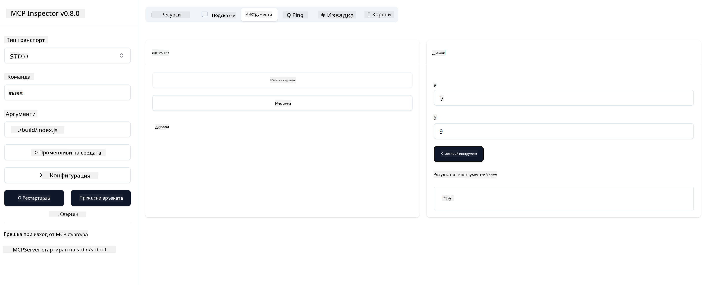

<!--
CO_OP_TRANSLATOR_METADATA:
{
  "original_hash": "37563349cd6894fe00489bf3b4d488ae",
  "translation_date": "2025-06-02T10:42:40+00:00",
  "source_file": "03-GettingStarted/01-first-server/README.md",
  "language_code": "bg"
}
-->
### -2- Създаване на проект

Сега, когато сте инсталирали SDK, нека създадем проект: 

### -3- Създаване на файлове за проекта

### -4- Създаване на сървърния код

### -5- Добавяне на инструмент и ресурс

Добавете инструмент и ресурс, като включите следния код: 

### -6 Финален код

Нека добавим последния необходим код, за да може сървърът да стартира: 

### -7- Тествайте сървъра

Стартирайте сървъра със следната команда: 

### -8- Стартиране с помощта на инспектора

Inspector е страхотен инструмент, който може да стартира вашия сървър и ви позволява да взаимодействате с него, за да тествате дали работи. Нека го стартираме:

> [!NOTE]
> може да изглежда различно в полето „command“, тъй като съдържа командата за стартиране на сървър с вашия конкретен runtime/

Ще видите следния потребителски интерфейс:

1. Свържете се със сървъра, като изберете бутона Connect  
   След като се свържете със сървъра, трябва да видите следното:

   

2. Изберете "Tools" и "listTools", трябва да се появи "Add", изберете "Add" и попълнете стойностите на параметрите.

   Трябва да видите следния отговор, т.е. резултат от инструмента "add":

   

Поздравления, успяхте да създадете и стартирате първия си сървър!

### Официални SDK-та

MCP предлага официални SDK-та за няколко езика:
- [C# SDK](https://github.com/modelcontextprotocol/csharp-sdk) - Поддържан в сътрудничество с Microsoft
- [Java SDK](https://github.com/modelcontextprotocol/java-sdk) - Поддържан в сътрудничество със Spring AI
- [TypeScript SDK](https://github.com/modelcontextprotocol/typescript-sdk) - Официалната TypeScript реализация
- [Python SDK](https://github.com/modelcontextprotocol/python-sdk) - Официалната Python реализация
- [Kotlin SDK](https://github.com/modelcontextprotocol/kotlin-sdk) - Официалната Kotlin реализация
- [Swift SDK](https://github.com/modelcontextprotocol/swift-sdk) - Поддържан в сътрудничество с Loopwork AI
- [Rust SDK](https://github.com/modelcontextprotocol/rust-sdk) - Официалната Rust реализация

## Основни изводи

- Настройването на MCP среда за разработка е лесно с езиково-специфични SDK-та
- Създаването на MCP сървъри включва създаване и регистриране на инструменти с ясни схеми
- Тестването и отстраняването на грешки са от съществено значение за надеждни MCP реализации

## Примери

- [Java Калкулатор](../samples/java/calculator/README.md)
- [.Net Калкулатор](../../../../03-GettingStarted/samples/csharp)
- [JavaScript Калкулатор](../samples/javascript/README.md)
- [TypeScript Калкулатор](../samples/typescript/README.md)
- [Python Калкулатор](../../../../03-GettingStarted/samples/python)

## Задача

Създайте прост MCP сървър с инструмент по ваш избор:
1. Имплементирайте инструмента на предпочитания от вас език (.NET, Java, Python или JavaScript).
2. Определете входни параметри и стойности за връщане.
3. Стартирайте инструмента inspector, за да се уверите, че сървърът работи както трябва.
4. Тествайте имплементацията с различни входни данни.

## Решение

[Решение](./solution/README.md)

## Допълнителни ресурси

- [MCP GitHub хранилище](https://github.com/microsoft/mcp-for-beginners)

## Какво следва

Следва: [Първи стъпки с MCP клиенти](/03-GettingStarted/02-client/README.md)

**Отказ от отговорност**:  
Този документ е преведен с помощта на AI преводаческа услуга [Co-op Translator](https://github.com/Azure/co-op-translator). Въпреки че се стремим към точност, моля, имайте предвид, че автоматизираните преводи могат да съдържат грешки или неточности. Оригиналният документ на неговия оригинален език трябва да се счита за авторитетен източник. За критична информация се препоръчва професионален човешки превод. Ние не носим отговорност за каквито и да е недоразумения или неправилни тълкувания, произтичащи от използването на този превод.