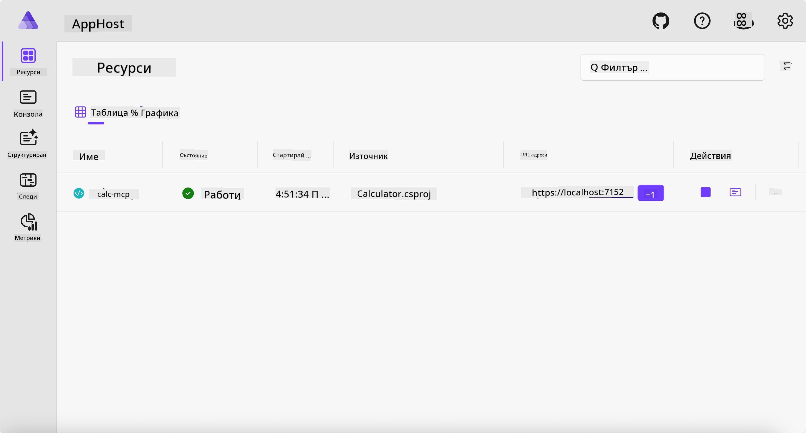
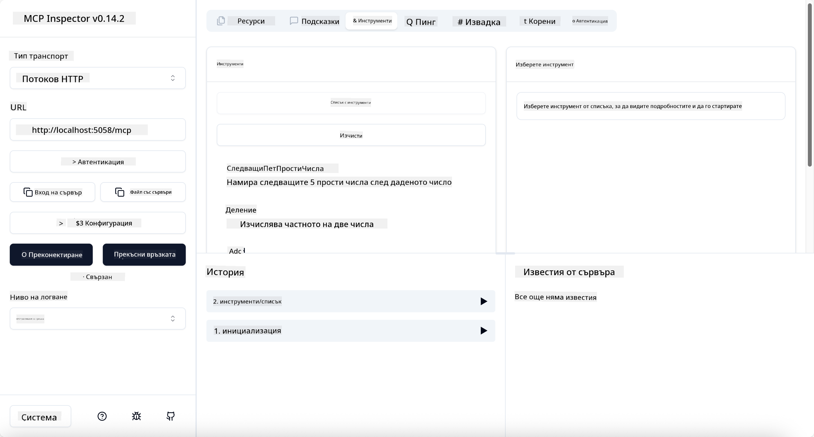

<!--
CO_OP_TRANSLATOR_METADATA:
{
  "original_hash": "0bc7bd48f55f1565f1d95ccb2c16f728",
  "translation_date": "2025-06-18T07:53:33+00:00",
  "source_file": "04-PracticalImplementation/samples/csharp/README.md",
  "language_code": "bg"
}
-->
# Пример

Предишният пример показва как да използвате локален .NET проект с типа `stdio`. И как да стартирате сървъра локално в контейнер. Това е добро решение в много ситуации. Въпреки това, може да е полезно сървърът да работи отдалечено, например в облачна среда. Тук идва типът `http`.

Когато разгледате решението в папката `04-PracticalImplementation`, може да изглежда много по-сложно от предишното. Но в действителност не е така. Ако погледнете внимателно проекта `src/Calculator`, ще видите, че кодът е почти същият като в предишния пример. Единствената разлика е, че използваме различна библиотека `ModelContextProtocol.AspNetCore` за обработка на HTTP заявките. И променяме метода `IsPrime`, за да го направим private, само за да покажем, че можете да имате private методи в кода си. Останалата част от кода е същата като преди.

Останалите проекти са от [.NET Aspire](https://learn.microsoft.com/dotnet/aspire/get-started/aspire-overview). Включването на .NET Aspire в решението подобрява опита на разработчика по време на разработка и тестване и помага с наблюдаемостта. Не е задължително за стартирането на сървъра, но е добра практика да го имате в решението си.

## Стартиране на сървъра локално

1. От VS Code (с разширението C# DevKit) отидете до директорията `04-PracticalImplementation/samples/csharp`.
1. Изпълнете следната команда, за да стартирате сървъра:

   ```bash
    dotnet watch run --project ./src/AppHost
   ```

1. Когато уеб браузър отвори таблото на .NET Aspire, обърнете внимание на URL адреса `http`. Той трябва да е нещо като `http://localhost:5058/`.

   

## Тест на Streamable HTTP с MCP Inspector

Ако имате Node.js версия 22.7.5 или по-нова, можете да използвате MCP Inspector за тестване на сървъра.

Стартирайте сървъра и изпълнете следната команда в терминал:

```bash
npx @modelcontextprotocol/inspector http://localhost:5058
```



- Изберете `Streamable HTTP` as the Transport type.
- In the Url field, enter the URL of the server noted earlier, and append `/mcp`. Той трябва да е `http` (а не `https`) something like `http://localhost:5058/mcp`.
- select the Connect button.

A nice thing about the Inspector is that it provide a nice visibility on what is happening.

- Try listing the available tools
- Try some of them, it should works just like before.

## Test MCP Server with GitHub Copilot Chat in VS Code

To use the Streamable HTTP transport with GitHub Copilot Chat, change the configuration of the `calc-mcp` сървър, създаден по-рано, за да изглежда така:

```jsonc
// .vscode/mcp.json
{
  "servers": {
    "calc-mcp": {
      "type": "http",
      "url": "http://localhost:5058/mcp"
    }
  }
}
```

Направете няколко теста:

- Попитайте за "3 прости числа след 6780". Обърнете внимание как Copilot ще използва новите инструменти `NextFivePrimeNumbers` и ще върне само първите 3 прости числа.
- Попитайте за "7 прости числа след 111", за да видите какво се случва.
- Попитайте "Джон има 24 близалки и иска да ги разпредели на трите си деца. Колко близалки получава всяко дете?", за да видите какво се случва.

## Разгръщане на сървъра в Azure

Нека разположим сървъра в Azure, за да могат повече хора да го използват.

От терминал отидете в папката `04-PracticalImplementation/samples/csharp` и изпълнете следната команда:

```bash
azd up
```

След като разгръщането приключи, трябва да видите съобщение като това:


Вземете URL адреса и го използвайте в MCP Inspector и в GitHub Copilot Chat.

```jsonc
// .vscode/mcp.json
{
  "servers": {
    "calc-mcp": {
      "type": "http",
      "url": "https://calc-mcp.gentleriver-3977fbcf.australiaeast.azurecontainerapps.io/mcp"
    }
  }
}
```

## Какво следва?

Ще изпробваме различни типове трансфер и инструменти за тестване. Също така ще разположим вашия MCP сървър в Azure. Но какво, ако нашият сървър трябва да има достъп до частни ресурси? Например база данни или частен API? В следващата глава ще разгледаме как можем да подобрим сигурността на нашия сървър.

**Отказ от отговорност**:  
Този документ е преведен с помощта на AI преводаческа услуга [Co-op Translator](https://github.com/Azure/co-op-translator). Въпреки че се стремим към точност, моля, имайте предвид, че автоматизираните преводи могат да съдържат грешки или неточности. Оригиналният документ на неговия роден език трябва да се счита за авторитетен източник. За критична информация се препоръчва професионален човешки превод. Ние не носим отговорност за каквито и да е недоразумения или погрешни тълкувания, произтичащи от използването на този превод.