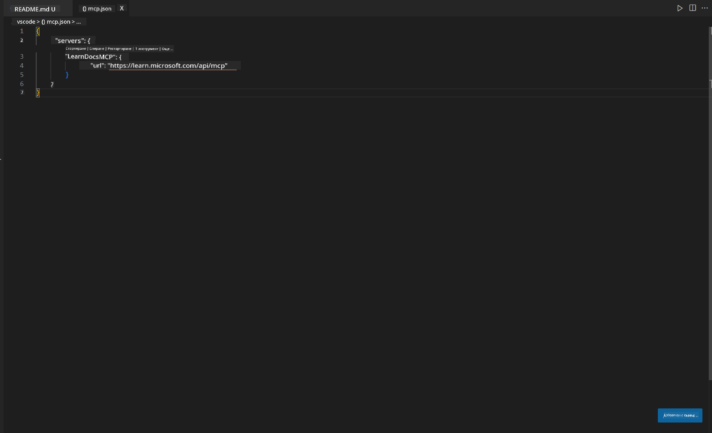

<!--
CO_OP_TRANSLATOR_METADATA:
{
  "original_hash": "db532b1ec386c9ce38c791653dc3c881",
  "translation_date": "2025-06-21T14:44:02+00:00",
  "source_file": "09-CaseStudy/docs-mcp/solution/scenario3/README.md",
  "language_code": "bg"
}
-->
# Сценарий 3: Документация в редактора с MCP сървър във VS Code

## Преглед

В този сценарий ще научите как да интегрирате Microsoft Learn Docs директно във вашата среда Visual Studio Code чрез MCP сървъра. Вместо постоянно да превключвате между браузърни табове, за да търсите документация, можете да достъпвате, търсите и препращате официални документи директно в редактора си. Този подход оптимизира работния ви процес, поддържа фокуса ви и позволява безпроблемна интеграция с инструменти като GitHub Copilot.

- Търсете и четете документация във VS Code, без да напускате средата за писане на код.
- Препращайте документация и вмъквайте линкове директно във вашите README или учебни файлове.
- Използвайте GitHub Copilot и MCP заедно за безпроблемен работен процес с документация, подпомогнат от AI.

## Учебни цели

След края на тази глава ще разбирате как да настроите и използвате MCP сървъра във VS Code, за да подобрите документацията и работния си процес по разработка. Ще можете да:

- Конфигурирате работното си пространство да използва MCP сървъра за търсене на документация.
- Търсите и вмъквате документация директно от VS Code.
- Комбинирате силата на GitHub Copilot и MCP за по-продуктивен работен процес, подпомогнат от AI.

Тези умения ще ви помогнат да останете съсредоточени, да подобрите качеството на документацията и да увеличите продуктивността си като разработчик или технически писател.

## Решение

За да постигнете достъп до документация в редактора, ще следвате поредица от стъпки, които интегрират MCP сървъра с VS Code и GitHub Copilot. Това решение е идеално за автори на курсове, технически писатели и разработчици, които искат да останат фокусирани в редактора, докато работят с документация и Copilot.

- Бързо добавяне на препратки към README, докато пишете курсова или проектна документация.
- Използвайте Copilot за генериране на код и MCP за моментално намиране и цитиране на релевантна документация.
- Останете съсредоточени в редактора и повишете продуктивността си.

### Подробно ръководство

За да започнете, следвайте тези стъпки. За всяка стъпка можете да добавите екранна снимка от папката assets, за да илюстрирате визуално процеса.

1. **Добавете MCP конфигурацията:**
   В корена на проекта си създайте файл `.vscode/mcp.json` и добавете следната конфигурация:
   ```json
   {
     "servers": {
       "LearnDocsMCP": {
         "url": "https://learn.microsoft.com/api/mcp"
       }
     }
   }
   ```
   Тази конфигурация казва на VS Code как да се свърже със [`Microsoft Learn Docs MCP server`](https://github.com/MicrosoftDocs/mcp).
   
   
    
2. **Отворете панела GitHub Copilot Chat:**
   Ако все още нямате инсталирано разширението GitHub Copilot, отидете в изгледа Extensions във VS Code и го инсталирайте. Можете да го изтеглите директно от [Visual Studio Code Marketplace](https://marketplace.visualstudio.com/items?itemName=GitHub.copilot-chat). След това отворете панела Copilot Chat от страничната лента.

   

3. **Активирайте agent mode и проверете инструментите:**
   В панела Copilot Chat включете agent mode.

   

   След активиране на agent mode, проверете дали MCP сървърът е в списъка с налични инструменти. Това гарантира, че Copilot агентът може да достъпва сървъра с документация, за да извлича релевантна информация.
   
   

4. **Започнете нов чат и задайте въпрос на агента:**
   Отворете нов чат в панела Copilot Chat. Сега можете да задавате на агента въпроси, свързани с документацията. Агентът ще използва MCP сървъра, за да извлече и покаже релевантна документация от Microsoft Learn директно в редактора.

   - *"Опитвам се да съставя учебен план за тема X. Ще я изучавам в продължение на 8 седмици, за всяка седмица предложи съдържание, което трябва да покрия."*

   

5. **Живо запитване:**

   > Нека вземем живо запитване от секцията [#get-help](https://discord.gg/D6cRhjHWSC) в Azure AI Foundry Discord ([виж оригиналното съобщение](https://discord.com/channels/1113626258182504448/1385498306720829572)):
   
   *"Търся отговори как да разположа мулти-агентско решение с AI агенти, разработени на Azure AI Foundry. Забелязах, че няма директен метод за разполагане, като например канали в Copilot Studio. Кои са различните начини за разполагане, които позволяват на корпоративни потребители да взаимодействат и да свършат работата?
Има много статии и блогове, които казват, че можем да използваме Azure Bot service за тази задача, който да действа като мост между MS Teams и Azure AI Foundry Agents. Работи ли това, ако настроя Azure бот, който се свързва с Orchestrator Agent в Azure AI Foundry чрез Azure function за координация, или трябва да създам Azure function за всеки AI агент в мулти-агентското решение, за да се извършва координацията в Bot framework? Други предложения са добре дошли."*

   

   Агентът ще отговори с релевантни линкове и обобщения на документация, които можете директно да вмъкнете във вашите markdown файлове или да използвате като препратки в кода си.
   
### Примерни запитвания

Ето няколко примерни запитвания, които можете да пробвате. Те ще демонстрират как MCP сървърът и Copilot могат да работят заедно, за да предоставят мигновена, контекстуално осъзната документация и препратки, без да напускате VS Code:

- "Покажи ми как се използват Azure Functions triggers."
- "Вмъкни линк към официалната документация за Azure Key Vault."
- "Кои са добрите практики за осигуряване на Azure ресурси?"
- "Намери quickstart за Azure AI услуги."

Тези запитвания ще демонстрират как MCP сървърът и Copilot работят заедно, за да предоставят мигновена, контекстуално осъзната документация и препратки, без да напускате VS Code.

---

**Отказ от отговорност**:  
Този документ е преведен с помощта на AI преводаческа услуга [Co-op Translator](https://github.com/Azure/co-op-translator). Въпреки че се стремим към точност, моля имайте предвид, че автоматизираните преводи могат да съдържат грешки или неточности. Оригиналният документ на неговия роден език трябва да се счита за авторитетен източник. За критична информация се препоръчва професионален човешки превод. Ние не носим отговорност за каквито и да е недоразумения или погрешни тълкувания, произтичащи от използването на този превод.