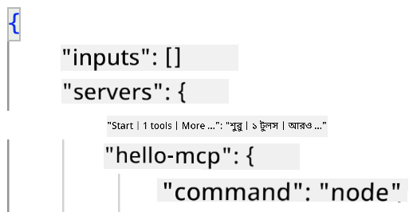

<!--
CO_OP_TRANSLATOR_METADATA:
{
  "original_hash": "8ea28e5e566edd5969337fd0b191ba3f",
  "translation_date": "2025-07-17T00:13:46+00:00",
  "source_file": "03-GettingStarted/04-vscode/README.md",
  "language_code": "bn"
}
-->
# GitHub Copilot Agent মোড থেকে একটি সার্ভার ব্যবহার করা

Visual Studio Code এবং GitHub Copilot একটি ক্লায়েন্ট হিসেবে কাজ করতে পারে এবং একটি MCP সার্ভার ব্যবহার করতে পারে। আপনি হয়তো ভাবছেন, আমরা কেন এটা করতে চাই? এর মানে হলো MCP সার্ভারের যেকোনো ফিচার এখন আপনার IDE থেকে সরাসরি ব্যবহার করা যাবে। ধরুন আপনি GitHub এর MCP সার্ভার যুক্ত করলেন, তাহলে টার্মিনালে নির্দিষ্ট কমান্ড টাইপ করার বদলে প্রম্পটের মাধ্যমে GitHub নিয়ন্ত্রণ করা যাবে। অথবা এমন কিছু কল্পনা করুন যা আপনার ডেভেলপার অভিজ্ঞতা উন্নত করতে পারে, সবকিছুই প্রাকৃতিক ভাষায় নিয়ন্ত্রণ করা যাবে। এখন আপনি বুঝতে পারছেন এর সুবিধা, তাই না?

## ওভারভিউ

এই পাঠে শেখানো হবে কিভাবে Visual Studio Code এবং GitHub Copilot এর Agent মোড ব্যবহার করে MCP সার্ভারের ক্লায়েন্ট হিসেবে কাজ করবেন।

## শেখার উদ্দেশ্য

এই পাঠ শেষ করার পর আপনি পারবেন:

- Visual Studio Code এর মাধ্যমে MCP সার্ভার ব্যবহার করা।
- GitHub Copilot এর মাধ্যমে টুলসের মতো ক্ষমতা চালানো।
- Visual Studio Code কনফিগার করে আপনার MCP সার্ভার খুঁজে বের করা এবং পরিচালনা করা।

## ব্যবহার

আপনি দুইভাবে আপনার MCP সার্ভার নিয়ন্ত্রণ করতে পারেন:

- ইউজার ইন্টারফেস, যা এই অধ্যায়ের পরের অংশে দেখানো হবে।
- টার্মিনাল, `code` এক্সিকিউটেবল ব্যবহার করে টার্মিনাল থেকে নিয়ন্ত্রণ করা সম্ভব:

  আপনার ইউজার প্রোফাইলে একটি MCP সার্ভার যোগ করতে --add-mcp কমান্ড লাইন অপশন ব্যবহার করুন এবং JSON সার্ভার কনফিগারেশন দিন যেমন {\"name\":\"server-name\",\"command\":...}।

  ```
  code --add-mcp "{\"name\":\"my-server\",\"command\": \"uvx\",\"args\": [\"mcp-server-fetch\"]}"
  ```

### স্ক্রিনশট


পরবর্তী অংশে আমরা ভিজ্যুয়াল ইন্টারফেস কিভাবে ব্যবহার করব তা বিস্তারিত আলোচনা করব।

## পদ্ধতি

উচ্চ স্তরে আমাদের এভাবে এগোতে হবে:

- একটি ফাইল কনফিগার করে MCP সার্ভার খুঁজে বের করা।
- সার্ভার চালু/সংযোগ করা এবং তার ক্ষমতাগুলো তালিকাভুক্ত করা।
- GitHub Copilot Chat ইন্টারফেসের মাধ্যমে ঐ ক্ষমতাগুলো ব্যবহার করা।

দারুণ, এখন আমরা প্রবাহ বুঝে গেছি, চলুন একটি অনুশীলনের মাধ্যমে Visual Studio Code থেকে MCP সার্ভার ব্যবহার করার চেষ্টা করি।

## অনুশীলন: একটি সার্ভার ব্যবহার করা

এই অনুশীলনে, আমরা Visual Studio Code কনফিগার করব যাতে এটি আপনার MCP সার্ভার খুঁজে পায় এবং GitHub Copilot Chat ইন্টারফেস থেকে ব্যবহার করা যায়।

### -0- প্রাথমিক ধাপ, MCP সার্ভার ডিসকভারি সক্রিয় করা

আপনাকে MCP সার্ভার ডিসকভারি সক্রিয় করতে হতে পারে।

1. Visual Studio Code এ `File -> Preferences -> Settings` এ যান।

1. "MCP" সার্চ করুন এবং settings.json ফাইলে `chat.mcp.discovery.enabled` সক্রিয় করুন।

### -1- কনফিগ ফাইল তৈরি করা

প্রজেক্ট রুটে একটি কনফিগ ফাইল তৈরি করুন, যার নাম হবে MCP.json এবং এটি .vscode ফোল্ডারে রাখতে হবে। এরকম দেখতে হবে:

```text
.vscode
|-- mcp.json
```

এরপর, কিভাবে একটি সার্ভার এন্ট্রি যোগ করবেন তা দেখা যাক।

### -2- একটি সার্ভার কনফিগার করা

*mcp.json* এ নিম্নলিখিত বিষয়বস্তু যোগ করুন:

```json
{
    "inputs": [],
    "servers": {
       "hello-mcp": {
           "command": "node",
           "args": [
               "build/index.js"
           ]
       }
    }
}
```

উপরের উদাহরণে Node.js এ লেখা একটি সার্ভার শুরু করার সহজ পদ্ধতি দেখানো হয়েছে, অন্য রানটাইমের জন্য `command` এবং `args` ব্যবহার করে সঠিক কমান্ড উল্লেখ করুন।

### -3- সার্ভার চালু করা

এখন আপনি একটি এন্ট্রি যোগ করেছেন, চলুন সার্ভার চালু করি:

1. *mcp.json* এ আপনার এন্ট্রি খুঁজে নিন এবং নিশ্চিত করুন "play" আইকন দেখতে পাচ্ছেন:

    

1. "play" আইকনে ক্লিক করুন, GitHub Copilot Chat এ টুলস আইকনের পাশে উপলব্ধ টুলসের সংখ্যা বাড়তে দেখবেন। ঐ টুলস আইকনে ক্লিক করলে নিবন্ধিত টুলসের তালিকা দেখতে পাবেন। আপনি প্রতিটি টুল চেক/আনচেক করতে পারবেন, যা নির্ধারণ করবে GitHub Copilot সেগুলোকে প্রসঙ্গ হিসেবে ব্যবহার করবে কিনা:

  

1. একটি টুল চালাতে, এমন একটি প্রম্পট টাইপ করুন যা আপনার টুলের বর্ণনার সাথে মেলে, যেমন "add 22 to 1":

  

  আপনি ২৩ ফলাফল হিসেবে দেখতে পাবেন।

## অ্যাসাইনমেন্ট

আপনার *mcp.json* ফাইলে একটি সার্ভার এন্ট্রি যোগ করার চেষ্টা করুন এবং নিশ্চিত করুন আপনি সার্ভার চালু/বন্ধ করতে পারেন। এছাড়াও GitHub Copilot Chat ইন্টারফেসের মাধ্যমে সার্ভারের টুলসের সাথে যোগাযোগ করতে পারেন।

## সমাধান

[Solution](./solution/README.md)

## মূল বিষয়সমূহ

এই অধ্যায় থেকে যা শিখবেন:

- Visual Studio Code একটি চমৎকার ক্লায়েন্ট যা আপনাকে একাধিক MCP সার্ভার এবং তাদের টুলস ব্যবহার করতে দেয়।
- GitHub Copilot Chat ইন্টারফেসের মাধ্যমে আপনি সার্ভারগুলোর সাথে ইন্টারঅ্যাক্ট করেন।
- আপনি ব্যবহারকারীর কাছ থেকে API কী-এর মতো ইনপুট চাইতে পারেন যা MCP সার্ভার কনফিগার করার সময় *mcp.json* ফাইলে পাস করা যায়।

## নমুনা

- [Java Calculator](../samples/java/calculator/README.md)
- [.Net Calculator](../../../../03-GettingStarted/samples/csharp)
- [JavaScript Calculator](../samples/javascript/README.md)
- [TypeScript Calculator](../samples/typescript/README.md)
- [Python Calculator](../../../../03-GettingStarted/samples/python)

## অতিরিক্ত সম্পদ

- [Visual Studio ডকুমেন্টেশন](https://code.visualstudio.com/docs/copilot/chat/mcp-servers)

## পরবর্তী ধাপ

- পরবর্তী: [SSE সার্ভার তৈরি করা](../05-sse-server/README.md)

**অস্বীকৃতি**:  
এই নথিটি AI অনুবাদ সেবা [Co-op Translator](https://github.com/Azure/co-op-translator) ব্যবহার করে অনূদিত হয়েছে। আমরা যথাসাধ্য সঠিকতার চেষ্টা করি, তবে স্বয়ংক্রিয় অনুবাদে ত্রুটি বা অসঙ্গতি থাকতে পারে। মূল নথিটি তার নিজস্ব ভাষায়ই কর্তৃত্বপূর্ণ উৎস হিসেবে বিবেচনা করা উচিত। গুরুত্বপূর্ণ তথ্যের জন্য পেশাদার মানব অনুবাদ গ্রহণ করার পরামর্শ দেওয়া হয়। এই অনুবাদের ব্যবহারে সৃষ্ট কোনো ভুল বোঝাবুঝি বা ভুল ব্যাখ্যার জন্য আমরা দায়ী নই।