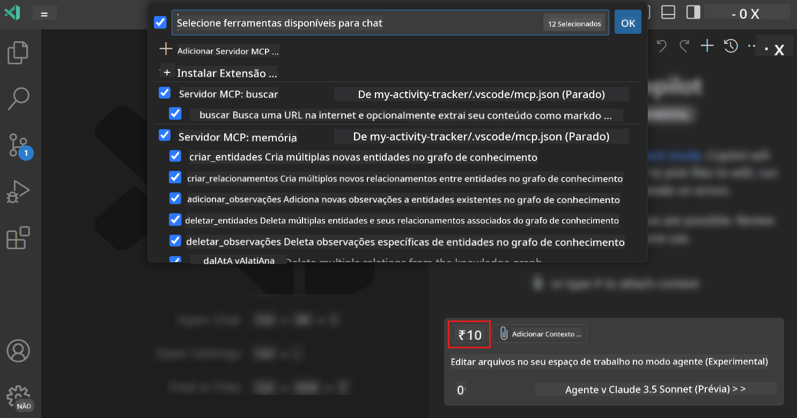

<!--
CO_OP_TRANSLATOR_METADATA:
{
  "original_hash": "8ea28e5e566edd5969337fd0b191ba3f",
  "translation_date": "2025-07-17T01:09:07+00:00",
  "source_file": "03-GettingStarted/04-vscode/README.md",
  "language_code": "br"
}
-->
# Consumindo um servidor no modo GitHub Copilot Agent

Visual Studio Code e GitHub Copilot podem atuar como clientes e consumir um MCP Server. Você pode estar se perguntando: por que faríamos isso? Bem, isso significa que qualquer funcionalidade que o MCP Server ofereça pode ser usada diretamente dentro do seu IDE. Imagine, por exemplo, adicionar o MCP server do GitHub, isso permitiria controlar o GitHub via prompts, em vez de digitar comandos específicos no terminal. Ou imagine qualquer outra coisa que possa melhorar sua experiência como desenvolvedor, tudo controlado por linguagem natural. Agora você começa a ver a vantagem, certo?

## Visão Geral

Esta lição explica como usar o Visual Studio Code e o modo Agent do GitHub Copilot como cliente para o seu MCP Server.

## Objetivos de Aprendizagem

Ao final desta lição, você será capaz de:

- Consumir um MCP Server via Visual Studio Code.
- Executar funcionalidades como ferramentas via GitHub Copilot.
- Configurar o Visual Studio Code para localizar e gerenciar seu MCP Server.

## Uso

Você pode controlar seu MCP server de duas formas diferentes:

- Interface do usuário, você verá como isso é feito mais adiante neste capítulo.
- Terminal, é possível controlar o servidor pelo terminal usando o executável `code`:

  Para adicionar um MCP server ao seu perfil de usuário, use a opção de linha de comando --add-mcp e forneça a configuração do servidor em JSON no formato {\"name\":\"server-name\",\"command\":...}.

  ```
  code --add-mcp "{\"name\":\"my-server\",\"command\": \"uvx\",\"args\": [\"mcp-server-fetch\"]}"
  ```

### Capturas de Tela





Vamos falar mais sobre como usar a interface visual nas próximas seções.

## Abordagem

Aqui está como devemos proceder em alto nível:

- Configurar um arquivo para localizar nosso MCP Server.
- Iniciar/Conectar ao servidor para que ele liste suas funcionalidades.
- Usar essas funcionalidades através da interface do GitHub Copilot Chat.

Ótimo, agora que entendemos o fluxo, vamos tentar usar um MCP Server pelo Visual Studio Code em um exercício.

## Exercício: Consumindo um servidor

Neste exercício, vamos configurar o Visual Studio Code para localizar seu MCP server para que ele possa ser usado pela interface do GitHub Copilot Chat.

### -0- Passo prévio, habilitar descoberta do MCP Server

Pode ser necessário habilitar a descoberta dos MCP Servers.

1. Vá em `File -> Preferences -> Settings` no Visual Studio Code.

1. Procure por "MCP" e habilite `chat.mcp.discovery.enabled` no arquivo settings.json.

### -1- Criar arquivo de configuração

Comece criando um arquivo de configuração na raiz do seu projeto, você precisará de um arquivo chamado MCP.json dentro de uma pasta chamada .vscode. Deve ficar assim:

```text
.vscode
|-- mcp.json
```

Agora, vamos ver como adicionar uma entrada de servidor.

### -2- Configurar um servidor

Adicione o seguinte conteúdo ao *mcp.json*:

```json
{
    "inputs": [],
    "servers": {
       "hello-mcp": {
           "command": "node",
           "args": [
               "build/index.js"
           ]
       }
    }
}
```

Acima temos um exemplo simples de como iniciar um servidor escrito em Node.js; para outras plataformas, indique o comando correto para iniciar o servidor usando `command` e `args`.

### -3- Iniciar o servidor

Agora que você adicionou uma entrada, vamos iniciar o servidor:

1. Localize sua entrada em *mcp.json* e certifique-se de encontrar o ícone de "play":

    

1. Clique no ícone de "play", você deverá ver o ícone de ferramentas no GitHub Copilot Chat aumentar o número de ferramentas disponíveis. Se clicar nesse ícone, verá uma lista das ferramentas registradas. Você pode marcar/desmarcar cada ferramenta dependendo se deseja que o GitHub Copilot as use como contexto:

  

1. Para executar uma ferramenta, digite um prompt que você sabe que corresponde à descrição de uma das suas ferramentas, por exemplo, um prompt como "add 22 to 1":

  

  Você deverá ver uma resposta dizendo 23.

## Tarefa

Tente adicionar uma entrada de servidor no seu arquivo *mcp.json* e certifique-se de que consegue iniciar/parar o servidor. Verifique também se consegue se comunicar com as ferramentas do seu servidor via interface do GitHub Copilot Chat.

## Solução

[Solution](./solution/README.md)

## Principais Lições

Os principais aprendizados deste capítulo são:

- Visual Studio Code é um ótimo cliente que permite consumir vários MCP Servers e suas ferramentas.
- A interface do GitHub Copilot Chat é como você interage com os servidores.
- Você pode solicitar ao usuário entradas como chaves de API que podem ser passadas para o MCP Server ao configurar a entrada do servidor no arquivo *mcp.json*.

## Exemplos

- [Java Calculator](../samples/java/calculator/README.md)
- [.Net Calculator](../../../../03-GettingStarted/samples/csharp)
- [JavaScript Calculator](../samples/javascript/README.md)
- [TypeScript Calculator](../samples/typescript/README.md)
- [Python Calculator](../../../../03-GettingStarted/samples/python)

## Recursos Adicionais

- [Visual Studio docs](https://code.visualstudio.com/docs/copilot/chat/mcp-servers)

## Próximos Passos

- Próximo: [Criando um SSE Server](../05-sse-server/README.md)

**Aviso Legal**:  
Este documento foi traduzido utilizando o serviço de tradução por IA [Co-op Translator](https://github.com/Azure/co-op-translator). Embora nos esforcemos para garantir a precisão, esteja ciente de que traduções automáticas podem conter erros ou imprecisões. O documento original em seu idioma nativo deve ser considerado a fonte autorizada. Para informações críticas, recomenda-se tradução profissional humana. Não nos responsabilizamos por quaisquer mal-entendidos ou interpretações incorretas decorrentes do uso desta tradução.