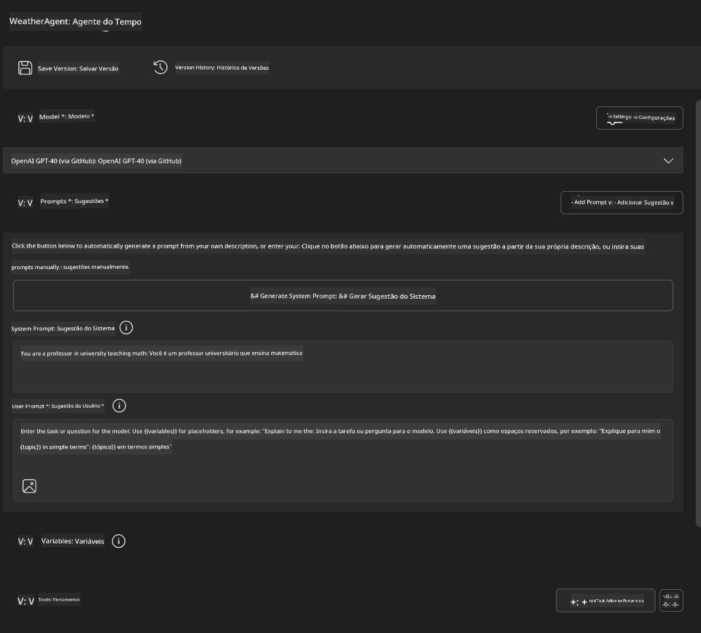
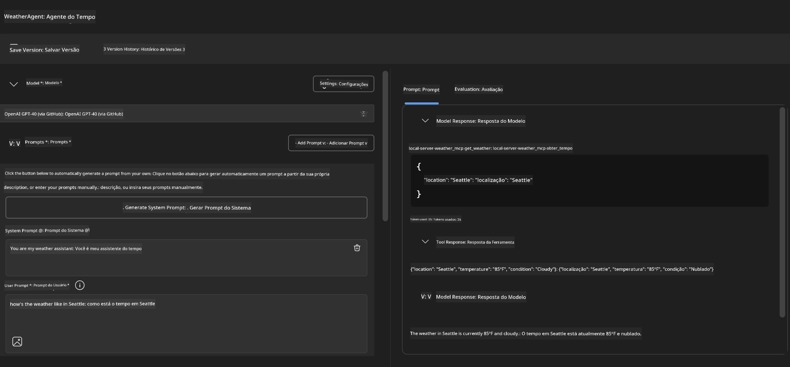
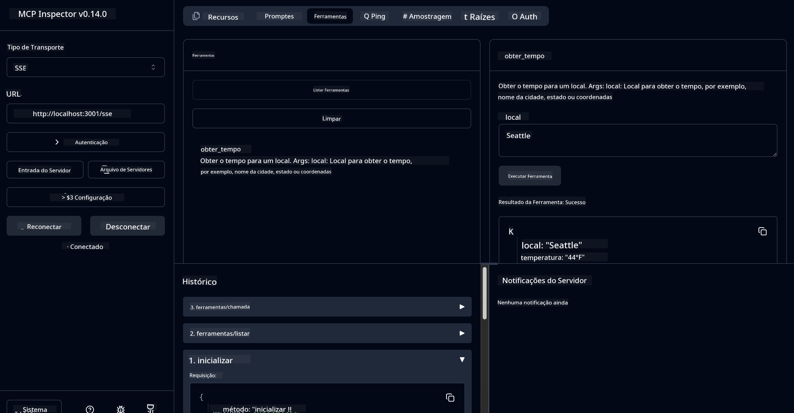

<!--
CO_OP_TRANSLATOR_METADATA:
{
  "original_hash": "dd8da3f75addcef453fe11f02a270217",
  "translation_date": "2025-06-10T06:09:25+00:00",
  "source_file": "10-StreamliningAIWorkflowsBuildingAnMCPServerWithAIToolkit/lab3/README.md",
  "language_code": "br"
}
-->
# 🔧 Module 3: Desenvolvimento Avançado de MCP com AI Toolkit


## 🎯 Objetivos de Aprendizagem

Ao final deste laboratório, você será capaz de:

- ✅ Criar servidores MCP personalizados usando o AI Toolkit
- ✅ Configurar e usar o SDK Python MCP mais recente (v1.9.3)
- ✅ Configurar e utilizar o MCP Inspector para depuração
- ✅ Depurar servidores MCP tanto no Agent Builder quanto no Inspector
- ✅ Entender fluxos avançados de desenvolvimento de servidores MCP

## 📋 Pré-requisitos

- Conclusão do Lab 2 (Fundamentos do MCP)
- VS Code com a extensão AI Toolkit instalada
- Ambiente Python 3.10+
- Node.js e npm para configuração do Inspector

## 🏗️ O que você vai construir

Neste laboratório, você vai criar um **Servidor MCP de Clima** que demonstra:
- Implementação personalizada de servidor MCP
- Integração com o AI Toolkit Agent Builder
- Fluxos profissionais de depuração
- Padrões modernos de uso do SDK MCP

---

## 🔧 Visão Geral dos Componentes Principais

### 🐍 MCP Python SDK
O SDK Python do Model Context Protocol fornece a base para construir servidores MCP personalizados. Você usará a versão 1.9.3 com capacidades aprimoradas de depuração.

### 🔍 MCP Inspector
Uma ferramenta poderosa de depuração que oferece:
- Monitoramento em tempo real do servidor
- Visualização da execução das ferramentas
- Inspeção das requisições/respostas de rede
- Ambiente interativo de testes

---

## 📖 Implementação Passo a Passo

### Passo 1: Crie um WeatherAgent no Agent Builder

1. **Abra o Agent Builder** no VS Code através da extensão AI Toolkit
2. **Crie um novo agente** com a seguinte configuração:
   - Nome do Agente: `WeatherAgent`



### Passo 2: Inicialize o Projeto do Servidor MCP

1. **Vá em Ferramentas** → **Adicionar Ferramenta** no Agent Builder
2. **Selecione "MCP Server"** entre as opções disponíveis
3. **Escolha "Criar um novo Servidor MCP"**
4. **Selecione o template `python-weather`**
5. **Dê um nome ao seu servidor:** `weather_mcp`


### Passo 3: Abra e Analise o Projeto

1. **Abra o projeto gerado** no VS Code
2. **Revise a estrutura do projeto:**
   ```
   weather_mcp/
   ├── src/
   │   ├── __init__.py
   │   └── server.py
   ├── inspector/
   │   ├── package.json
   │   └── package-lock.json
   ├── .vscode/
   │   ├── launch.json
   │   └── tasks.json
   ├── pyproject.toml
   └── README.md
   ```

### Passo 4: Atualize para o SDK MCP Mais Recente

> **🔍 Por que atualizar?** Queremos usar o SDK MCP mais recente (v1.9.3) e o serviço Inspector (0.14.0) para recursos avançados e melhor depuração.

#### 4a. Atualize as Dependências Python

**Edite `pyproject.toml`:** update [./code/weather_mcp/pyproject.toml](../../../../10-StreamliningAIWorkflowsBuildingAnMCPServerWithAIToolkit/lab3/code/weather_mcp/pyproject.toml)


#### 4b. Update Inspector Configuration

**Edit `inspector/package.json`:** update [./code/weather_mcp/inspector/package.json](../../../../10-StreamliningAIWorkflowsBuildingAnMCPServerWithAIToolkit/lab3/code/weather_mcp/inspector/package.json)

#### 4c. Update Inspector Dependencies

**Edit `inspector/package-lock.json`:** update [./code/weather_mcp/inspector/package-lock.json](../../../../10-StreamliningAIWorkflowsBuildingAnMCPServerWithAIToolkit/lab3/code/weather_mcp/inspector/package-lock.json)

> **📝 Note:** This file contains extensive dependency definitions. Below is the essential structure - the full content ensures proper dependency resolution.


> **⚡ Full Package Lock:** The complete package-lock.json contains ~3000 lines of dependency definitions. The above shows the key structure - use the provided file for complete dependency resolution.

### Step 5: Configure VS Code Debugging

*Note: Please copy the file in the specified path to replace the corresponding local file*

#### 5a. Update Launch Configuration

**Edit `.vscode/launch.json`:**

```json
{
  "version": "0.2.0",
  "configurations": [
    {
      "name": "Attach to Local MCP",
      "type": "debugpy",
      "request": "attach",
      "connect": {
        "host": "localhost",
        "port": 5678
      },
      "presentation": {
        "hidden": true
      },
      "internalConsoleOptions": "neverOpen",
      "postDebugTask": "Terminate All Tasks"
    },
    {
      "name": "Launch Inspector (Edge)",
      "type": "msedge",
      "request": "launch",
      "url": "http://localhost:6274?timeout=60000&serverUrl=http://localhost:3001/sse#tools",
      "cascadeTerminateToConfigurations": [
        "Attach to Local MCP"
      ],
      "presentation": {
        "hidden": true
      },
      "internalConsoleOptions": "neverOpen"
    },
    {
      "name": "Launch Inspector (Chrome)",
      "type": "chrome",
      "request": "launch",
      "url": "http://localhost:6274?timeout=60000&serverUrl=http://localhost:3001/sse#tools",
      "cascadeTerminateToConfigurations": [
        "Attach to Local MCP"
      ],
      "presentation": {
        "hidden": true
      },
      "internalConsoleOptions": "neverOpen"
    }
  ],
  "compounds": [
    {
      "name": "Debug in Agent Builder",
      "configurations": [
        "Attach to Local MCP"
      ],
      "preLaunchTask": "Open Agent Builder",
    },
    {
      "name": "Debug in Inspector (Edge)",
      "configurations": [
        "Launch Inspector (Edge)",
        "Attach to Local MCP"
      ],
      "preLaunchTask": "Start MCP Inspector",
      "stopAll": true
    },
    {
      "name": "Debug in Inspector (Chrome)",
      "configurations": [
        "Launch Inspector (Chrome)",
        "Attach to Local MCP"
      ],
      "preLaunchTask": "Start MCP Inspector",
      "stopAll": true
    }
  ]
}
```

**Edite `.vscode/tasks.json`:**

```
{
  "version": "2.0.0",
  "tasks": [
    {
      "label": "Start MCP Server",
      "type": "shell",
      "command": "python -m debugpy --listen 127.0.0.1:5678 src/__init__.py sse",
      "isBackground": true,
      "options": {
        "cwd": "${workspaceFolder}",
        "env": {
          "PORT": "3001"
        }
      },
      "problemMatcher": {
        "pattern": [
          {
            "regexp": "^.*$",
            "file": 0,
            "location": 1,
            "message": 2
          }
        ],
        "background": {
          "activeOnStart": true,
          "beginsPattern": ".*",
          "endsPattern": "Application startup complete|running"
        }
      }
    },
    {
      "label": "Start MCP Inspector",
      "type": "shell",
      "command": "npm run dev:inspector",
      "isBackground": true,
      "options": {
        "cwd": "${workspaceFolder}/inspector",
        "env": {
          "CLIENT_PORT": "6274",
          "SERVER_PORT": "6277",
        }
      },
      "problemMatcher": {
        "pattern": [
          {
            "regexp": "^.*$",
            "file": 0,
            "location": 1,
            "message": 2
          }
        ],
        "background": {
          "activeOnStart": true,
          "beginsPattern": "Starting MCP inspector",
          "endsPattern": "Proxy server listening on port"
        }
      },
      "dependsOn": [
        "Start MCP Server"
      ]
    },
    {
      "label": "Open Agent Builder",
      "type": "shell",
      "command": "echo ${input:openAgentBuilder}",
      "presentation": {
        "reveal": "never"
      },
      "dependsOn": [
        "Start MCP Server"
      ],
    },
    {
      "label": "Terminate All Tasks",
      "command": "echo ${input:terminate}",
      "type": "shell",
      "problemMatcher": []
    }
  ],
  "inputs": [
    {
      "id": "openAgentBuilder",
      "type": "command",
      "command": "ai-mlstudio.agentBuilder",
      "args": {
        "initialMCPs": [ "local-server-weather_mcp" ],
        "triggeredFrom": "vsc-tasks"
      }
    },
    {
      "id": "terminate",
      "type": "command",
      "command": "workbench.action.tasks.terminate",
      "args": "terminateAll"
    }
  ]
}
```


---

## 🚀 Executando e Testando seu Servidor MCP

### Passo 6: Instale as Dependências

Após as alterações de configuração, execute os comandos abaixo:

**Instale as dependências Python:**
```bash
uv sync
```

**Instale as dependências do Inspector:**
```bash
cd inspector
npm install
```

### Passo 7: Depure com o Agent Builder

1. **Pressione F5** ou use a configuração **"Debug in Agent Builder"**
2. **Selecione a configuração composta** no painel de depuração
3. **Aguarde o servidor iniciar** e o Agent Builder abrir
4. **Teste seu servidor MCP de clima** com consultas em linguagem natural

Insira o prompt assim

SYSTEM_PROMPT

```
You are my weather assistant
```

USER_PROMPT

```
How's the weather like in Seattle
```



### Passo 8: Depure com o MCP Inspector

1. **Use a configuração "Debug in Inspector"** (Edge ou Chrome)
2. **Abra a interface do Inspector** em `http://localhost:6274`
3. **Explore o ambiente interativo de testes:**
   - Veja as ferramentas disponíveis
   - Teste a execução das ferramentas
   - Monitore requisições de rede
   - Depure as respostas do servidor



---

## 🎯 Resultados Principais de Aprendizagem

Ao concluir este laboratório, você:

- [x] **Criou um servidor MCP personalizado** usando templates do AI Toolkit
- [x] **Atualizou para o SDK MCP mais recente** (v1.9.3) para funcionalidades avançadas
- [x] **Configurou fluxos profissionais de depuração** para Agent Builder e Inspector
- [x] **Configurou o MCP Inspector** para testes interativos do servidor
- [x] **Dominou configurações de depuração no VS Code** para desenvolvimento MCP

## 🔧 Recursos Avançados Explorados

| Recurso | Descrição | Caso de Uso |
|---------|-------------|----------|
| **MCP Python SDK v1.9.3** | Implementação do protocolo mais recente | Desenvolvimento moderno de servidores |
| **MCP Inspector 0.14.0** | Ferramenta interativa de depuração | Testes em tempo real do servidor |
| **Depuração no VS Code** | Ambiente integrado de desenvolvimento | Fluxo profissional de depuração |
| **Integração com Agent Builder** | Conexão direta com AI Toolkit | Testes completos de agentes |

## 📚 Recursos Adicionais

- [MCP Python SDK Documentation](https://modelcontextprotocol.io/docs/sdk/python)
- [AI Toolkit Extension Guide](https://code.visualstudio.com/docs/ai/ai-toolkit)
- [VS Code Debugging Documentation](https://code.visualstudio.com/docs/editor/debugging)
- [Model Context Protocol Specification](https://modelcontextprotocol.io/docs/concepts/architecture)

---

**🎉 Parabéns!** Você concluiu com sucesso o Lab 3 e agora pode criar, depurar e implantar servidores MCP personalizados usando fluxos profissionais de desenvolvimento.

### 🔜 Continue para o Próximo Módulo

Pronto para aplicar suas habilidades MCP em um fluxo de desenvolvimento real? Continue para **[Module 4: Practical MCP Development - Custom GitHub Clone Server](../lab4/README.md)** onde você vai:
- Construir um servidor MCP pronto para produção que automatiza operações de repositórios GitHub
- Implementar funcionalidade de clonagem de repositórios GitHub via MCP
- Integrar servidores MCP personalizados com VS Code e GitHub Copilot Agent Mode
- Testar e implantar servidores MCP personalizados em ambientes de produção
- Aprender automação prática de fluxos de trabalho para desenvolvedores

**Aviso Legal**:  
Este documento foi traduzido utilizando o serviço de tradução por IA [Co-op Translator](https://github.com/Azure/co-op-translator). Embora nos esforcemos para garantir a precisão, por favor, esteja ciente de que traduções automáticas podem conter erros ou imprecisões. O documento original em seu idioma nativo deve ser considerado a fonte autorizada. Para informações críticas, recomenda-se a tradução profissional feita por humanos. Não nos responsabilizamos por quaisquer mal-entendidos ou interpretações incorretas decorrentes do uso desta tradução.