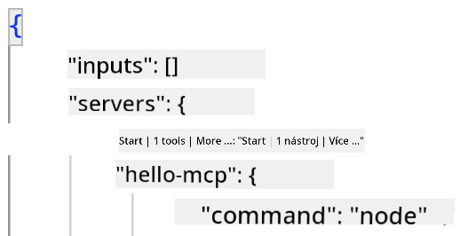
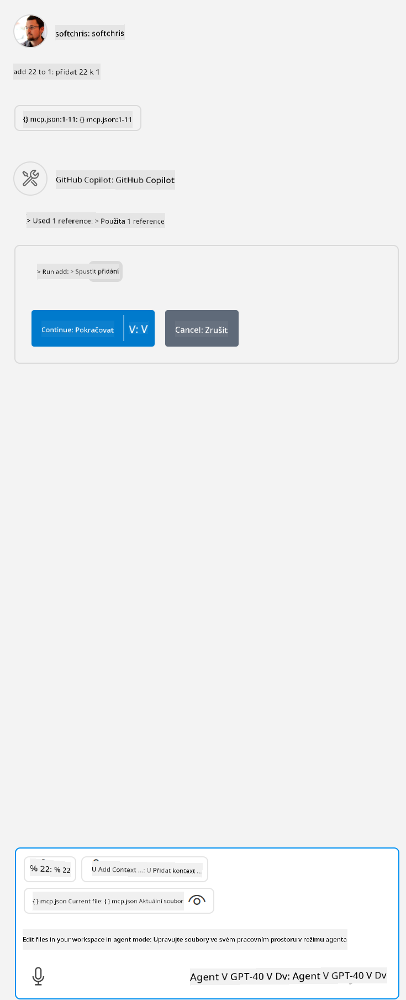

<!--
CO_OP_TRANSLATOR_METADATA:
{
  "original_hash": "8ea28e5e566edd5969337fd0b191ba3f",
  "translation_date": "2025-07-17T10:48:37+00:00",
  "source_file": "03-GettingStarted/04-vscode/README.md",
  "language_code": "cs"
}
-->
# Používání serveru v režimu GitHub Copilot Agent

Visual Studio Code a GitHub Copilot mohou fungovat jako klient a využívat MCP Server. Proč bychom to chtěli dělat, možná se ptáte? Znamená to, že všechny funkce MCP Serveru můžete nyní používat přímo ve svém IDE. Představte si například, že přidáte GitHubův MCP server, což by umožnilo ovládat GitHub pomocí příkazů v přirozeném jazyce místo psaní konkrétních příkazů v terminálu. Nebo si představte cokoliv, co by mohlo zlepšit váš vývojářský zážitek, a to vše ovládané přirozeným jazykem. Už vidíte ten přínos, že?

## Přehled

Tato lekce ukazuje, jak používat Visual Studio Code a režim GitHub Copilot Agent jako klienta pro váš MCP Server.

## Cíle učení

Na konci této lekce budete umět:

- Využívat MCP Server přes Visual Studio Code.
- Spouštět funkce jako nástroje přes GitHub Copilot.
- Nastavit Visual Studio Code tak, aby našel a spravoval váš MCP Server.

## Použití

Můžete ovládat svůj MCP server dvěma způsoby:

- Uživatelské rozhraní, ukážeme si to později v této kapitole.
- Terminál, je možné ovládat věci z terminálu pomocí spustitelného souboru `code`:

  Pro přidání MCP serveru do vašeho uživatelského profilu použijte příkazovou volbu --add-mcp a poskytněte konfiguraci serveru ve formátu JSON jako {\"name\":\"server-name\",\"command\":...}.

  ```
  code --add-mcp "{\"name\":\"my-server\",\"command\": \"uvx\",\"args\": [\"mcp-server-fetch\"]}"
  ```

### Snímky obrazovky


V dalších částech si podrobněji povíme, jak používat vizuální rozhraní.

## Přístup

Tady je, jak k tomu musíme přistoupit na vysoké úrovni:

- Nastavit soubor, který najde náš MCP Server.
- Spustit/Připojit se k serveru, aby vypsal své schopnosti.
- Používat tyto schopnosti přes rozhraní GitHub Copilot Chat.

Skvěle, teď když rozumíme postupu, pojďme si vyzkoušet použití MCP Serveru ve Visual Studio Code v praktickém cvičení.

## Cvičení: Používání serveru

V tomto cvičení nakonfigurujeme Visual Studio Code tak, aby našel váš MCP server a mohl být použit přes rozhraní GitHub Copilot Chat.

### -0- Předkrok, povolení objevování MCP Serverů

Možná budete muset povolit objevování MCP Serverů.

1. V Visual Studio Code přejděte na `Soubor -> Předvolby -> Nastavení`.

1. Vyhledejte "MCP" a povolte `chat.mcp.discovery.enabled` v souboru settings.json.

### -1- Vytvoření konfiguračního souboru

Začněte vytvořením konfiguračního souboru v kořenovém adresáři projektu, budete potřebovat soubor s názvem MCP.json, který umístíte do složky .vscode. Měl by vypadat takto:

```text
.vscode
|-- mcp.json
```

Dále si ukážeme, jak přidat záznam serveru.

### -2- Konfigurace serveru

Přidejte následující obsah do *mcp.json*:

```json
{
    "inputs": [],
    "servers": {
       "hello-mcp": {
           "command": "node",
           "args": [
               "build/index.js"
           ]
       }
    }
}
```

Výše je jednoduchý příklad, jak spustit server napsaný v Node.js, pro jiné runtime uveďte správný příkaz pro spuštění serveru pomocí `command` a `args`.

### -3- Spuštění serveru

Nyní, když jste přidali záznam, spusťte server:

1. Najděte svůj záznam v *mcp.json* a ujistěte se, že vidíte ikonu "play":

    

1. Klikněte na ikonu "play", měli byste vidět, že ikona nástrojů v GitHub Copilot Chat se zvětší o počet dostupných nástrojů. Pokud na tuto ikonu kliknete, uvidíte seznam registrovaných nástrojů. Můžete je zaškrtnout nebo odškrtnout podle toho, zda chcete, aby je GitHub Copilot používal jako kontext:

  

1. Pro spuštění nástroje napište prompt, o kterém víte, že odpovídá popisu některého z vašich nástrojů, například prompt „add 22 to 1“:

  

  Měli byste vidět odpověď s výsledkem 23.

## Zadání

Zkuste přidat záznam serveru do svého *mcp.json* souboru a ujistěte se, že můžete server spustit a zastavit. Také ověřte, že můžete komunikovat s nástroji na serveru přes rozhraní GitHub Copilot Chat.

## Řešení

[Řešení](./solution/README.md)

## Hlavní poznatky

Hlavní poznatky z této kapitoly jsou:

- Visual Studio Code je skvělý klient, který umožňuje využívat více MCP Serverů a jejich nástrojů.
- Rozhraní GitHub Copilot Chat je způsob, jak komunikovat se servery.
- Můžete vyzvat uživatele k zadání vstupů, jako jsou API klíče, které lze předat MCP Serveru při konfiguraci záznamu serveru v souboru *mcp.json*.

## Ukázky

- [Java Calculator](../samples/java/calculator/README.md)
- [.Net Calculator](../../../../03-GettingStarted/samples/csharp)
- [JavaScript Calculator](../samples/javascript/README.md)
- [TypeScript Calculator](../samples/typescript/README.md)
- [Python Calculator](../../../../03-GettingStarted/samples/python)

## Další zdroje

- [Visual Studio dokumentace](https://code.visualstudio.com/docs/copilot/chat/mcp-servers)

## Co dál

- Další: [Vytvoření SSE serveru](../05-sse-server/README.md)

**Prohlášení o vyloučení odpovědnosti**:  
Tento dokument byl přeložen pomocí AI překladatelské služby [Co-op Translator](https://github.com/Azure/co-op-translator). I když usilujeme o přesnost, mějte prosím na paměti, že automatické překlady mohou obsahovat chyby nebo nepřesnosti. Původní dokument v jeho mateřském jazyce by měl být považován za autoritativní zdroj. Pro důležité informace se doporučuje profesionální lidský překlad. Nejsme odpovědní za jakékoliv nedorozumění nebo nesprávné výklady vyplývající z použití tohoto překladu.