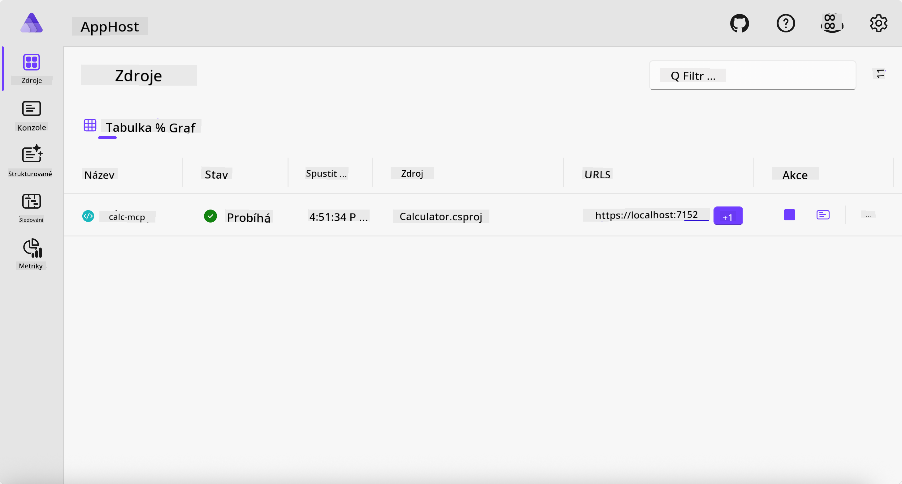

<!--
CO_OP_TRANSLATOR_METADATA:
{
  "original_hash": "0bc7bd48f55f1565f1d95ccb2c16f728",
  "translation_date": "2025-06-18T07:53:00+00:00",
  "source_file": "04-PracticalImplementation/samples/csharp/README.md",
  "language_code": "cs"
}
-->
# Ukázka

Předchozí příklad ukazuje, jak použít lokální .NET projekt s typem `stdio`. A jak spustit server lokálně v kontejneru. To je dobré řešení v mnoha situacích. Nicméně může být užitečné mít server běžící vzdáleně, například v cloudovém prostředí. Právě zde přichází na řadu typ `http`.

Když se podíváte na řešení ve složce `04-PracticalImplementation`, může se zdát mnohem složitější než předchozí. Ale ve skutečnosti tomu tak není. Pokud se podíváte blíže na projekt `src/Calculator`, uvidíte, že je to většinou stejný kód jako v předchozím příkladu. Jediný rozdíl je v tom, že používáme jinou knihovnu `ModelContextProtocol.AspNetCore` pro zpracování HTTP požadavků. A měníme metodu `IsPrime` na privátní, jen abychom ukázali, že ve svém kódu můžete mít privátní metody. Zbytek kódu je stejný jako dříve.

Ostatní projekty jsou z [.NET Aspire](https://learn.microsoft.com/dotnet/aspire/get-started/aspire-overview). Mít .NET Aspire v řešení zlepší zkušenost vývojáře při vývoji a testování a pomůže s observabilitou. Není to nutné pro spuštění serveru, ale je dobrým zvykem mít to ve svém řešení.

## Spuštění serveru lokálně

1. Ve VS Code (s rozšířením C# DevKit) přejděte do adresáře `04-PracticalImplementation/samples/csharp`.
1. Spusťte následující příkaz pro start serveru:

   ```bash
    dotnet watch run --project ./src/AppHost
   ```

1. Když se v prohlížeči otevře dashboard .NET Aspire, všimněte si URL `http`. Mělo by to být něco jako `http://localhost:5058/`.

   

## Testování Streamable HTTP pomocí MCP Inspectoru

Pokud máte Node.js verze 22.7.5 a vyšší, můžete použít MCP Inspector pro testování vašeho serveru.

Spusťte server a v terminálu spusťte následující příkaz:

```bash
npx @modelcontextprotocol/inspector http://localhost:5058
```


- Vyberte `Streamable HTTP` as the Transport type.
- In the Url field, enter the URL of the server noted earlier, and append `/mcp`. Mělo by to být `http` (ne `https`) something like `http://localhost:5058/mcp`.
- select the Connect button.

A nice thing about the Inspector is that it provide a nice visibility on what is happening.

- Try listing the available tools
- Try some of them, it should works just like before.

## Test MCP Server with GitHub Copilot Chat in VS Code

To use the Streamable HTTP transport with GitHub Copilot Chat, change the configuration of the `calc-mcp` server vytvořený dříve, aby vypadal takto:

```jsonc
// .vscode/mcp.json
{
  "servers": {
    "calc-mcp": {
      "type": "http",
      "url": "http://localhost:5058/mcp"
    }
  }
}
```

Proveďte několik testů:

- Zeptejte se na "3 prvočísla po 6780". Všimněte si, že Copilot použije nové nástroje `NextFivePrimeNumbers` a vrátí pouze první 3 prvočísla.
- Zeptejte se na "7 prvočísel po 111", abyste viděli, co se stane.
- Zeptejte se na "John má 24 lízátek a chce je rozdělit mezi své 3 děti. Kolik lízátek dostane každé dítě?", abyste viděli, co se stane.

## Nasazení serveru do Azure

Nasadíme server do Azure, aby ho mohlo používat více lidí.

V terminálu přejděte do složky `04-PracticalImplementation/samples/csharp` a spusťte následující příkaz:

```bash
azd up
```

Po dokončení nasazení byste měli vidět zprávu jako tato:


Zkopírujte URL a použijte ji v MCP Inspectoru a v GitHub Copilot Chat.

```jsonc
// .vscode/mcp.json
{
  "servers": {
    "calc-mcp": {
      "type": "http",
      "url": "https://calc-mcp.gentleriver-3977fbcf.australiaeast.azurecontainerapps.io/mcp"
    }
  }
}
```

## Co dál?

Vyzkoušíme různé typy transportů a testovací nástroje. Také nasadíme váš MCP server do Azure. Ale co když náš server potřebuje přístup k soukromým zdrojům? Například k databázi nebo soukromému API? V dalším kapitole uvidíme, jak můžeme zlepšit zabezpečení našeho serveru.

**Prohlášení o vyloučení odpovědnosti**:  
Tento dokument byl přeložen pomocí AI překladatelské služby [Co-op Translator](https://github.com/Azure/co-op-translator). Přestože usilujeme o přesnost, mějte prosím na paměti, že automatizované překlady mohou obsahovat chyby nebo nepřesnosti. Původní dokument v jeho mateřském jazyce by měl být považován za autoritativní zdroj. Pro kritické informace se doporučuje profesionální lidský překlad. Nejsme odpovědní za jakékoliv nedorozumění nebo chybné výklady vzniklé použitím tohoto překladu.