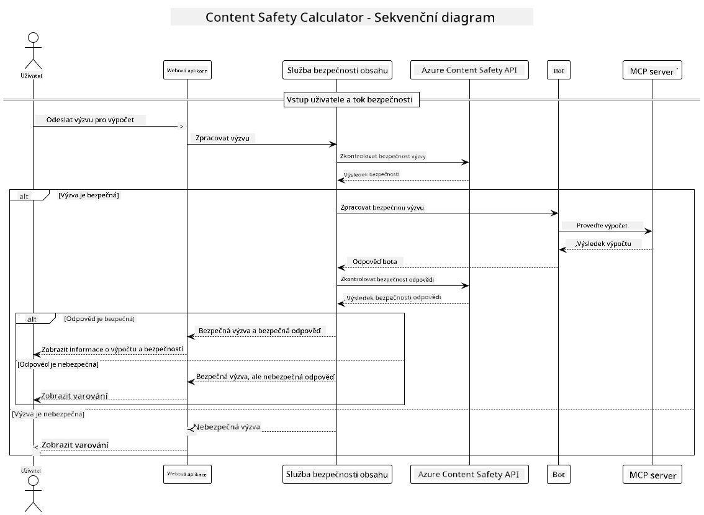

<!--
CO_OP_TRANSLATOR_METADATA:
{
  "original_hash": "e5ea5e7582f70008ea9bec3b3820f20a",
  "translation_date": "2025-05-27T16:25:23+00:00",
  "source_file": "04-PracticalImplementation/samples/java/containerapp/README.md",
  "language_code": "cs"
}
-->
## System Architecture

This project demonstrates a web application that performs content safety checks before sending user prompts to a calculator service via Model Context Protocol (MCP).



### How It Works

1. **User Input**: The user submits a calculation prompt through the web interface  
2. **Content Safety Screening (Input)**: The prompt is analyzed by the Azure Content Safety API  
3. **Safety Decision (Input)**:  
   - If the content is safe (severity < 2 in all categories), it proceeds to the calculator  
   - If the content is flagged as potentially harmful, the process stops and returns a warning  
4. **Calculator Integration**: Safe content is processed by LangChain4j, which communicates with the MCP calculator server  
5. **Content Safety Screening (Output)**: The bot’s response is analyzed by the Azure Content Safety API  
6. **Safety Decision (Output)**:  
   - If the bot response is safe, it’s shown to the user  
   - If the bot response is flagged as potentially harmful, it’s replaced with a warning  
7. **Response**: Results (if safe) are displayed to the user along with both safety analyses  

## Using Model Context Protocol (MCP) with Calculator Services

This project shows how to use Model Context Protocol (MCP) to call calculator MCP services from LangChain4j. The implementation runs a local MCP server on port 8080 to provide calculator operations.

### Setting up Azure Content Safety Service

Before using content safety features, create an Azure Content Safety service resource:

1. Sign in to the [Azure Portal](https://portal.azure.com)  
2. Click "Create a resource" and search for "Content Safety"  
3. Select "Content Safety" and click "Create"  
4. Enter a unique name for your resource  
5. Select your subscription and resource group (or create a new one)  
6. Choose a supported region (check [Region availability](https://azure.microsoft.com/en-us/global-infrastructure/services/?products=cognitive-services) for details)  
7. Select an appropriate pricing tier  
8. Click "Create" to deploy the resource  
9. Once deployment finishes, click "Go to resource"  
10. In the left pane, under "Resource Management", select "Keys and Endpoint"  
11. Copy one of the keys and the endpoint URL for use in the next step  

### Configuring Environment Variables

Set the `GITHUB_TOKEN` environment variable for GitHub models authentication:  
```sh
export GITHUB_TOKEN=<your_github_token>
```

For content safety features, set:  
```sh
export CONTENT_SAFETY_ENDPOINT=<your_content_safety_endpoint>
export CONTENT_SAFETY_KEY=<your_content_safety_key>
```

These environment variables enable the application to authenticate with the Azure Content Safety service. If they are not set, the app will use placeholder values for demonstration, but content safety features will not function properly.

### Starting the Calculator MCP Server

Before running the client, start the calculator MCP server in SSE mode on localhost:8080.

## Project Description

This project demonstrates integrating Model Context Protocol (MCP) with LangChain4j to call calculator services. Key features include:

- Using MCP to connect to a calculator service for basic math operations  
- Dual-layer content safety checks on both user prompts and bot responses  
- Integration with GitHub’s gpt-4.1-nano model via LangChain4j  
- Using Server-Sent Events (SSE) for MCP transport  

## Content Safety Integration

The project includes comprehensive content safety measures to ensure both user inputs and system responses are free from harmful content:

1. **Input Screening**: All user prompts are analyzed for harmful categories such as hate speech, violence, self-harm, and sexual content before processing.  
2. **Output Screening**: Even when using potentially uncensored models, all generated responses are checked through the same content safety filters before being displayed.  

This dual-layer approach ensures the system stays safe regardless of which AI model is used, protecting users from harmful inputs and potentially problematic AI-generated outputs.

## Web Client

The application features a user-friendly web interface that lets users interact with the Content Safety Calculator system:

### Web Interface Features

- Simple, intuitive form for entering calculation prompts  
- Dual-layer content safety validation (input and output)  
- Real-time feedback on prompt and response safety  
- Color-coded safety indicators for easy understanding  
- Clean, responsive design that works across devices  
- Example safe prompts to guide users  

### Using the Web Client

1. Start the application:  
   ```sh
   mvn spring-boot:run
   ```

2. Open your browser and go to `http://localhost:8087`  

3. Enter a calculation prompt in the text area (e.g., "Calculate the sum of 24.5 and 17.3")  

4. Click "Submit" to process your request  

5. View the results, which include:  
   - Content safety analysis of your prompt  
   - The calculated result (if the prompt was safe)  
   - Content safety analysis of the bot’s response  
   - Any safety warnings if either input or output was flagged  

The web client automatically manages both content safety checks, ensuring all interactions are safe and appropriate regardless of which AI model is used.

**Prohlášení o vyloučení odpovědnosti**:  
Tento dokument byl přeložen pomocí AI překladatelské služby [Co-op Translator](https://github.com/Azure/co-op-translator). I když usilujeme o přesnost, mějte prosím na paměti, že automatické překlady mohou obsahovat chyby nebo nepřesnosti. Originální dokument v jeho původním jazyce by měl být považován za autoritativní zdroj. Pro důležité informace se doporučuje profesionální lidský překlad. Nejsme odpovědní za jakékoliv nedorozumění nebo nesprávné výklady vyplývající z použití tohoto překladu.