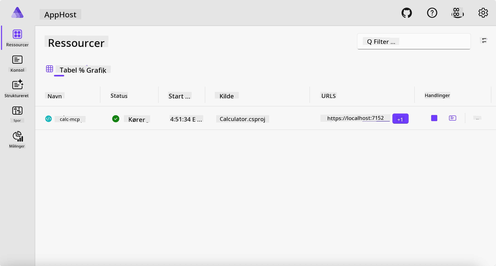

<!--
CO_OP_TRANSLATOR_METADATA:
{
  "original_hash": "0bc7bd48f55f1565f1d95ccb2c16f728",
  "translation_date": "2025-06-18T07:50:51+00:00",
  "source_file": "04-PracticalImplementation/samples/csharp/README.md",
  "language_code": "da"
}
-->
# Eksempel

Det forrige eksempel viser, hvordan man bruger et lokalt .NET-projekt med typen `stdio`. Og hvordan man kører serveren lokalt i en container. Dette er en god løsning i mange situationer. Men det kan være nyttigt at have serveren kørende eksternt, for eksempel i et cloud-miljø. Her kommer typen `http` ind i billedet.

Når man ser på løsningen i `04-PracticalImplementation`-mappen, kan den se meget mere kompleks ud end den forrige. Men i virkeligheden er den det ikke. Hvis du kigger nærmere på projektet `src/Calculator`, vil du se, at det stort set er den samme kode som i det tidligere eksempel. Den eneste forskel er, at vi bruger et andet bibliotek `ModelContextProtocol.AspNetCore` til at håndtere HTTP-forespørgslerne. Og vi ændrer metoden `IsPrime` til at være privat, bare for at vise, at du kan have private metoder i din kode. Resten af koden er den samme som før.

De andre projekter kommer fra [.NET Aspire](https://learn.microsoft.com/dotnet/aspire/get-started/aspire-overview). At have .NET Aspire i løsningen vil forbedre udviklerens oplevelse under udvikling og test og hjælpe med observabilitet. Det er ikke nødvendigt for at køre serveren, men det er god praksis at have det med i din løsning.

## Start serveren lokalt

1. Fra VS Code (med C# DevKit-udvidelsen) naviger ned til `04-PracticalImplementation/samples/csharp`-mappen.
1. Kør følgende kommando for at starte serveren:

   ```bash
    dotnet watch run --project ./src/AppHost
   ```

1. Når en webbrowser åbner .NET Aspire-dashboardet, bemærk `http` URL'en. Den burde være noget i retning af `http://localhost:5058/`.

   

## Test Streamable HTTP med MCP Inspector

Hvis du har Node.js 22.7.5 eller nyere, kan du bruge MCP Inspector til at teste din server.

Start serveren og kør følgende kommando i en terminal:

```bash
npx @modelcontextprotocol/inspector http://localhost:5058
```


- Vælg `Streamable HTTP` as the Transport type.
- In the Url field, enter the URL of the server noted earlier, and append `/mcp`. Det burde være `http` (ikke `https`) something like `http://localhost:5058/mcp`.
- select the Connect button.

A nice thing about the Inspector is that it provide a nice visibility on what is happening.

- Try listing the available tools
- Try some of them, it should works just like before.

## Test MCP Server with GitHub Copilot Chat in VS Code

To use the Streamable HTTP transport with GitHub Copilot Chat, change the configuration of the `calc-mcp` serveren oprettet tidligere, så det ser sådan ud:

```jsonc
// .vscode/mcp.json
{
  "servers": {
    "calc-mcp": {
      "type": "http",
      "url": "http://localhost:5058/mcp"
    }
  }
}
```

Lav nogle tests:

- Spørg efter "3 primtal efter 6780". Bemærk hvordan Copilot vil bruge de nye værktøjer `NextFivePrimeNumbers` og kun returnere de første 3 primtal.
- Spørg efter "7 primtal efter 111" for at se, hvad der sker.
- Spørg efter "John har 24 slik og vil fordele dem alle til sine 3 børn. Hvor mange slik får hvert barn?", for at se hvad der sker.

## Udrul serveren til Azure

Lad os udrulle serveren til Azure, så flere kan bruge den.

Fra en terminal, naviger til mappen `04-PracticalImplementation/samples/csharp` og kør følgende kommando:

```bash
azd up
```

Når udrulningen er færdig, burde du se en besked som denne:


Tag URL'en og brug den i MCP Inspector og i GitHub Copilot Chat.

```jsonc
// .vscode/mcp.json
{
  "servers": {
    "calc-mcp": {
      "type": "http",
      "url": "https://calc-mcp.gentleriver-3977fbcf.australiaeast.azurecontainerapps.io/mcp"
    }
  }
}
```

## Hvad nu?

Vi prøver forskellige transporttyper og testværktøjer. Vi udruller også din MCP-server til Azure. Men hvad hvis vores server skal have adgang til private ressourcer? For eksempel en database eller en privat API? I næste kapitel vil vi se, hvordan vi kan forbedre sikkerheden på vores server.

**Ansvarsfraskrivelse**:  
Dette dokument er blevet oversat ved hjælp af AI-oversættelsestjenesten [Co-op Translator](https://github.com/Azure/co-op-translator). Selvom vi bestræber os på nøjagtighed, bedes du være opmærksom på, at automatiserede oversættelser kan indeholde fejl eller unøjagtigheder. Det oprindelige dokument på dets oprindelige sprog bør betragtes som den autoritative kilde. For kritisk information anbefales professionel menneskelig oversættelse. Vi påtager os intet ansvar for eventuelle misforståelser eller fejltolkninger, der måtte opstå som følge af brugen af denne oversættelse.