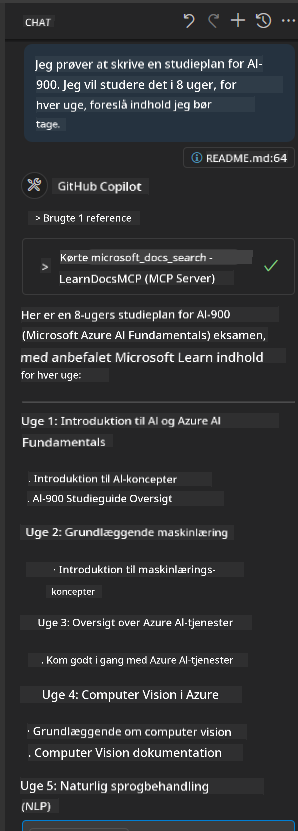

<!--
CO_OP_TRANSLATOR_METADATA:
{
  "original_hash": "4319d291c9d124ecafea52b3d04bfa0e",
  "translation_date": "2025-06-23T11:10:53+00:00",
  "source_file": "09-CaseStudy/docs-mcp/README.md",
  "language_code": "da"
}
-->
> For en detaljeret gennemgang med skærmbilleder og trin-for-trin vejledning, se [`README.md`](./solution/scenario3/README.md).

Denne tilgang er ideel for alle, der bygger tekniske kurser, skriver dokumentation eller udvikler kode med hyppige referencebehov.

## Vigtige pointer

At integrere dokumentation direkte i dine værktøjer er ikke bare en bekvemmelighed—det er en revolution for produktiviteten. Ved at forbinde til Microsoft Learn Docs MCP-serveren fra din klient kan du:

- Eliminere kontekstskift mellem din kode og dokumentation
- Hente opdateret, kontekstbevidst dokumentation i realtid
- Bygge smartere, mere interaktive udviklerværktøjer

Disse færdigheder hjælper dig med at skabe løsninger, der ikke kun er effektive, men også behagelige at bruge.

## Yderligere ressourcer

For at uddybe din forståelse, udforsk disse officielle ressourcer:

- [Microsoft Learn Docs MCP Server (GitHub)](https://github.com/MicrosoftDocs/mcp)
- [Kom godt i gang med Azure MCP Server (mcp-python)](https://learn.microsoft.com/en-us/azure/developer/azure-mcp-server/get-started#create-the-python-app)
- [Hvad er Azure MCP Server?](https://learn.microsoft.com/en-us/azure/developer/azure-mcp-server/)
- [Model Context Protocol (MCP) Introduktion](https://modelcontextprotocol.io/introduction)
- [Tilføj plugins fra en MCP Server (Python)](https://learn.microsoft.com/en-us/semantic-kernel/concepts/plugins/adding-mcp-plugins)

**Ansvarsfraskrivelse**:  
Dette dokument er blevet oversat ved hjælp af AI-oversættelsestjenesten [Co-op Translator](https://github.com/Azure/co-op-translator). Selvom vi bestræber os på nøjagtighed, bedes du være opmærksom på, at automatiserede oversættelser kan indeholde fejl eller unøjagtigheder. Det oprindelige dokument på dets oprindelige sprog bør betragtes som den autoritative kilde. For kritisk information anbefales professionel menneskelig oversættelse. Vi påtager os intet ansvar for misforståelser eller fejltolkninger, der måtte opstå som følge af brugen af denne oversættelse.