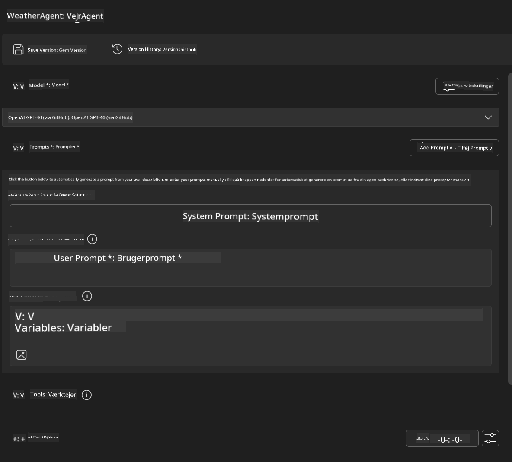
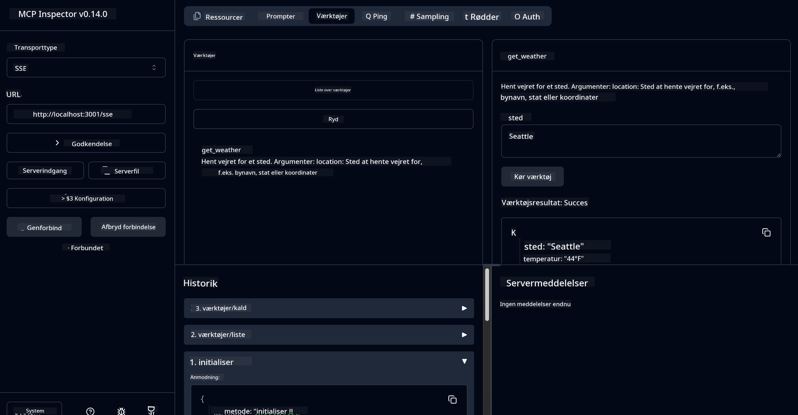

<!--
CO_OP_TRANSLATOR_METADATA:
{
  "original_hash": "dd8da3f75addcef453fe11f02a270217",
  "translation_date": "2025-06-10T06:13:02+00:00",
  "source_file": "10-StreamliningAIWorkflowsBuildingAnMCPServerWithAIToolkit/lab3/README.md",
  "language_code": "da"
}
-->
# 🔧 Modul 3: Avanceret MCP-udvikling med AI Toolkit


## 🎯 Læringsmål

Når du er færdig med dette lab, vil du kunne:

- ✅ Oprette tilpassede MCP-servere ved hjælp af AI Toolkit
- ✅ Konfigurere og bruge den nyeste MCP Python SDK (v1.9.3)
- ✅ Opsætte og anvende MCP Inspector til fejlfinding
- ✅ Fejlsøge MCP-servere i både Agent Builder og Inspector-miljøer
- ✅ Forstå avancerede arbejdsgange for MCP-serverudvikling

## 📋 Forudsætninger

- Gennemført Lab 2 (MCP Fundamentals)
- VS Code med AI Toolkit-udvidelsen installeret
- Python 3.10+ miljø
- Node.js og npm til opsætning af Inspector

## 🏗️ Hvad du vil bygge

I dette lab opretter du en **Weather MCP Server**, som demonstrerer:
- Tilpasset MCP-serverimplementering
- Integration med AI Toolkit Agent Builder
- Professionelle fejlsøgningsarbejdsgange
- Moderne MCP SDK-brugsmønstre

---

## 🔧 Oversigt over kernekomponenter

### 🐍 MCP Python SDK  
Model Context Protocol Python SDK udgør fundamentet for at bygge tilpassede MCP-servere. Du bruger version 1.9.3 med forbedrede fejlsøgningsfunktioner.

### 🔍 MCP Inspector  
Et kraftfuldt fejlsøgningsværktøj, som tilbyder:  
- Realtids overvågning af servere  
- Visualisering af værktøjsudførelse  
- Inspektion af netværksanmodninger/-svar  
- Interaktiv testmiljø

---

## 📖 Trin-for-trin implementering

### Trin 1: Opret en WeatherAgent i Agent Builder

1. **Start Agent Builder** i VS Code via AI Toolkit-udvidelsen  
2. **Opret en ny agent** med følgende konfiguration:  
   - Agentnavn: `WeatherAgent`



### Trin 2: Initialiser MCP Server-projekt

1. **Gå til Tools** → **Add Tool** i Agent Builder  
2. **Vælg "MCP Server"** blandt de tilgængelige muligheder  
3. **Vælg "Create A new MCP Server"**  
4. **Vælg skabelonen `python-weather`**  
5. **Navngiv din server:** `weather_mcp`


### Trin 3: Åbn og gennemgå projektet

1. **Åbn det genererede projekt** i VS Code  
2. **Gennemgå projektstrukturen:**  
   ```
   weather_mcp/
   ├── src/
   │   ├── __init__.py
   │   └── server.py
   ├── inspector/
   │   ├── package.json
   │   └── package-lock.json
   ├── .vscode/
   │   ├── launch.json
   │   └── tasks.json
   ├── pyproject.toml
   └── README.md
   ```

### Trin 4: Opgrader til nyeste MCP SDK

> **🔍 Hvorfor opgradere?** Vi ønsker at bruge den nyeste MCP SDK (v1.9.3) og Inspector-service (0.14.0) for at få forbedrede funktioner og bedre fejlsøgning.

#### 4a. Opdater Python-afhængigheder

**Rediger `pyproject.toml`:** update [./code/weather_mcp/pyproject.toml](../../../../10-StreamliningAIWorkflowsBuildingAnMCPServerWithAIToolkit/lab3/code/weather_mcp/pyproject.toml)


#### 4b. Update Inspector Configuration

**Edit `inspector/package.json`:** update [./code/weather_mcp/inspector/package.json](../../../../10-StreamliningAIWorkflowsBuildingAnMCPServerWithAIToolkit/lab3/code/weather_mcp/inspector/package.json)

#### 4c. Update Inspector Dependencies

**Edit `inspector/package-lock.json`:** update [./code/weather_mcp/inspector/package-lock.json](../../../../10-StreamliningAIWorkflowsBuildingAnMCPServerWithAIToolkit/lab3/code/weather_mcp/inspector/package-lock.json)

> **📝 Note:** This file contains extensive dependency definitions. Below is the essential structure - the full content ensures proper dependency resolution.


> **⚡ Full Package Lock:** The complete package-lock.json contains ~3000 lines of dependency definitions. The above shows the key structure - use the provided file for complete dependency resolution.

### Step 5: Configure VS Code Debugging

*Note: Please copy the file in the specified path to replace the corresponding local file*

#### 5a. Update Launch Configuration

**Edit `.vscode/launch.json`:**

```json
{
  "version": "0.2.0",
  "configurations": [
    {
      "name": "Attach to Local MCP",
      "type": "debugpy",
      "request": "attach",
      "connect": {
        "host": "localhost",
        "port": 5678
      },
      "presentation": {
        "hidden": true
      },
      "internalConsoleOptions": "neverOpen",
      "postDebugTask": "Terminate All Tasks"
    },
    {
      "name": "Launch Inspector (Edge)",
      "type": "msedge",
      "request": "launch",
      "url": "http://localhost:6274?timeout=60000&serverUrl=http://localhost:3001/sse#tools",
      "cascadeTerminateToConfigurations": [
        "Attach to Local MCP"
      ],
      "presentation": {
        "hidden": true
      },
      "internalConsoleOptions": "neverOpen"
    },
    {
      "name": "Launch Inspector (Chrome)",
      "type": "chrome",
      "request": "launch",
      "url": "http://localhost:6274?timeout=60000&serverUrl=http://localhost:3001/sse#tools",
      "cascadeTerminateToConfigurations": [
        "Attach to Local MCP"
      ],
      "presentation": {
        "hidden": true
      },
      "internalConsoleOptions": "neverOpen"
    }
  ],
  "compounds": [
    {
      "name": "Debug in Agent Builder",
      "configurations": [
        "Attach to Local MCP"
      ],
      "preLaunchTask": "Open Agent Builder",
    },
    {
      "name": "Debug in Inspector (Edge)",
      "configurations": [
        "Launch Inspector (Edge)",
        "Attach to Local MCP"
      ],
      "preLaunchTask": "Start MCP Inspector",
      "stopAll": true
    },
    {
      "name": "Debug in Inspector (Chrome)",
      "configurations": [
        "Launch Inspector (Chrome)",
        "Attach to Local MCP"
      ],
      "preLaunchTask": "Start MCP Inspector",
      "stopAll": true
    }
  ]
}
```

**Rediger `.vscode/tasks.json`:**

```
{
  "version": "2.0.0",
  "tasks": [
    {
      "label": "Start MCP Server",
      "type": "shell",
      "command": "python -m debugpy --listen 127.0.0.1:5678 src/__init__.py sse",
      "isBackground": true,
      "options": {
        "cwd": "${workspaceFolder}",
        "env": {
          "PORT": "3001"
        }
      },
      "problemMatcher": {
        "pattern": [
          {
            "regexp": "^.*$",
            "file": 0,
            "location": 1,
            "message": 2
          }
        ],
        "background": {
          "activeOnStart": true,
          "beginsPattern": ".*",
          "endsPattern": "Application startup complete|running"
        }
      }
    },
    {
      "label": "Start MCP Inspector",
      "type": "shell",
      "command": "npm run dev:inspector",
      "isBackground": true,
      "options": {
        "cwd": "${workspaceFolder}/inspector",
        "env": {
          "CLIENT_PORT": "6274",
          "SERVER_PORT": "6277",
        }
      },
      "problemMatcher": {
        "pattern": [
          {
            "regexp": "^.*$",
            "file": 0,
            "location": 1,
            "message": 2
          }
        ],
        "background": {
          "activeOnStart": true,
          "beginsPattern": "Starting MCP inspector",
          "endsPattern": "Proxy server listening on port"
        }
      },
      "dependsOn": [
        "Start MCP Server"
      ]
    },
    {
      "label": "Open Agent Builder",
      "type": "shell",
      "command": "echo ${input:openAgentBuilder}",
      "presentation": {
        "reveal": "never"
      },
      "dependsOn": [
        "Start MCP Server"
      ],
    },
    {
      "label": "Terminate All Tasks",
      "command": "echo ${input:terminate}",
      "type": "shell",
      "problemMatcher": []
    }
  ],
  "inputs": [
    {
      "id": "openAgentBuilder",
      "type": "command",
      "command": "ai-mlstudio.agentBuilder",
      "args": {
        "initialMCPs": [ "local-server-weather_mcp" ],
        "triggeredFrom": "vsc-tasks"
      }
    },
    {
      "id": "terminate",
      "type": "command",
      "command": "workbench.action.tasks.terminate",
      "args": "terminateAll"
    }
  ]
}
```


---

## 🚀 Kørsel og test af din MCP-server

### Trin 6: Installer afhængigheder

Efter konfigurationsændringerne, kør følgende kommandoer:

**Installer Python-afhængigheder:**  
```bash
uv sync
```

**Installer Inspector-afhængigheder:**  
```bash
cd inspector
npm install
```

### Trin 7: Fejlsøg med Agent Builder

1. **Tryk på F5** eller brug konfigurationen **"Debug in Agent Builder"**  
2. **Vælg compound-konfigurationen** i debug-panelet  
3. **Vent på at serveren starter** og Agent Builder åbner  
4. **Test din Weather MCP Server** med naturlige sprogforespørgsler

Indtast prompt som denne

SYSTEM_PROMPT

```
You are my weather assistant
```

USER_PROMPT

```
How's the weather like in Seattle
```


### Trin 8: Fejlsøg med MCP Inspector

1. **Brug konfigurationen "Debug in Inspector"** (Edge eller Chrome)  
2. **Åbn Inspector-grænsefladen** på `http://localhost:6274`  
3. **Udforsk det interaktive testmiljø:**  
   - Se tilgængelige værktøjer  
   - Test værktøjsudførelse  
   - Overvåg netværksanmodninger  
   - Fejlsøg serverrespons



---

## 🎯 Vigtige læringsresultater

Ved at gennemføre dette lab har du:

- [x] **Oprettet en tilpasset MCP-server** ved hjælp af AI Toolkit-skabeloner  
- [x] **Opgraderet til den nyeste MCP SDK** (v1.9.3) for forbedret funktionalitet  
- [x] **Konfigureret professionelle fejlsøgningsarbejdsgange** for både Agent Builder og Inspector  
- [x] **Opsat MCP Inspector** til interaktiv servertest  
- [x] **Behersket VS Code fejlsøgningskonfigurationer** til MCP-udvikling

## 🔧 Avancerede funktioner udforsket

| Funktion | Beskrivelse | Anvendelsestilfælde |
|---------|-------------|---------------------|
| **MCP Python SDK v1.9.3** | Nyeste protokolimplementering | Moderne serverudvikling |
| **MCP Inspector 0.14.0** | Interaktivt fejlsøgningsværktøj | Realtids servertest |
| **VS Code Debugging** | Integreret udviklingsmiljø | Professionel fejlsøgningsworkflow |
| **Agent Builder Integration** | Direkte AI Toolkit-forbindelse | End-to-end agenttest |

## 📚 Yderligere ressourcer

- [MCP Python SDK Documentation](https://modelcontextprotocol.io/docs/sdk/python)  
- [AI Toolkit Extension Guide](https://code.visualstudio.com/docs/ai/ai-toolkit)  
- [VS Code Debugging Documentation](https://code.visualstudio.com/docs/editor/debugging)  
- [Model Context Protocol Specification](https://modelcontextprotocol.io/docs/concepts/architecture)

---

**🎉 Tillykke!** Du har nu gennemført Lab 3 og kan oprette, fejlsøge og implementere tilpassede MCP-servere med professionelle udviklingsarbejdsgange.

### 🔜 Fortsæt til næste modul

Klar til at anvende dine MCP-færdigheder i en reel udviklingsworkflow? Fortsæt til **[Modul 4: Praktisk MCP-udvikling - Custom GitHub Clone Server](../lab4/README.md)**, hvor du vil:  
- Bygge en produktionsklar MCP-server, der automatiserer GitHub-repositorieoperationer  
- Implementere GitHub-repositorie-kloning via MCP  
- Integrere tilpassede MCP-servere med VS Code og GitHub Copilot Agent Mode  
- Teste og implementere tilpassede MCP-servere i produktionsmiljøer  
- Lære praktisk workflow-automatisering for udviklere

**Ansvarsfraskrivelse**:  
Dette dokument er blevet oversat ved hjælp af AI-oversættelsestjenesten [Co-op Translator](https://github.com/Azure/co-op-translator). Selvom vi bestræber os på nøjagtighed, bedes du være opmærksom på, at automatiserede oversættelser kan indeholde fejl eller unøjagtigheder. Det oprindelige dokument på dets modersmål bør betragtes som den autoritative kilde. For vigtig information anbefales professionel menneskelig oversættelse. Vi påtager os intet ansvar for misforståelser eller fejltolkninger, der opstår som følge af brugen af denne oversættelse.