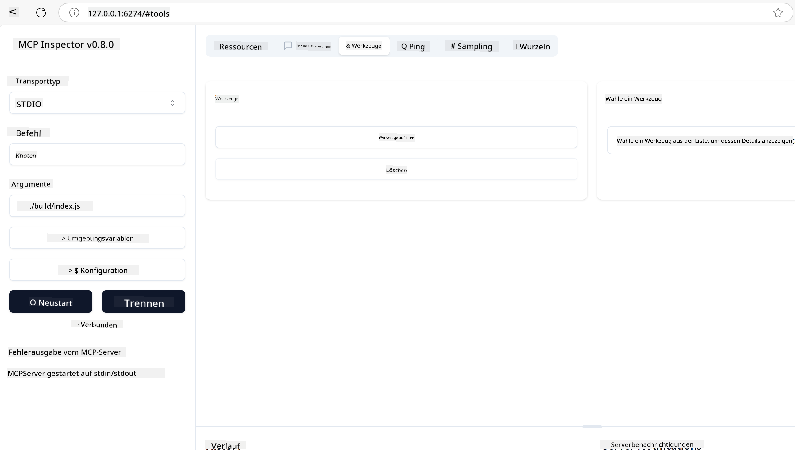

<!--
CO_OP_TRANSLATOR_METADATA:
{
  "original_hash": "d90651bcd1df019768921d531653638a",
  "translation_date": "2025-06-12T21:53:22+00:00",
  "source_file": "03-GettingStarted/01-first-server/README.md",
  "language_code": "de"
}
-->
### -2- Projekt erstellen

Jetzt, wo du dein SDK installiert hast, lass uns als Nächstes ein Projekt erstellen:

### -3- Projektdateien erstellen

### -4- Servercode erstellen

### -5- Hinzufügen eines Tools und einer Ressource

Füge ein Tool und eine Ressource hinzu, indem du den folgenden Code einfügst:

### -6- Finaler Code

Fügen wir den letzten Code hinzu, den der Server benötigt, um starten zu können:

### -7- Server testen

Starte den Server mit folgendem Befehl:

### -8- Mit dem Inspector ausführen

Der Inspector ist ein großartiges Werkzeug, mit dem du deinen Server starten und interaktiv testen kannst, ob alles funktioniert. Lass uns ihn starten:

> [!NOTE]
> Im Feld "command" kann der Befehl unterschiedlich aussehen, da er den Befehl zum Starten eines Servers mit deinem spezifischen Runtime enthält.

Du solltest folgende Benutzeroberfläche sehen:

1. Verbinde dich mit dem Server, indem du auf die Schaltfläche „Connect“ klickst.  
   Sobald du mit dem Server verbunden bist, solltest du Folgendes sehen:

   

2. Wähle „Tools“ und dann „listTools“ aus. Du solltest „Add“ sehen, wähle „Add“ aus und fülle die Parameterwerte aus.

   Du solltest folgende Antwort sehen, also das Ergebnis des „add“-Tools:

   

Glückwunsch, du hast deinen ersten Server erfolgreich erstellt und gestartet!

### Offizielle SDKs

MCP bietet offizielle SDKs für mehrere Sprachen an:
- [C# SDK](https://github.com/modelcontextprotocol/csharp-sdk) – Wird in Zusammenarbeit mit Microsoft gepflegt
- [Java SDK](https://github.com/modelcontextprotocol/java-sdk) – Wird in Zusammenarbeit mit Spring AI gepflegt
- [TypeScript SDK](https://github.com/modelcontextprotocol/typescript-sdk) – Die offizielle TypeScript-Implementierung
- [Python SDK](https://github.com/modelcontextprotocol/python-sdk) – Die offizielle Python-Implementierung
- [Kotlin SDK](https://github.com/modelcontextprotocol/kotlin-sdk) – Die offizielle Kotlin-Implementierung
- [Swift SDK](https://github.com/modelcontextprotocol/swift-sdk) – Wird in Zusammenarbeit mit Loopwork AI gepflegt
- [Rust SDK](https://github.com/modelcontextprotocol/rust-sdk) – Die offizielle Rust-Implementierung

## Wichtige Erkenntnisse

- Das Einrichten einer MCP-Entwicklungsumgebung ist dank sprachspezifischer SDKs unkompliziert
- Der Aufbau von MCP-Servern umfasst das Erstellen und Registrieren von Tools mit klar definierten Schemata
- Testen und Debuggen sind entscheidend für zuverlässige MCP-Implementierungen

## Beispiele

- [Java Rechner](../samples/java/calculator/README.md)
- [.Net Rechner](../../../../03-GettingStarted/samples/csharp)
- [JavaScript Rechner](../samples/javascript/README.md)
- [TypeScript Rechner](../samples/typescript/README.md)
- [Python Rechner](../../../../03-GettingStarted/samples/python)

## Aufgabe

Erstelle einen einfachen MCP-Server mit einem Tool deiner Wahl:
1. Implementiere das Tool in deiner bevorzugten Sprache (.NET, Java, Python oder JavaScript).
2. Definiere Eingabeparameter und Rückgabewerte.
3. Führe das Inspector-Tool aus, um sicherzustellen, dass der Server wie erwartet funktioniert.
4. Teste die Implementierung mit verschiedenen Eingaben.

## Lösung

[Lösung](./solution/README.md)

## Zusätzliche Ressourcen

- [Build Agents using Model Context Protocol on Azure](https://learn.microsoft.com/azure/developer/ai/intro-agents-mcp)
- [Remote MCP with Azure Container Apps (Node.js/TypeScript/JavaScript)](https://learn.microsoft.com/samples/azure-samples/mcp-container-ts/mcp-container-ts/)
- [.NET OpenAI MCP Agent](https://learn.microsoft.com/samples/azure-samples/openai-mcp-agent-dotnet/openai-mcp-agent-dotnet/)

## Was kommt als Nächstes

Weiter: [Getting Started with MCP Clients](/03-GettingStarted/02-client/README.md)

**Haftungsausschluss**:  
Dieses Dokument wurde mithilfe des KI-Übersetzungsdienstes [Co-op Translator](https://github.com/Azure/co-op-translator) übersetzt. Obwohl wir uns um Genauigkeit bemühen, beachten Sie bitte, dass automatisierte Übersetzungen Fehler oder Ungenauigkeiten enthalten können. Das Originaldokument in seiner Ursprungssprache ist als maßgebliche Quelle zu betrachten. Für wichtige Informationen wird eine professionelle menschliche Übersetzung empfohlen. Wir übernehmen keine Haftung für Missverständnisse oder Fehlinterpretationen, die aus der Verwendung dieser Übersetzung entstehen.