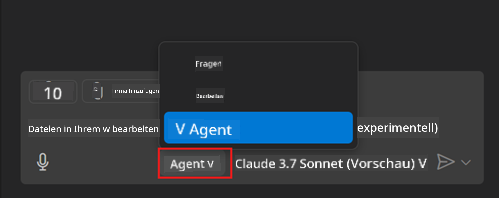

<!--
CO_OP_TRANSLATOR_METADATA:
{
  "original_hash": "8ea28e5e566edd5969337fd0b191ba3f",
  "translation_date": "2025-07-16T22:18:36+00:00",
  "source_file": "03-GettingStarted/04-vscode/README.md",
  "language_code": "de"
}
-->
# Nutzung eines Servers im GitHub Copilot Agent-Modus

Visual Studio Code und GitHub Copilot können als Client fungieren und einen MCP Server nutzen. Warum sollte man das tun wollen, fragst du dich vielleicht? Nun, das bedeutet, dass alle Funktionen, die der MCP Server bietet, jetzt direkt in deiner IDE verwendet werden können. Stell dir vor, du fügst zum Beispiel den MCP Server von GitHub hinzu – damit könntest du GitHub über Eingabeaufforderungen steuern, anstatt spezifische Befehle im Terminal zu tippen. Oder denk an alles, was allgemein deine Entwicklererfahrung verbessern könnte, gesteuert durch natürliche Sprache. Jetzt siehst du den Vorteil, oder?

## Überblick

Diese Lektion zeigt, wie man Visual Studio Code und den Agent-Modus von GitHub Copilot als Client für deinen MCP Server verwendet.

## Lernziele

Am Ende dieser Lektion wirst du in der Lage sein:

- Einen MCP Server über Visual Studio Code zu nutzen.
- Funktionen wie Tools über GitHub Copilot auszuführen.
- Visual Studio Code so zu konfigurieren, dass dein MCP Server gefunden und verwaltet wird.

## Verwendung

Du kannst deinen MCP Server auf zwei verschiedene Arten steuern:

- Benutzeroberfläche, wie du später in diesem Kapitel sehen wirst.
- Terminal, es ist möglich, Dinge über das Terminal mit dem `code`-Executable zu steuern:

  Um einen MCP Server zu deinem Benutzerprofil hinzuzufügen, verwende die Kommandozeilenoption --add-mcp und gib die JSON-Serverkonfiguration in der Form {\"name\":\"server-name\",\"command\":...} an.

  ```
  code --add-mcp "{\"name\":\"my-server\",\"command\": \"uvx\",\"args\": [\"mcp-server-fetch\"]}"
  ```

### Screenshots

  
  


Lass uns im nächsten Abschnitt genauer anschauen, wie wir die visuelle Oberfläche nutzen.

## Vorgehensweise

So gehen wir auf hoher Ebene vor:

- Eine Datei konfigurieren, um unseren MCP Server zu finden.
- Den Server starten/verbinden, damit er seine Fähigkeiten auflistet.
- Diese Fähigkeiten über die GitHub Copilot Chat-Oberfläche nutzen.

Super, jetzt wo wir den Ablauf verstanden haben, probieren wir in einer Übung, einen MCP Server über Visual Studio Code zu verwenden.

## Übung: Einen Server nutzen

In dieser Übung konfigurieren wir Visual Studio Code so, dass dein MCP Server gefunden wird und über die GitHub Copilot Chat-Oberfläche genutzt werden kann.

### -0- Vorbereitung: MCP Server-Erkennung aktivieren

Möglicherweise musst du die Erkennung von MCP Servern aktivieren.

1. Gehe in Visual Studio Code zu `Datei -> Einstellungen -> Einstellungen`.

1. Suche nach "MCP" und aktiviere `chat.mcp.discovery.enabled` in der settings.json Datei.

### -1- Konfigurationsdatei erstellen

Beginne damit, eine Konfigurationsdatei im Projektstamm zu erstellen. Du benötigst eine Datei namens MCP.json, die in einem Ordner namens .vscode abgelegt wird. Sie sollte so aussehen:

```text
.vscode
|-- mcp.json
```

Als Nächstes sehen wir, wie man einen Servereintrag hinzufügt.

### -2- Einen Server konfigurieren

Füge folgenden Inhalt zu *mcp.json* hinzu:

```json
{
    "inputs": [],
    "servers": {
       "hello-mcp": {
           "command": "node",
           "args": [
               "build/index.js"
           ]
       }
    }
}
```

Oben siehst du ein einfaches Beispiel, wie man einen Server in Node.js startet. Für andere Laufzeitumgebungen gib den passenden Befehl zum Starten des Servers mit `command` und `args` an.

### -3- Server starten

Nachdem du einen Eintrag hinzugefügt hast, starten wir den Server:

1. Suche deinen Eintrag in *mcp.json* und achte darauf, dass du das "Play"-Symbol findest:

    

1. Klicke auf das "Play"-Symbol. Du solltest sehen, dass das Tools-Symbol im GitHub Copilot Chat die Anzahl der verfügbaren Tools erhöht. Wenn du auf das Tools-Symbol klickst, siehst du eine Liste der registrierten Tools. Du kannst jedes Tool an- oder abwählen, je nachdem, ob GitHub Copilot es als Kontext verwenden soll:

  

1. Um ein Tool auszuführen, gib eine Eingabeaufforderung ein, von der du weißt, dass sie zur Beschreibung eines deiner Tools passt, zum Beispiel eine Eingabe wie "add 22 to 1":

  

  Du solltest eine Antwort mit 23 erhalten.

## Aufgabe

Versuche, einen Servereintrag zu deiner *mcp.json* Datei hinzuzufügen und stelle sicher, dass du den Server starten und stoppen kannst. Vergewissere dich außerdem, dass du über die GitHub Copilot Chat-Oberfläche mit den Tools auf deinem Server kommunizieren kannst.

## Lösung

[Solution](./solution/README.md)

## Wichtige Erkenntnisse

Die wichtigsten Erkenntnisse aus diesem Kapitel sind:

- Visual Studio Code ist ein großartiger Client, mit dem du mehrere MCP Server und deren Tools nutzen kannst.
- Die GitHub Copilot Chat-Oberfläche ist der Weg, wie du mit den Servern interagierst.
- Du kannst den Nutzer nach Eingaben wie API-Schlüsseln fragen, die beim Konfigurieren des Servereintrags in der *mcp.json* Datei an den MCP Server übergeben werden.

## Beispiele

- [Java Calculator](../samples/java/calculator/README.md)  
- [.Net Calculator](../../../../03-GettingStarted/samples/csharp)  
- [JavaScript Calculator](../samples/javascript/README.md)  
- [TypeScript Calculator](../samples/typescript/README.md)  
- [Python Calculator](../../../../03-GettingStarted/samples/python)

## Zusätzliche Ressourcen

- [Visual Studio docs](https://code.visualstudio.com/docs/copilot/chat/mcp-servers)

## Was kommt als Nächstes

- Weiter: [Erstellen eines SSE Servers](../05-sse-server/README.md)

**Haftungsausschluss**:  
Dieses Dokument wurde mit dem KI-Übersetzungsdienst [Co-op Translator](https://github.com/Azure/co-op-translator) übersetzt. Obwohl wir uns um Genauigkeit bemühen, beachten Sie bitte, dass automatisierte Übersetzungen Fehler oder Ungenauigkeiten enthalten können. Das Originaldokument in seiner Ursprungssprache gilt als maßgebliche Quelle. Für wichtige Informationen wird eine professionelle menschliche Übersetzung empfohlen. Wir übernehmen keine Haftung für Missverständnisse oder Fehlinterpretationen, die aus der Nutzung dieser Übersetzung entstehen.