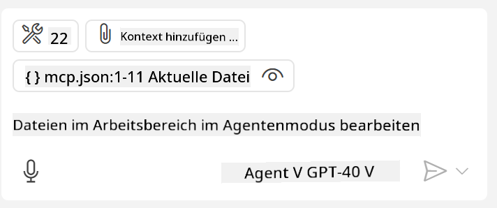

<!--
CO_OP_TRANSLATOR_METADATA:
{
  "original_hash": "c37fabfbc0dcbc9a4afb6d17e7d3be9f",
  "translation_date": "2025-05-16T15:13:41+00:00",
  "source_file": "03-GettingStarted/04-vscode/README.md",
  "language_code": "de"
}
-->
Lass uns im nächsten Abschnitt mehr darüber sprechen, wie wir die visuelle Oberfläche nutzen.

## Vorgehensweise

So gehen wir auf hoher Ebene vor:

- Konfiguriere eine Datei, damit unser MCP Server gefunden wird.
- Starte/verbinde dich mit dem Server, damit dessen Fähigkeiten aufgelistet werden.
- Nutze diese Fähigkeiten über die Chat-Oberfläche von GitHub Copilot.

Super, jetzt wo wir den Ablauf verstanden haben, probieren wir in einer Übung, einen MCP Server über Visual Studio Code zu verwenden.

## Übung: Einen Server nutzen

In dieser Übung konfigurieren wir Visual Studio Code so, dass dein MCP Server gefunden wird und über die Chat-Oberfläche von GitHub Copilot verwendet werden kann.

### -0- Vorbereitung: MCP Server-Erkennung aktivieren

Möglicherweise musst du die Erkennung von MCP Servern aktivieren.

1. Gehe zu `Datei -> Einstellungen -> Einstellungen` und suche nach `` in Visual Studio Code.

1. Search for "MCP" and enable `chat.mcp.discovery.enabled` in der settings.json-Datei.

### -1- Konfigurationsdatei erstellen

Beginne damit, eine Konfigurationsdatei im Projektstamm zu erstellen. Du benötigst eine Datei namens MCP.json, die du in einem Ordner namens .vscode ablegst. Sie sollte so aussehen:

```text
.vscode
|-- mcp.json
```

Als Nächstes sehen wir, wie wir einen Servereintrag hinzufügen können.

### -2- Server konfigurieren

Füge folgenden Inhalt zu *mcp.json* hinzu:

```json
{
    "inputs": [],
    "servers": {
       "hello-mcp": {
           "command": "cmd",
           "args": [
               "/c", "node", "<absolute path>\\build\\index.js"
           ]
       }
    }
}
```

Oben siehst du ein einfaches Beispiel, wie man einen Server in Node.js startet. Für andere Laufzeitumgebungen gib den passenden Befehl zum Starten des Servers mit `command` and `args` an.

### -3- Server starten

Nachdem du den Eintrag hinzugefügt hast, starten wir den Server:

1. Finde deinen Eintrag in *mcp.json* und achte darauf, dass du das "Play"-Symbol findest:

  

2. Klicke auf das "Play"-Symbol. Im GitHub Copilot Chat sollte sich das Symbol für Tools ändern und die Anzahl der verfügbaren Tools anzeigen. Wenn du darauf klickst, siehst du eine Liste der registrierten Tools. Du kannst jedes Tool aktivieren oder deaktivieren, je nachdem, ob GitHub Copilot es als Kontext verwenden soll:

  

3. Um ein Tool auszuführen, gib einen Prompt ein, der zur Beschreibung eines deiner Tools passt, zum Beispiel: "add 22 to 1":

  

  Du solltest als Antwort die Zahl 23 erhalten.

## Aufgabe

Füge deinem *mcp.json* eine Serverkonfiguration hinzu und stelle sicher, dass du den Server starten und stoppen kannst. Vergewissere dich außerdem, dass du über die Chat-Oberfläche von GitHub Copilot mit den Tools auf deinem Server kommunizieren kannst.

## Lösung

[Lösung](./solution/README.md)

## Wichtige Erkenntnisse

Folgendes hast du aus diesem Kapitel mitgenommen:

- Visual Studio Code ist ein hervorragender Client, mit dem du mehrere MCP Server und deren Tools nutzen kannst.
- Die Chat-Oberfläche von GitHub Copilot ist dein Interface zur Interaktion mit den Servern.
- Du kannst den Benutzer nach Eingaben wie API-Schlüsseln fragen, die beim Konfigurieren des Servereintrags in der *mcp.json*-Datei an den MCP Server übergeben werden.

## Beispiele

- [Java Rechner](../samples/java/calculator/README.md)
- [.Net Rechner](../../../../03-GettingStarted/samples/csharp)
- [JavaScript Rechner](../samples/javascript/README.md)
- [TypeScript Rechner](../samples/typescript/README.md)
- [Python Rechner](../../../../03-GettingStarted/samples/python)

## Zusätzliche Ressourcen

- [Visual Studio Dokumentation](https://code.visualstudio.com/docs/copilot/chat/mcp-servers)

## Was kommt als Nächstes

- Nächstes Thema: [Erstellen eines SSE Servers](/03-GettingStarted/05-sse-server/README.md)

**Haftungsausschluss**:  
Dieses Dokument wurde mit dem KI-Übersetzungsdienst [Co-op Translator](https://github.com/Azure/co-op-translator) übersetzt. Obwohl wir uns um Genauigkeit bemühen, beachten Sie bitte, dass automatisierte Übersetzungen Fehler oder Ungenauigkeiten enthalten können. Das Originaldokument in seiner Ursprungssprache ist als maßgebliche Quelle zu betrachten. Für wichtige Informationen wird eine professionelle menschliche Übersetzung empfohlen. Wir übernehmen keine Haftung für Missverständnisse oder Fehlinterpretationen, die durch die Nutzung dieser Übersetzung entstehen.