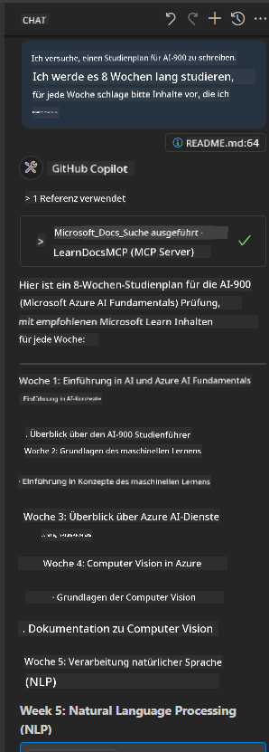

<!--
CO_OP_TRANSLATOR_METADATA:
{
  "original_hash": "4319d291c9d124ecafea52b3d04bfa0e",
  "translation_date": "2025-06-23T10:58:08+00:00",
  "source_file": "09-CaseStudy/docs-mcp/README.md",
  "language_code": "de"
}
-->
> Für eine ausführliche Anleitung mit Screenshots und Schritt-für-Schritt-Anleitung siehe [`README.md`](./solution/scenario3/README.md).

Dieser Ansatz ist ideal für alle, die technische Kurse erstellen, Dokumentationen schreiben oder Code mit häufigem Nachschlagebedarf entwickeln.

## Wichtige Erkenntnisse

Die direkte Integration von Dokumentation in deine Werkzeuge ist nicht nur praktisch – sie verändert die Produktivität grundlegend. Durch die Verbindung mit dem Microsoft Learn Docs MCP-Server von deinem Client aus kannst du:

- Das ständige Wechseln zwischen Code und Dokumentation vermeiden
- Aktuelle, kontextbezogene Dokumentation in Echtzeit abrufen
- Intelligentere, interaktivere Entwickler-Tools erstellen

Diese Fähigkeiten helfen dir, Lösungen zu entwickeln, die nicht nur effizient, sondern auch angenehm zu bedienen sind.

## Weitere Ressourcen

Um dein Wissen zu vertiefen, schau dir diese offiziellen Ressourcen an:

- [Microsoft Learn Docs MCP Server (GitHub)](https://github.com/MicrosoftDocs/mcp)
- [Erste Schritte mit Azure MCP Server (mcp-python)](https://learn.microsoft.com/en-us/azure/developer/azure-mcp-server/get-started#create-the-python-app)
- [Was ist der Azure MCP Server?](https://learn.microsoft.com/en-us/azure/developer/azure-mcp-server/)
- [Model Context Protocol (MCP) Einführung](https://modelcontextprotocol.io/introduction)
- [Plugins von einem MCP-Server hinzufügen (Python)](https://learn.microsoft.com/en-us/semantic-kernel/concepts/plugins/adding-mcp-plugins)

**Haftungsausschluss**:  
Dieses Dokument wurde mit dem KI-Übersetzungsdienst [Co-op Translator](https://github.com/Azure/co-op-translator) übersetzt. Obwohl wir auf Genauigkeit achten, bitten wir zu beachten, dass automatisierte Übersetzungen Fehler oder Ungenauigkeiten enthalten können. Das Originaldokument in seiner Ursprungssprache gilt als maßgebliche Quelle. Für wichtige Informationen wird eine professionelle menschliche Übersetzung empfohlen. Wir übernehmen keine Haftung für Missverständnisse oder Fehlinterpretationen, die aus der Nutzung dieser Übersetzung entstehen.