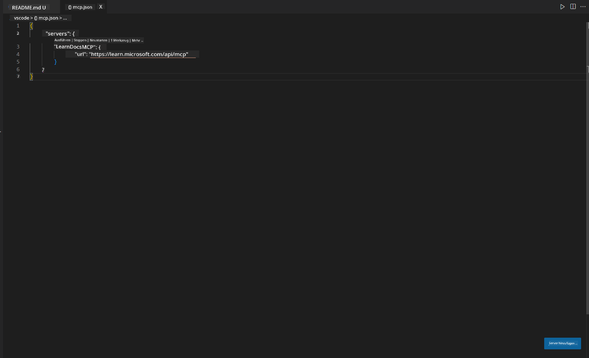
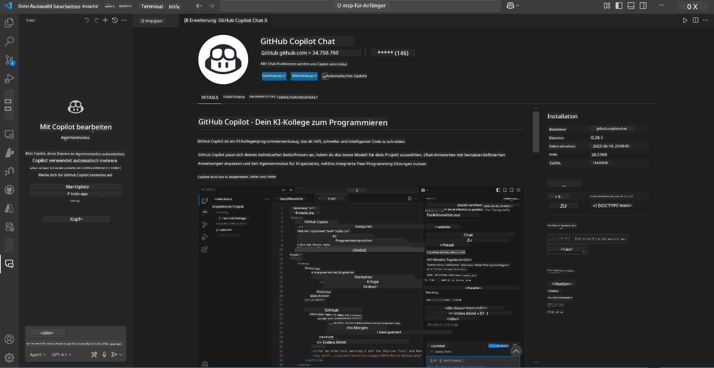
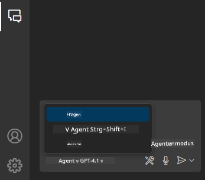
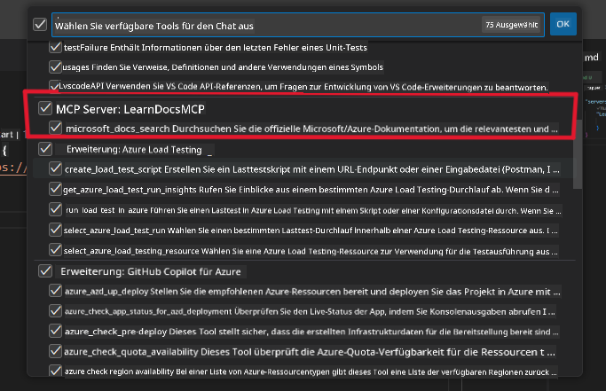
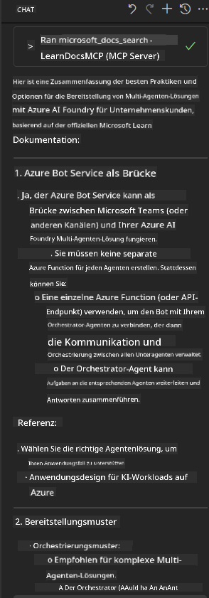

<!--
CO_OP_TRANSLATOR_METADATA:
{
  "original_hash": "db532b1ec386c9ce38c791653dc3c881",
  "translation_date": "2025-06-21T14:34:29+00:00",
  "source_file": "09-CaseStudy/docs-mcp/solution/scenario3/README.md",
  "language_code": "de"
}
-->
# Szenario 3: In-Editor-Dokumentation mit MCP-Server in VS Code

## Überblick

In diesem Szenario lernst du, wie du Microsoft Learn Docs direkt in deine Visual Studio Code Umgebung mit dem MCP-Server integrierst. Anstatt ständig zwischen Browser-Tabs zu wechseln, um Dokumentationen zu suchen, kannst du offizielle Docs direkt im Editor aufrufen, durchsuchen und referenzieren. Dieser Ansatz optimiert deinen Arbeitsablauf, hält dich fokussiert und ermöglicht eine nahtlose Integration mit Tools wie GitHub Copilot.

- Suche und lese Dokumentationen innerhalb von VS Code, ohne deine Programmierumgebung zu verlassen.
- Verweise auf Dokumentationen und füge Links direkt in deine README- oder Kursdateien ein.
- Nutze GitHub Copilot und MCP gemeinsam für einen reibungslosen, KI-gestützten Dokumentationsworkflow.

## Lernziele

Am Ende dieses Kapitels wirst du wissen, wie du den MCP-Server in VS Code einrichtest und nutzt, um deinen Dokumentations- und Entwicklungsworkflow zu verbessern. Du wirst in der Lage sein:

- Deinen Workspace so zu konfigurieren, dass der MCP-Server für die Dokumentationssuche verwendet wird.
- Dokumentationen direkt aus VS Code heraus zu suchen und einzufügen.
- Die Kombination aus GitHub Copilot und MCP für einen produktiveren, KI-unterstützten Workflow zu nutzen.

Diese Fähigkeiten helfen dir, fokussiert zu bleiben, die Qualität deiner Dokumentation zu verbessern und deine Produktivität als Entwickler oder technischer Redakteur zu steigern.

## Lösung

Um Zugriff auf Dokumentationen direkt im Editor zu erhalten, folgst du einer Reihe von Schritten, die den MCP-Server mit VS Code und GitHub Copilot verbinden. Diese Lösung ist ideal für Kursautoren, Dokumentationsschreiber und Entwickler, die beim Arbeiten mit Docs und Copilot im Editor konzentriert bleiben möchten.

- Füge beim Schreiben eines Kurses oder einer Projektdokumentation schnell Referenzlinks zu einer README hinzu.
- Nutze Copilot zum Generieren von Code und MCP, um relevante Dokumentationen sofort zu finden und zu zitieren.
- Bleibe fokussiert im Editor und steigere deine Produktivität.

### Schritt-für-Schritt-Anleitung

Um loszulegen, folge diesen Schritten. Für jeden Schritt kannst du einen Screenshot aus dem Assets-Ordner hinzufügen, um den Vorgang visuell zu veranschaulichen.

1. **Füge die MCP-Konfiguration hinzu:**  
   Erstelle im Projektstamm eine `.vscode/mcp.json` Datei und füge folgende Konfiguration ein:  
   ```json
   {
     "servers": {
       "LearnDocsMCP": {
         "url": "https://learn.microsoft.com/api/mcp"
       }
     }
   }
   ```  
   Diese Konfiguration teilt VS Code mit, wie die Verbindung zum [`Microsoft Learn Docs MCP server`](https://github.com/MicrosoftDocs/mcp) hergestellt wird.
   
   
    
2. **Öffne das GitHub Copilot Chat-Panel:**  
   Falls die GitHub Copilot Erweiterung noch nicht installiert ist, gehe zur Erweiterungsansicht in VS Code und installiere sie. Du kannst sie direkt aus dem [Visual Studio Code Marketplace](https://marketplace.visualstudio.com/items?itemName=GitHub.copilot-chat) herunterladen. Öffne anschließend das Copilot Chat-Panel über die Seitenleiste.

   

3. **Aktiviere den Agentenmodus und überprüfe die Tools:**  
   Aktiviere im Copilot Chat-Panel den Agentenmodus.

   

   Nach der Aktivierung des Agentenmodus stelle sicher, dass der MCP-Server als verfügbares Tool gelistet ist. So kann der Copilot-Agent auf den Dokumentationsserver zugreifen, um relevante Informationen abzurufen.
   
   

4. **Starte einen neuen Chat und stelle Anfragen an den Agenten:**  
   Öffne im Copilot Chat-Panel einen neuen Chat. Du kannst nun deine Dokumentationsanfragen an den Agenten richten. Der Agent nutzt den MCP-Server, um relevante Microsoft Learn Dokumentationen direkt im Editor abzurufen und anzuzeigen.

   - *„Ich möchte einen Lernplan für Thema X erstellen. Ich plane, es über 8 Wochen zu lernen. Für jede Woche, schlage mir Inhalte vor, die ich bearbeiten sollte.“*

   

5. **Live-Abfrage:**  

   > Hier ein Live-Beispiel aus dem [#get-help](https://discord.gg/D6cRhjHWSC) Bereich im Azure AI Foundry Discord ([Originalnachricht ansehen](https://discord.com/channels/1113626258182504448/1385498306720829572)):
   
   *„Ich suche Antworten dazu, wie man eine Multi-Agenten-Lösung mit KI-Agenten, die auf Azure AI Foundry entwickelt wurden, bereitstellt. Es gibt keine direkte Bereitstellungsmethode wie Copilot Studio Channels. Welche Möglichkeiten gibt es, um diese Bereitstellung für Unternehmenskunden zu realisieren, damit sie interagieren und ihre Aufgaben erledigen können?  
   Es gibt zahlreiche Artikel/Blogs, die sagen, dass man den Azure Bot Service verwenden kann, der als Brücke zwischen MS Teams und Azure AI Foundry Agents fungiert. Funktioniert das, wenn ich einen Azure Bot einrichte, der über eine Azure Function mit dem Orchestrator Agent auf Azure AI Foundry verbunden ist, um die Orchestrierung durchzuführen? Oder muss ich für jeden KI-Agenten der Multi-Agenten-Lösung eine eigene Azure Function erstellen, um die Orchestrierung im Bot Framework zu realisieren? Andere Vorschläge sind sehr willkommen.“*

   

   Der Agent antwortet mit relevanten Dokumentationslinks und Zusammenfassungen, die du direkt in deine Markdown-Dateien einfügen oder als Referenzen im Code verwenden kannst.
   
### Beispielanfragen

Hier einige Beispielanfragen, die du ausprobieren kannst. Diese zeigen, wie MCP-Server und Copilot zusammenarbeiten, um sofort kontextbezogene Dokumentationen und Verweise zu liefern, ohne VS Code zu verlassen:

- „Zeig mir, wie man Azure Functions Triggers verwendet.“
- „Füge einen Link zur offiziellen Dokumentation für Azure Key Vault ein.“
- „Was sind Best Practices zur Absicherung von Azure-Ressourcen?“
- „Finde ein Quickstart für Azure AI Services.“

Diese Anfragen demonstrieren, wie MCP-Server und Copilot gemeinsam eine sofortige, kontextbewusste Dokumentation und Verweise innerhalb von VS Code ermöglichen.

---

**Haftungsausschluss**:  
Dieses Dokument wurde mit dem KI-Übersetzungsdienst [Co-op Translator](https://github.com/Azure/co-op-translator) übersetzt. Obwohl wir uns um Genauigkeit bemühen, beachten Sie bitte, dass automatisierte Übersetzungen Fehler oder Ungenauigkeiten enthalten können. Das Originaldokument in seiner Ursprungssprache ist als maßgebliche Quelle zu betrachten. Für wichtige Informationen wird eine professionelle menschliche Übersetzung empfohlen. Wir übernehmen keine Haftung für Missverständnisse oder Fehlinterpretationen, die aus der Verwendung dieser Übersetzung entstehen.