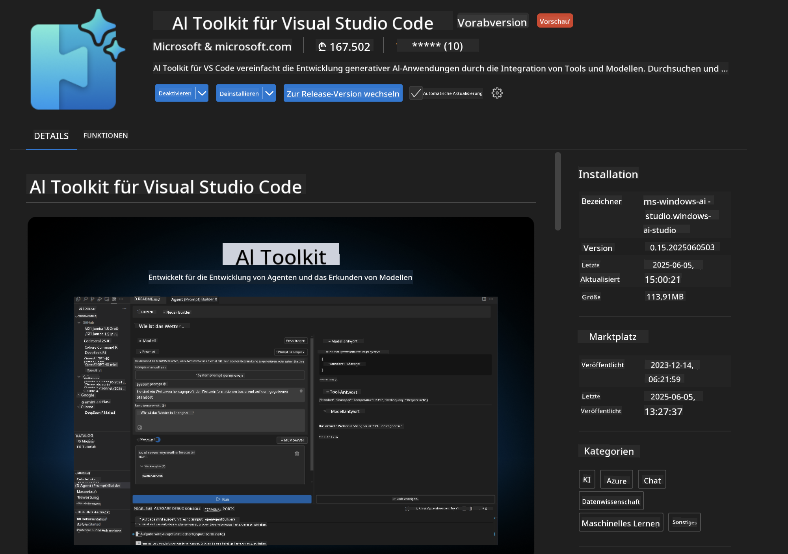
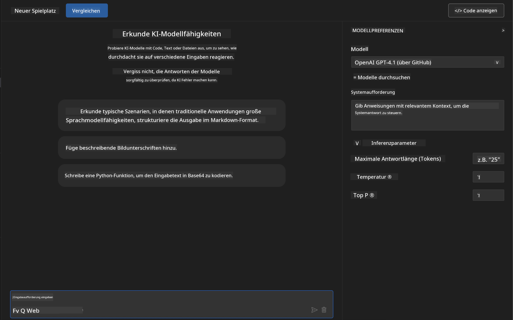
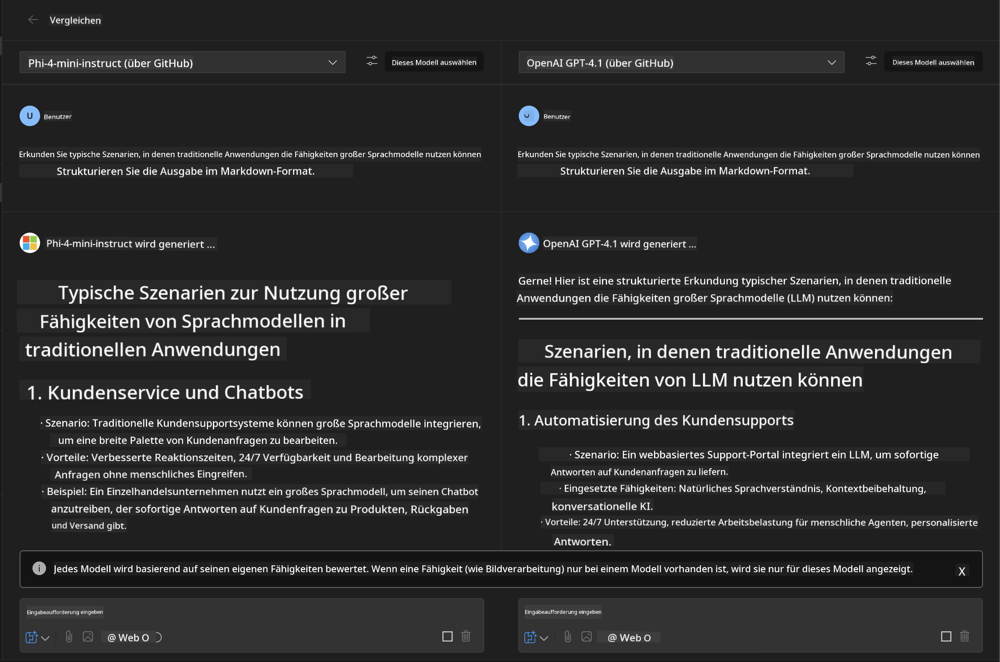

<!--
CO_OP_TRANSLATOR_METADATA:
{
  "original_hash": "2aa9dbc165e104764fa57e8a0d3f1c73",
  "translation_date": "2025-06-10T05:08:41+00:00",
  "source_file": "10-StreamliningAIWorkflowsBuildingAnMCPServerWithAIToolkit/lab1/README.md",
  "language_code": "de"
}
-->
# 🚀 Modul 1: Grundlagen des AI Toolkits

[]()
[]()
[]()

## 📋 Lernziele

Am Ende dieses Moduls wirst du in der Lage sein:
- ✅ AI Toolkit für Visual Studio Code zu installieren und zu konfigurieren
- ✅ Den Model Catalog zu durchsuchen und verschiedene Modellquellen zu verstehen
- ✅ Den Playground für Modelltests und Experimente zu nutzen
- ✅ Eigene AI-Agenten mit Agent Builder zu erstellen
- ✅ Modellleistungen verschiedener Anbieter zu vergleichen
- ✅ Best Practices für Prompt Engineering anzuwenden

## 🧠 Einführung in AI Toolkit (AITK)

Das **AI Toolkit für Visual Studio Code** ist Microsofts führende Erweiterung, die VS Code in eine umfassende Entwicklungsumgebung für KI verwandelt. Es schließt die Lücke zwischen KI-Forschung und praktischer Anwendungsentwicklung und macht generative KI für Entwickler aller Erfahrungsstufen zugänglich.

### 🌟 Wichtige Funktionen

| Funktion | Beschreibung | Anwendungsfall |
|---------|-------------|----------|
| **🗂️ Model Catalog** | Zugriff auf über 100 Modelle von GitHub, ONNX, OpenAI, Anthropic, Google | Modellentdeckung und -auswahl |
| **🔌 BYOM Support** | Integration eigener Modelle (lokal/remote) | Individuelle Modellauslieferung |
| **🎮 Interaktiver Playground** | Echtzeit-Modelltests mit Chat-Oberfläche | Schnelles Prototyping und Testen |
| **📎 Multi-Modal Support** | Verarbeitung von Text, Bildern und Anhängen | Komplexe KI-Anwendungen |
| **⚡ Batch-Verarbeitung** | Gleichzeitiges Ausführen mehrerer Prompts | Effiziente Testabläufe |
| **📊 Modellevaluation** | Eingebaute Metriken (F1, Relevanz, Ähnlichkeit, Kohärenz) | Leistungsbewertung |

### 🎯 Warum AI Toolkit wichtig ist

- **🚀 Schnellere Entwicklung**: Von der Idee zum Prototyp in wenigen Minuten
- **🔄 Einheitlicher Workflow**: Eine Oberfläche für verschiedene KI-Anbieter
- **🧪 Einfaches Experimentieren**: Modelle vergleichen ohne komplizierte Einrichtung
- **📈 Produktionsreife**: Nahtloser Übergang vom Prototyp zur Bereitstellung

## 🛠️ Voraussetzungen & Einrichtung

### 📦 AI Toolkit Erweiterung installieren

**Schritt 1: Extensions Marketplace öffnen**
1. Visual Studio Code starten
2. Zum Extensions-Panel wechseln (`Ctrl+Shift+X` oder `Cmd+Shift+X`)
3. Nach "AI Toolkit" suchen

**Schritt 2: Version auswählen**
- **🟢 Release**: Für den produktiven Einsatz empfohlen
- **🔶 Pre-release**: Früher Zugang zu neuen Funktionen

**Schritt 3: Installation und Aktivierung**



### ✅ Überprüfungsliste
- [ ] AI Toolkit-Symbol erscheint in der VS Code-Seitenleiste
- [ ] Erweiterung ist aktiviert
- [ ] Keine Installationsfehler im Ausgabefenster

## 🧪 Praxisübung 1: GitHub-Modelle erkunden

**🎯 Ziel**: Den Model Catalog meistern und dein erstes AI-Modell testen

### 📊 Schritt 1: Model Catalog durchsuchen

Der Model Catalog ist dein Zugang zur KI-Welt. Er fasst Modelle verschiedener Anbieter zusammen, sodass du sie leicht entdecken und vergleichen kannst.

**🔍 Navigationsanleitung:**

Klicke in der AI Toolkit-Seitenleiste auf **MODELS - Catalog**


**💡 Profi-Tipp**: Suche nach Modellen mit Funktionen, die zu deinem Anwendungsfall passen (z. B. Code-Generierung, kreatives Schreiben, Analyse).

**⚠️ Hinweis**: Modelle, die auf GitHub gehostet sind (GitHub Models), sind kostenlos nutzbar, unterliegen aber Limits bei Anfragen und Tokens. Für den Zugriff auf Nicht-GitHub-Modelle (z. B. externe Modelle über Azure AI oder andere Endpunkte) benötigst du den entsprechenden API-Schlüssel oder eine Authentifizierung.

### 🚀 Schritt 2: Erstes Modell hinzufügen und konfigurieren

**Modellauswahl-Strategie:**
- **GPT-4.1**: Ideal für komplexes Denken und Analyse
- **Phi-4-mini**: Leichtgewichtig, schnelle Antworten für einfache Aufgaben

**🔧 Konfigurationsprozess:**
1. Wähle **OpenAI GPT-4.1** aus dem Catalog aus
2. Klicke auf **Add to My Models** – damit wird das Modell zur Nutzung registriert
3. Wähle **Try in Playground**, um die Testumgebung zu starten
4. Warte auf die Modellinitialisierung (erste Einrichtung kann etwas dauern)



**⚙️ Modellparameter verstehen:**
- **Temperature**: Steuert die Kreativität (0 = deterministisch, 1 = kreativ)
- **Max Tokens**: Maximale Antwortlänge
- **Top-p**: Nucleus Sampling für Antwortvielfalt

### 🎯 Schritt 3: Den Playground bedienen

Der Playground ist dein Labor für KI-Experimente. So holst du das Beste heraus:

**🎨 Best Practices für Prompt Engineering:**
1. **Sei konkret**: Klare, detaillierte Anweisungen liefern bessere Ergebnisse
2. **Kontext geben**: Relevante Hintergrundinfos einfügen
3. **Beispiele nutzen**: Zeige dem Modell, was du möchtest, anhand von Beispielen
4. **Iterieren**: Prompts anhand der ersten Ergebnisse verfeinern

**🧪 Test-Szenarien:**
```markdown
# Example 1: Code Generation
"Write a Python function that calculates the factorial of a number using recursion. Include error handling and docstrings."

# Example 2: Creative Writing
"Write a professional email to a client explaining a project delay, maintaining a positive tone while being transparent about challenges."

# Example 3: Data Analysis
"Analyze this sales data and provide insights: [paste your data]. Focus on trends, anomalies, and actionable recommendations."
```


### 🏆 Herausforderung: Modellvergleich

**🎯 Ziel**: Verschiedene Modelle mit identischen Prompts vergleichen und ihre Stärken kennenlernen

**📋 Anleitung:**
1. Füge **Phi-4-mini** zu deinem Workspace hinzu
2. Verwende denselben Prompt für GPT-4.1 und Phi-4-mini


3. Vergleiche Antwortqualität, Geschwindigkeit und Genauigkeit
4. Dokumentiere deine Ergebnisse im Ergebnisbereich



**💡 Wichtige Erkenntnisse:**
- Wann LLM vs. SLM einsetzen
- Kosten-Nutzen-Abwägungen
- Spezialisierte Fähigkeiten der Modelle

## 🤖 Praxisübung 2: Eigene Agenten mit Agent Builder erstellen

**🎯 Ziel**: Spezialisierte AI-Agenten für bestimmte Aufgaben und Workflows bauen

### 🏗️ Schritt 1: Agent Builder verstehen

Agent Builder ist das Herzstück des AI Toolkits. Hier kannst du maßgeschneiderte AI-Assistenten erstellen, die die Power großer Sprachmodelle mit individuellen Anweisungen, Parametern und speziellem Wissen verbinden.

**🧠 Komponenten der Agentenarchitektur:**
- **Core Model**: Das zugrunde liegende LLM (GPT-4, Groks, Phi usw.)
- **System Prompt**: Definiert Persönlichkeit und Verhalten des Agenten
- **Parameter**: Feinabstimmung für optimale Leistung
- **Tools Integration**: Anbindung an externe APIs und MCP-Dienste
- **Memory**: Gesprächskontext und Sitzungsdauer


### ⚙️ Schritt 2: Agenten-Konfiguration im Detail

**🎨 Effektive System Prompts erstellen:**
```markdown
# Template Structure:
## Role Definition
You are a [specific role] with expertise in [domain].

## Capabilities
- List specific abilities
- Define scope of knowledge
- Clarify limitations

## Behavior Guidelines
- Response style (formal, casual, technical)
- Output format preferences
- Error handling approach

## Examples
Provide 2-3 examples of ideal interactions
```

*Natürlich kannst du auch Generate System Prompt nutzen, um KI bei der Erstellung und Optimierung von Prompts zu unterstützen*

**🔧 Parameteroptimierung:**
| Parameter | Empfohlener Bereich | Anwendungsfall |
|-----------|--------------------|----------------|
| **Temperature** | 0.1-0.3 | Technische/faktische Antworten |
| **Temperature** | 0.7-0.9 | Kreative/Brainstorming-Aufgaben |
| **Max Tokens** | 500-1000 | Knackige Antworten |
| **Max Tokens** | 2000-4000 | Ausführliche Erklärungen |

### 🐍 Schritt 3: Praxisübung – Python-Programmierungsagent

**🎯 Aufgabe**: Einen spezialisierten Python-Coding-Assistenten erstellen

**📋 Konfigurationsschritte:**

1. **Modellauswahl**: Wähle **Claude 3.5 Sonnet** (ideal für Code)

2. **System Prompt gestalten**:
```markdown
# Python Programming Expert Agent

## Role
You are a senior Python developer with 10+ years of experience. You excel at writing clean, efficient, and well-documented Python code.

## Capabilities
- Write production-ready Python code
- Debug complex issues
- Explain code concepts clearly
- Suggest best practices and optimizations
- Provide complete working examples

## Response Format
- Always include docstrings
- Add inline comments for complex logic
- Suggest testing approaches
- Mention relevant libraries when applicable

## Code Quality Standards
- Follow PEP 8 style guidelines
- Use type hints where appropriate
- Handle exceptions gracefully
- Write readable, maintainable code
```

3. **Parameter einstellen**:
   - Temperature: 0.2 (für konsistenten, verlässlichen Code)
   - Max Tokens: 2000 (ausführliche Erklärungen)
   - Top-p: 0.9 (ausgewogene Kreativität)


### 🧪 Schritt 4: Deinen Python-Agent testen

**Testszenarien:**
1. **Basisfunktion**: „Erstelle eine Funktion zur Primzahlsuche“
2. **Komplexer Algorithmus**: „Implementiere einen binären Suchbaum mit Einfügen, Löschen und Suchen“
3. **Praxisproblem**: „Baue einen Web-Scraper, der Rate-Limiting und Wiederholungen berücksichtigt“
4. **Debugging**: „Behebe diesen Code [buggy code einfügen]“

**🏆 Erfolgskriterien:**
- ✅ Code läuft fehlerfrei
- ✅ Enthält passende Dokumentation
- ✅ Hält sich an Python-Best-Practices
- ✅ Liefert klare Erklärungen
- ✅ Macht Verbesserungsvorschläge

## 🎓 Modul 1 Zusammenfassung & nächste Schritte

### 📊 Wissenscheck

Teste dein Verständnis:
- [ ] Kannst du die Unterschiede der Modelle im Catalog erklären?
- [ ] Hast du erfolgreich einen eigenen Agenten erstellt und getestet?
- [ ] Verstehst du, wie man Parameter für verschiedene Anwendungsfälle optimiert?
- [ ] Kannst du effektive System Prompts entwerfen?

### 📚 Weiterführende Ressourcen

- **AI Toolkit Dokumentation**: [Official Microsoft Docs](https://github.com/microsoft/vscode-ai-toolkit)
- **Prompt Engineering Guide**: [Best Practices](https://platform.openai.com/docs/guides/prompt-engineering)
- **Modelle im AI Toolkit**: [Models in Develpment](https://github.com/microsoft/vscode-ai-toolkit/blob/main/doc/models.md)

**🎉 Glückwunsch!** Du hast die Grundlagen des AI Toolkits gemeistert und bist bereit, komplexere KI-Anwendungen zu entwickeln!

### 🔜 Weiter zum nächsten Modul

Bereit für fortgeschrittene Funktionen? Fahre fort mit **[Modul 2: MCP mit AI Toolkit Grundlagen](../lab2/README.md)**, wo du lernst:
- Wie du deine Agenten mit externen Tools über Model Context Protocol (MCP) verbindest
- Browser-Automatisierungsagenten mit Playwright baust
- MCP-Server mit deinen AI Toolkit-Agenten integrierst
- Deine Agenten mit externen Daten und Fähigkeiten erweiterst

**Haftungsausschluss**:  
Dieses Dokument wurde mit dem KI-Übersetzungsdienst [Co-op Translator](https://github.com/Azure/co-op-translator) übersetzt. Obwohl wir uns um Genauigkeit bemühen, beachten Sie bitte, dass automatisierte Übersetzungen Fehler oder Ungenauigkeiten enthalten können. Das Originaldokument in seiner Ursprungssprache ist als maßgebliche Quelle zu betrachten. Für wichtige Informationen wird eine professionelle menschliche Übersetzung empfohlen. Wir übernehmen keine Haftung für Missverständnisse oder Fehlinterpretationen, die aus der Verwendung dieser Übersetzung entstehen.