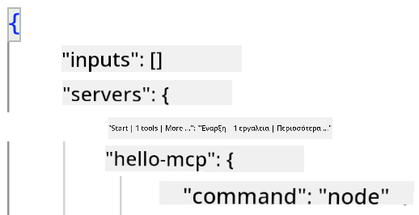

<!--
CO_OP_TRANSLATOR_METADATA:
{
  "original_hash": "8ea28e5e566edd5969337fd0b191ba3f",
  "translation_date": "2025-07-17T05:49:21+00:00",
  "source_file": "03-GettingStarted/04-vscode/README.md",
  "language_code": "el"
}
-->
# Κατανάλωση ενός server από το GitHub Copilot Agent mode

Το Visual Studio Code και το GitHub Copilot μπορούν να λειτουργήσουν ως πελάτες και να καταναλώσουν έναν MCP Server. Μπορεί να αναρωτιέστε γιατί θα θέλαμε να το κάνουμε αυτό; Λοιπόν, αυτό σημαίνει ότι οποιαδήποτε λειτουργία έχει ο MCP Server μπορεί τώρα να χρησιμοποιηθεί μέσα από το IDE σας. Φανταστείτε, για παράδειγμα, να προσθέσετε τον MCP server του GitHub, κάτι που θα επέτρεπε τον έλεγχο του GitHub μέσω εντολών σε φυσική γλώσσα αντί να πληκτρολογείτε συγκεκριμένες εντολές στο τερματικό. Ή φανταστείτε οτιδήποτε γενικά που θα μπορούσε να βελτιώσει την εμπειρία σας ως προγραμματιστής, όλα ελεγχόμενα με φυσική γλώσσα. Τώρα αρχίζετε να βλέπετε το όφελος, σωστά;

## Επισκόπηση

Αυτό το μάθημα καλύπτει πώς να χρησιμοποιήσετε το Visual Studio Code και το GitHub Copilot σε Agent mode ως πελάτη για τον MCP Server σας.

## Στόχοι Μάθησης

Στο τέλος αυτού του μαθήματος, θα μπορείτε να:

- Καταναλώνετε έναν MCP Server μέσω του Visual Studio Code.
- Εκτελείτε λειτουργίες όπως εργαλεία μέσω του GitHub Copilot.
- Ρυθμίζετε το Visual Studio Code ώστε να βρίσκει και να διαχειρίζεται τον MCP Server σας.

## Χρήση

Μπορείτε να ελέγξετε τον MCP server σας με δύο διαφορετικούς τρόπους:

- Μέσω γραφικού περιβάλλοντος, θα δείτε πώς γίνεται αυτό αργότερα σε αυτό το κεφάλαιο.
- Μέσω τερματικού, είναι δυνατόν να ελέγχετε πράγματα από το τερματικό χρησιμοποιώντας το εκτελέσιμο `code`:

  Για να προσθέσετε έναν MCP server στο προφίλ χρήστη σας, χρησιμοποιήστε την επιλογή γραμμής εντολών --add-mcp και παρέχετε τη διαμόρφωση του server σε μορφή JSON ως {\"name\":\"server-name\",\"command\":...}.

  ```
  code --add-mcp "{\"name\":\"my-server\",\"command\": \"uvx\",\"args\": [\"mcp-server-fetch\"]}"
  ```

### Στιγμιότυπα οθόνης

  
  


Ας μιλήσουμε περισσότερο για το πώς χρησιμοποιούμε το γραφικό περιβάλλον στις επόμενες ενότητες.

## Προσέγγιση

Ακολουθεί πώς πρέπει να προσεγγίσουμε το θέμα σε υψηλό επίπεδο:

- Ρυθμίστε ένα αρχείο για να βρείτε τον MCP Server μας.
- Ξεκινήστε/Συνδεθείτε στον server ώστε να εμφανίσει τις δυνατότητές του.
- Χρησιμοποιήστε αυτές τις δυνατότητες μέσω της διεπαφής GitHub Copilot Chat.

Τέλεια, τώρα που κατανοούμε τη ροή, ας δοκιμάσουμε να χρησιμοποιήσουμε έναν MCP Server μέσω του Visual Studio Code με μια άσκηση.

## Άσκηση: Κατανάλωση ενός server

Σε αυτή την άσκηση, θα ρυθμίσουμε το Visual Studio Code ώστε να βρει τον MCP server σας, ώστε να μπορεί να χρησιμοποιηθεί μέσω της διεπαφής GitHub Copilot Chat.

### -0- Προκαταρκτικό βήμα, ενεργοποίηση ανίχνευσης MCP Server

Ίσως χρειαστεί να ενεργοποιήσετε την ανίχνευση MCP Servers.

1. Μεταβείτε στο `File -> Preferences -> Settings` στο Visual Studio Code.

1. Αναζητήστε "MCP" και ενεργοποιήστε το `chat.mcp.discovery.enabled` στο αρχείο settings.json.

### -1- Δημιουργία αρχείου ρύθμισης

Ξεκινήστε δημιουργώντας ένα αρχείο ρύθμισης στη ρίζα του έργου σας, θα χρειαστείτε ένα αρχείο με όνομα MCP.json το οποίο θα τοποθετήσετε σε έναν φάκελο με όνομα .vscode. Θα πρέπει να μοιάζει ως εξής:

```text
.vscode
|-- mcp.json
```

Στη συνέχεια, ας δούμε πώς μπορούμε να προσθέσουμε μια εγγραφή server.

### -2- Ρύθμιση ενός server

Προσθέστε το παρακάτω περιεχόμενο στο *mcp.json*:

```json
{
    "inputs": [],
    "servers": {
       "hello-mcp": {
           "command": "node",
           "args": [
               "build/index.js"
           ]
       }
    }
}
```

Παραπάνω υπάρχει ένα απλό παράδειγμα για το πώς να ξεκινήσετε έναν server γραμμένο σε Node.js, για άλλες πλατφόρμες υποδείξτε την κατάλληλη εντολή εκκίνησης του server χρησιμοποιώντας τα `command` και `args`.

### -3- Εκκίνηση του server

Τώρα που έχετε προσθέσει μια εγγραφή, ας ξεκινήσουμε τον server:

1. Εντοπίστε την εγγραφή σας στο *mcp.json* και βεβαιωθείτε ότι βλέπετε το εικονίδιο "play":

    

1. Κάντε κλικ στο εικονίδιο "play", θα πρέπει να δείτε το εικονίδιο εργαλείων στο GitHub Copilot Chat να αυξάνει τον αριθμό των διαθέσιμων εργαλείων. Αν κάνετε κλικ σε αυτό το εικονίδιο εργαλείων, θα δείτε μια λίστα με τα καταχωρημένα εργαλεία. Μπορείτε να επιλέξετε/αποεπιλέξετε κάθε εργαλείο ανάλογα με το αν θέλετε το GitHub Copilot να τα χρησιμοποιεί ως πλαίσιο:

  

1. Για να εκτελέσετε ένα εργαλείο, πληκτρολογήστε μια εντολή που ξέρετε ότι ταιριάζει με την περιγραφή ενός από τα εργαλεία σας, για παράδειγμα μια εντολή όπως "add 22 to 1":

  

  Θα πρέπει να δείτε μια απάντηση που λέει 23.

## Ανάθεση

Δοκιμάστε να προσθέσετε μια εγγραφή server στο αρχείο *mcp.json* και βεβαιωθείτε ότι μπορείτε να ξεκινήσετε/σταματήσετε τον server. Βεβαιωθείτε επίσης ότι μπορείτε να επικοινωνήσετε με τα εργαλεία στον server σας μέσω της διεπαφής GitHub Copilot Chat.

## Λύση

[Solution](./solution/README.md)

## Κύρια Σημεία

Τα βασικά σημεία από αυτό το κεφάλαιο είναι τα εξής:

- Το Visual Studio Code είναι ένας εξαιρετικός πελάτης που σας επιτρέπει να καταναλώνετε πολλούς MCP Servers και τα εργαλεία τους.
- Η διεπαφή GitHub Copilot Chat είναι ο τρόπος με τον οποίο αλληλεπιδράτε με τους servers.
- Μπορείτε να ζητήσετε από τον χρήστη να εισάγει δεδομένα όπως API keys, τα οποία μπορούν να περαστούν στον MCP Server κατά τη ρύθμιση της εγγραφής server στο αρχείο *mcp.json*.

## Παραδείγματα

- [Java Calculator](../samples/java/calculator/README.md)  
- [.Net Calculator](../../../../03-GettingStarted/samples/csharp)  
- [JavaScript Calculator](../samples/javascript/README.md)  
- [TypeScript Calculator](../samples/typescript/README.md)  
- [Python Calculator](../../../../03-GettingStarted/samples/python)

## Πρόσθετοι Πόροι

- [Visual Studio docs](https://code.visualstudio.com/docs/copilot/chat/mcp-servers)

## Τι Ακολουθεί

- Επόμενο: [Creating an SSE Server](../05-sse-server/README.md)

**Αποποίηση ευθυνών**:  
Αυτό το έγγραφο έχει μεταφραστεί χρησιμοποιώντας την υπηρεσία αυτόματης μετάφρασης AI [Co-op Translator](https://github.com/Azure/co-op-translator). Παρόλο που επιδιώκουμε την ακρίβεια, παρακαλούμε να γνωρίζετε ότι οι αυτόματες μεταφράσεις ενδέχεται να περιέχουν λάθη ή ανακρίβειες. Το πρωτότυπο έγγραφο στη γλώσσα του θεωρείται η αυθεντική πηγή. Για κρίσιμες πληροφορίες, συνιστάται επαγγελματική ανθρώπινη μετάφραση. Δεν φέρουμε ευθύνη για τυχόν παρεξηγήσεις ή λανθασμένες ερμηνείες που προκύπτουν από τη χρήση αυτής της μετάφρασης.