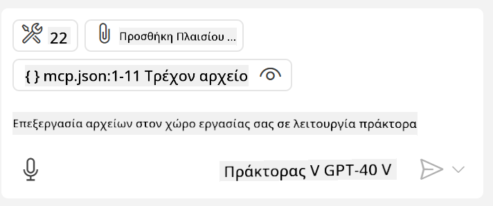
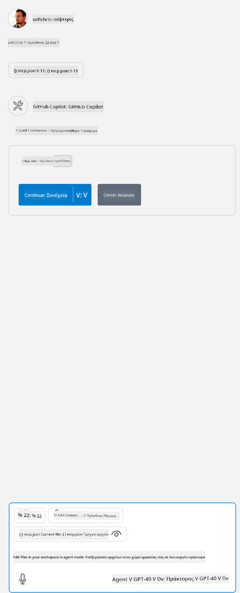

<!--
CO_OP_TRANSLATOR_METADATA:
{
  "original_hash": "0eb9557780cd0a2551cdb8a16c886b51",
  "translation_date": "2025-06-17T15:47:58+00:00",
  "source_file": "03-GettingStarted/04-vscode/README.md",
  "language_code": "el"
}
-->
Ας μιλήσουμε περισσότερο για το πώς χρησιμοποιούμε το οπτικό περιβάλλον στις επόμενες ενότητες.

## Προσέγγιση

Ακολουθεί ένας γενικός οδηγός για το πώς πρέπει να προσεγγίσουμε το θέμα:

- Διαμορφώστε ένα αρχείο για να βρείτε τον MCP Server σας.
- Ξεκινήστε/Συνδεθείτε στον συγκεκριμένο server ώστε να εμφανίσει τις δυνατότητές του.
- Χρησιμοποιήστε αυτές τις δυνατότητες μέσω του περιβάλλοντος συνομιλίας του GitHub Copilot.

Τέλεια, τώρα που καταλαβαίνουμε τη ροή, ας δοκιμάσουμε να χρησιμοποιήσουμε έναν MCP Server μέσω του Visual Studio Code με μια άσκηση.

## Άσκηση: Χρήση ενός server

Σε αυτή την άσκηση, θα ρυθμίσουμε το Visual Studio Code ώστε να βρει τον MCP server σας, ώστε να μπορεί να χρησιμοποιηθεί από το περιβάλλον συνομιλίας του GitHub Copilot.

### -0- Προετοιμασία, ενεργοποίηση ανίχνευσης MCP Server

Ίσως χρειαστεί να ενεργοποιήσετε την ανίχνευση MCP Servers.

1. Μεταβείτε στο `File -> Preferences -> Settings` και στο αρχείο settings.json βρείτε την επιλογή `chat.mcp.discovery.enabled`.

### -1- Δημιουργία αρχείου ρυθμίσεων

Ξεκινήστε δημιουργώντας ένα αρχείο ρυθμίσεων στη ρίζα του έργου σας. Θα χρειαστείτε ένα αρχείο με όνομα MCP.json, το οποίο θα τοποθετήσετε σε έναν φάκελο με όνομα .vscode. Θα πρέπει να μοιάζει κάπως έτσι:

```text
.vscode
|-- mcp.json
```

Έπειτα, ας δούμε πώς μπορούμε να προσθέσουμε μια εγγραφή για server.

### -2- Διαμόρφωση server

Προσθέστε το παρακάτω περιεχόμενο στο *mcp.json*:

```json
{
    "inputs": [],
    "servers": {
       "hello-mcp": {
           "command": "node",
           "args": [
               "build/index.js"
           ]
       }
    }
}
```

Παραπάνω βλέπετε ένα απλό παράδειγμα για το πώς να ξεκινήσετε έναν server γραμμένο σε Node.js. Για άλλες πλατφόρμες, υποδείξτε την κατάλληλη εντολή εκκίνησης του server χρησιμοποιώντας το `command` and `args`.

### -3- Εκκίνηση του server

Τώρα που έχετε προσθέσει μια εγγραφή, ας ξεκινήσουμε τον server:

1. Εντοπίστε την εγγραφή σας στο *mcp.json* και βεβαιωθείτε ότι βλέπετε το εικονίδιο "play":

    

2. Κάντε κλικ στο εικονίδιο "play". Θα δείτε το εικονίδιο εργαλείων στο GitHub Copilot Chat να αυξάνει τον αριθμό των διαθέσιμων εργαλείων. Αν κάνετε κλικ στο εικονίδιο εργαλείων, θα δείτε μια λίστα με τα καταχωρημένα εργαλεία. Μπορείτε να επιλέξετε ή να αποεπιλέξετε κάθε εργαλείο ανάλογα με το αν θέλετε να χρησιμοποιούνται ως πλαίσιο από το GitHub Copilot:

  

3. Για να εκτελέσετε ένα εργαλείο, πληκτρολογήστε ένα prompt που γνωρίζετε ότι ταιριάζει με την περιγραφή ενός από τα εργαλεία σας, για παράδειγμα ένα prompt όπως "add 22 to 1":

  

  Θα πρέπει να δείτε απάντηση που λέει 23.

## Ανάθεση

Δοκιμάστε να προσθέσετε μια εγγραφή server στο αρχείο *mcp.json* και βεβαιωθείτε ότι μπορείτε να ξεκινήσετε/σταματήσετε τον server. Βεβαιωθείτε επίσης ότι μπορείτε να επικοινωνήσετε με τα εργαλεία στον server μέσω του περιβάλλοντος συνομιλίας του GitHub Copilot.

## Λύση

[Λύση](./solution/README.md)

## Κύρια σημεία

Τα βασικά σημεία από αυτό το κεφάλαιο είναι τα εξής:

- Το Visual Studio Code είναι ένας εξαιρετικός πελάτης που σας επιτρέπει να χρησιμοποιήσετε πολλούς MCP Servers και τα εργαλεία τους.
- Το περιβάλλον συνομιλίας του GitHub Copilot είναι ο τρόπος με τον οποίο αλληλεπιδράτε με τους servers.
- Μπορείτε να ζητήσετε από τον χρήστη να εισάγει στοιχεία όπως API keys, τα οποία μπορούν να περαστούν στον MCP Server κατά τη διαμόρφωση της εγγραφής server στο αρχείο *mcp.json*.

## Παραδείγματα

- [Java Calculator](../samples/java/calculator/README.md)
- [.Net Calculator](../../../../03-GettingStarted/samples/csharp)
- [JavaScript Calculator](../samples/javascript/README.md)
- [TypeScript Calculator](../samples/typescript/README.md)
- [Python Calculator](../../../../03-GettingStarted/samples/python)

## Πρόσθετοι πόροι

- [Τεκμηρίωση Visual Studio](https://code.visualstudio.com/docs/copilot/chat/mcp-servers)

## Τι ακολουθεί

- Επόμενο: [Δημιουργία SSE Server](/03-GettingStarted/05-sse-server/README.md)

**Αποποίηση Ευθυνών**:  
Αυτό το έγγραφο έχει μεταφραστεί χρησιμοποιώντας την υπηρεσία αυτόματης μετάφρασης AI [Co-op Translator](https://github.com/Azure/co-op-translator). Παρόλο που προσπαθούμε για ακρίβεια, παρακαλούμε να γνωρίζετε ότι οι αυτόματες μεταφράσεις ενδέχεται να περιέχουν σφάλματα ή ανακρίβειες. Το πρωτότυπο έγγραφο στη μητρική του γλώσσα πρέπει να θεωρείται η επίσημη πηγή. Για κρίσιμες πληροφορίες, συνιστάται η επαγγελματική ανθρώπινη μετάφραση. Δεν φέρουμε ευθύνη για τυχόν παρεξηγήσεις ή λανθασμένες ερμηνείες που προκύπτουν από τη χρήση αυτής της μετάφρασης.