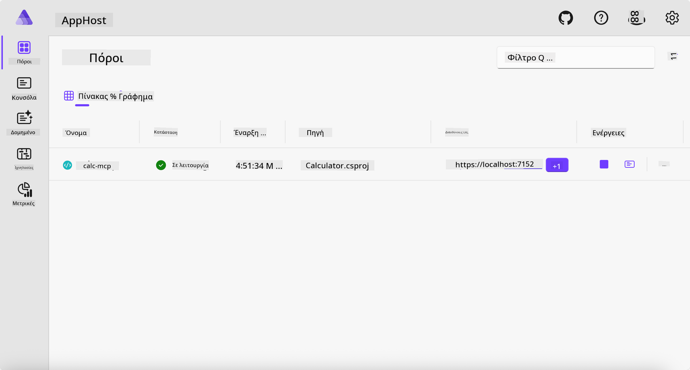

<!--
CO_OP_TRANSLATOR_METADATA:
{
  "original_hash": "0bc7bd48f55f1565f1d95ccb2c16f728",
  "translation_date": "2025-06-18T07:50:13+00:00",
  "source_file": "04-PracticalImplementation/samples/csharp/README.md",
  "language_code": "el"
}
-->
# Παράδειγμα

Το προηγούμενο παράδειγμα δείχνει πώς να χρησιμοποιήσετε ένα τοπικό έργο .NET με τον τύπο `stdio`. Και πώς να τρέξετε τον server τοπικά μέσα σε ένα container. Αυτή είναι μια καλή λύση σε πολλές περιπτώσεις. Ωστόσο, μπορεί να είναι χρήσιμο να έχετε τον server να τρέχει απομακρυσμένα, όπως σε ένα περιβάλλον cloud. Εδώ είναι που μπαίνει ο τύπος `http`.

Κοιτάζοντας τη λύση στον φάκελο `04-PracticalImplementation`, μπορεί να φαίνεται πολύ πιο σύνθετη από την προηγούμενη. Αλλά στην πραγματικότητα, δεν είναι. Αν κοιτάξετε προσεκτικά το έργο `src/Calculator`, θα δείτε ότι είναι κατά κύριο λόγο ο ίδιος κώδικας με το προηγούμενο παράδειγμα. Η μόνη διαφορά είναι ότι χρησιμοποιούμε μια διαφορετική βιβλιοθήκη `ModelContextProtocol.AspNetCore` για να χειριστούμε τα HTTP αιτήματα. Και αλλάζουμε τη μέθοδο `IsPrime` ώστε να γίνει ιδιωτική, απλά για να δείξουμε ότι μπορείτε να έχετε ιδιωτικές μεθόδους στον κώδικά σας. Ο υπόλοιπος κώδικας είναι ο ίδιος με πριν.

Τα υπόλοιπα έργα προέρχονται από το [.NET Aspire](https://learn.microsoft.com/dotnet/aspire/get-started/aspire-overview). Η παρουσία του .NET Aspire στη λύση βελτιώνει την εμπειρία του προγραμματιστή κατά την ανάπτυξη και τις δοκιμές και βοηθά στην παρατηρησιμότητα. Δεν είναι απαραίτητο για να τρέξει ο server, αλλά είναι καλή πρακτική να το έχετε στη λύση σας.

## Εκκίνηση του server τοπικά

1. Από το VS Code (με την επέκταση C# DevKit), μεταβείτε στον φάκελο `04-PracticalImplementation/samples/csharp`.
1. Εκτελέστε την παρακάτω εντολή για να ξεκινήσει ο server:

   ```bash
    dotnet watch run --project ./src/AppHost
   ```

1. Όταν ένας web browser ανοίξει το dashboard του .NET Aspire, σημειώστε το URL `http`. Θα πρέπει να είναι κάτι σαν `http://localhost:5058/`.

   

## Δοκιμή Streamable HTTP με τον MCP Inspector

Αν έχετε Node.js 22.7.5 ή νεότερη έκδοση, μπορείτε να χρησιμοποιήσετε τον MCP Inspector για να δοκιμάσετε τον server σας.

Ξεκινήστε τον server και τρέξτε την παρακάτω εντολή σε ένα τερματικό:

```bash
npx @modelcontextprotocol/inspector http://localhost:5058
```


- Επιλέξτε το `Streamable HTTP` as the Transport type.
- In the Url field, enter the URL of the server noted earlier, and append `/mcp`. Θα πρέπει να είναι `http` (όχι `https`) something like `http://localhost:5058/mcp`.
- select the Connect button.

A nice thing about the Inspector is that it provide a nice visibility on what is happening.

- Try listing the available tools
- Try some of them, it should works just like before.

## Test MCP Server with GitHub Copilot Chat in VS Code

To use the Streamable HTTP transport with GitHub Copilot Chat, change the configuration of the `calc-mcp` server που δημιουργήθηκε προηγουμένως ώστε να μοιάζει έτσι:

```jsonc
// .vscode/mcp.json
{
  "servers": {
    "calc-mcp": {
      "type": "http",
      "url": "http://localhost:5058/mcp"
    }
  }
}
```

Κάντε μερικές δοκιμές:

- Ζητήστε "3 πρώτους αριθμούς μετά το 6780". Παρατηρήστε πώς το Copilot θα χρησιμοποιήσει τα νέα εργαλεία `NextFivePrimeNumbers` και θα επιστρέψει μόνο τους πρώτους 3 πρώτους αριθμούς.
- Ζητήστε "7 πρώτους αριθμούς μετά το 111", για να δείτε τι συμβαίνει.
- Ζητήστε "Ο John έχει 24 γλειφιτζούρια και θέλει να τα μοιράσει όλα στα 3 παιδιά του. Πόσα γλειφιτζούρια έχει κάθε παιδί;", για να δείτε τι συμβαίνει.

## Ανάπτυξη του server στο Azure

Ας αναπτύξουμε τον server στο Azure ώστε να μπορούν να τον χρησιμοποιούν περισσότεροι.

Από ένα τερματικό, μεταβείτε στον φάκελο `04-PracticalImplementation/samples/csharp` και εκτελέστε την παρακάτω εντολή:

```bash
azd up
```

Μόλις ολοκληρωθεί η ανάπτυξη, θα πρέπει να δείτε ένα μήνυμα σαν αυτό:


Πάρτε το URL και χρησιμοποιήστε το στον MCP Inspector και στο GitHub Copilot Chat.

```jsonc
// .vscode/mcp.json
{
  "servers": {
    "calc-mcp": {
      "type": "http",
      "url": "https://calc-mcp.gentleriver-3977fbcf.australiaeast.azurecontainerapps.io/mcp"
    }
  }
}
```

## Τι ακολουθεί;

Δοκιμάζουμε διαφορετικούς τύπους μεταφοράς και εργαλεία δοκιμών. Επίσης, αναπτύσσουμε τον MCP server σας στο Azure. Αλλά τι γίνεται αν ο server μας χρειάζεται πρόσβαση σε ιδιωτικούς πόρους; Για παράδειγμα, μια βάση δεδομένων ή ένα ιδιωτικό API; Στο επόμενο κεφάλαιο, θα δούμε πώς μπορούμε να βελτιώσουμε την ασφάλεια του server μας.

**Αποποίηση ευθυνών**:  
Αυτό το έγγραφο έχει μεταφραστεί χρησιμοποιώντας την υπηρεσία αυτόματης μετάφρασης AI [Co-op Translator](https://github.com/Azure/co-op-translator). Παρόλο που επιδιώκουμε την ακρίβεια, παρακαλούμε να γνωρίζετε ότι οι αυτοματοποιημένες μεταφράσεις ενδέχεται να περιέχουν λάθη ή ανακρίβειες. Το πρωτότυπο έγγραφο στην αρχική του γλώσσα πρέπει να θεωρείται η επίσημη πηγή. Για κρίσιμες πληροφορίες, συνιστάται η επαγγελματική μετάφραση από άνθρωπο. Δεν φέρουμε ευθύνη για τυχόν παρεξηγήσεις ή λανθασμένες ερμηνείες που προκύπτουν από τη χρήση αυτής της μετάφρασης.