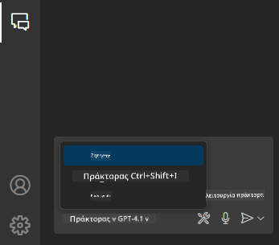
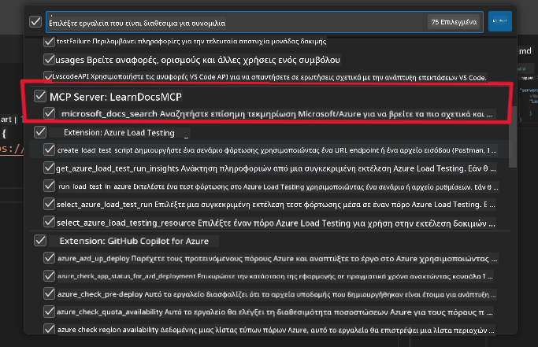
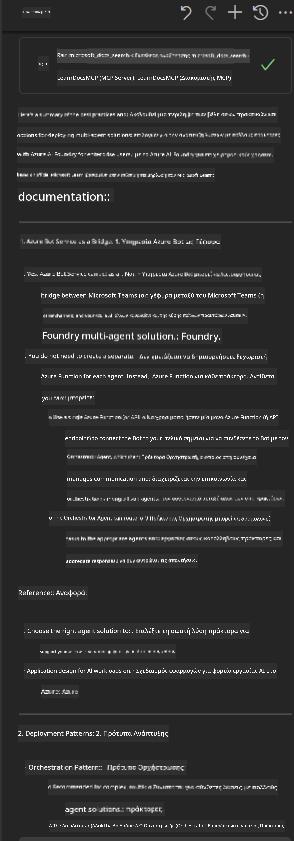

<!--
CO_OP_TRANSLATOR_METADATA:
{
  "original_hash": "db532b1ec386c9ce38c791653dc3c881",
  "translation_date": "2025-06-21T14:39:46+00:00",
  "source_file": "09-CaseStudy/docs-mcp/solution/scenario3/README.md",
  "language_code": "el"
}
-->
# Σενάριο 3: Έγγραφα μέσα στον Επεξεργαστή με MCP Server στο VS Code

## Επισκόπηση

Σε αυτό το σενάριο, θα μάθετε πώς να φέρνετε τα Microsoft Learn Docs απευθείας στο περιβάλλον του Visual Studio Code χρησιμοποιώντας τον MCP server. Αντί να αλλάζετε συνεχώς καρτέλες στον browser για να αναζητήσετε τεκμηρίωση, μπορείτε να έχετε πρόσβαση, να αναζητάτε και να αναφέρετε επίσημα έγγραφα μέσα στον ίδιο τον επεξεργαστή σας. Αυτή η προσέγγιση απλοποιεί τη ροή εργασίας σας, σας κρατά συγκεντρωμένους και επιτρέπει ομαλή ενσωμάτωση με εργαλεία όπως το GitHub Copilot.

- Αναζητήστε και διαβάστε τεκμηρίωση μέσα στο VS Code χωρίς να εγκαταλείπετε το περιβάλλον προγραμματισμού.
- Αναφέρετε τεκμηρίωση και εισάγετε συνδέσμους απευθείας στα README ή στα αρχεία του μαθήματος.
- Χρησιμοποιήστε το GitHub Copilot και το MCP μαζί για μια ομαλή, με υποστήριξη AI ροή εργασίας τεκμηρίωσης.

## Στόχοι Μάθησης

Μέχρι το τέλος αυτού του κεφαλαίου, θα κατανοείτε πώς να ρυθμίσετε και να χρησιμοποιήσετε τον MCP server μέσα στο VS Code για να βελτιώσετε τη ροή εργασίας σας όσον αφορά την τεκμηρίωση και την ανάπτυξη. Θα μπορείτε να:

- Διαμορφώσετε το χώρο εργασίας σας ώστε να χρησιμοποιεί τον MCP server για αναζήτηση τεκμηρίωσης.
- Αναζητάτε και να εισάγετε τεκμηρίωση απευθείας μέσα από το VS Code.
- Συνδυάσετε τη δύναμη του GitHub Copilot και του MCP για μια πιο αποδοτική, με υποστήριξη AI ροή εργασίας.

Αυτές οι δεξιότητες θα σας βοηθήσουν να παραμείνετε συγκεντρωμένοι, να βελτιώσετε την ποιότητα της τεκμηρίωσης και να αυξήσετε την παραγωγικότητά σας ως προγραμματιστής ή τεχνικός συγγραφέας.

## Λύση

Για να έχετε πρόσβαση σε τεκμηρίωση μέσα στον επεξεργαστή, θα ακολουθήσετε μια σειρά βημάτων που ενσωματώνουν τον MCP server με το VS Code και το GitHub Copilot. Αυτή η λύση είναι ιδανική για συγγραφείς μαθημάτων, τεχνικούς συγγραφείς και προγραμματιστές που θέλουν να διατηρούν την προσοχή τους στον επεξεργαστή ενώ δουλεύουν με τεκμηρίωση και το Copilot.

- Προσθέστε γρήγορα συνδέσμους αναφοράς σε ένα README ενώ γράφετε τεκμηρίωση για μάθημα ή έργο.
- Χρησιμοποιήστε το Copilot για να δημιουργήσετε κώδικα και το MCP για να βρείτε και να παραθέσετε άμεσα σχετική τεκμηρίωση.
- Παραμείνετε συγκεντρωμένοι στον επεξεργαστή σας και αυξήστε την παραγωγικότητα.

### Οδηγός Βήμα-βήμα

Για να ξεκινήσετε, ακολουθήστε τα παρακάτω βήματα. Για κάθε βήμα, μπορείτε να προσθέσετε ένα στιγμιότυπο οθόνης από τον φάκελο assets για να απεικονίσετε οπτικά τη διαδικασία.

1. **Προσθέστε τη διαμόρφωση MCP:**
   Στη ρίζα του έργου σας, δημιουργήστε ένα αρχείο `.vscode/mcp.json` και προσθέστε την παρακάτω διαμόρφωση:
   ```json
   {
     "servers": {
       "LearnDocsMCP": {
         "url": "https://learn.microsoft.com/api/mcp"
       }
     }
   }
   ```
   Αυτή η διαμόρφωση ενημερώνει το VS Code πώς να συνδεθεί με τον [`Microsoft Learn Docs MCP server`](https://github.com/MicrosoftDocs/mcp).
   
   
    
2. **Ανοίξτε τον πίνακα GitHub Copilot Chat:**
   Αν δεν έχετε ήδη εγκατεστημένη την επέκταση GitHub Copilot, πηγαίνετε στην προβολή Extensions στο VS Code και εγκαταστήστε την. Μπορείτε να την κατεβάσετε απευθείας από το [Visual Studio Code Marketplace](https://marketplace.visualstudio.com/items?itemName=GitHub.copilot-chat). Στη συνέχεια, ανοίξτε τον πίνακα Copilot Chat από την πλαϊνή μπάρα.

   

3. **Ενεργοποιήστε τη λειτουργία agent και επαληθεύστε τα εργαλεία:**
   Στον πίνακα Copilot Chat, ενεργοποιήστε τη λειτουργία agent.

   

   Αφού ενεργοποιήσετε τη λειτουργία agent, βεβαιωθείτε ότι ο MCP server εμφανίζεται ως ένα από τα διαθέσιμα εργαλεία. Αυτό εξασφαλίζει ότι ο agent του Copilot μπορεί να έχει πρόσβαση στον server τεκμηρίωσης για να ανακτήσει σχετικές πληροφορίες.
   
   
4. **Ξεκινήστε μια νέα συνομιλία και δώστε εντολή στον agent:**
   Ανοίξτε μια νέα συνομιλία στον πίνακα Copilot Chat. Τώρα μπορείτε να δώσετε εντολές στον agent με ερωτήματα σχετικά με τεκμηρίωση. Ο agent θα χρησιμοποιήσει τον MCP server για να ανακτήσει και να εμφανίσει σχετική τεκμηρίωση Microsoft Learn απευθείας στον επεξεργαστή σας.

   - *«Προσπαθώ να γράψω ένα πλάνο μελέτης για το θέμα Χ. Θα το μελετήσω για 8 εβδομάδες, για κάθε εβδομάδα προτείνε περιεχόμενο που θα πρέπει να καλύψω.»*

   

5. **Ζωντανή Ερώτηση:**

   > Ας δούμε μια ζωντανή ερώτηση από την ενότητα [#get-help](https://discord.gg/D6cRhjHWSC) στο Discord του Azure AI Foundry ([δείτε το αρχικό μήνυμα](https://discord.com/channels/1113626258182504448/1385498306720829572)):
   
   *«Αναζητώ απαντήσεις για το πώς να αναπτύξω μια λύση πολλαπλών agents με AI agents που έχουν αναπτυχθεί στο Azure AI Foundry. Βλέπω ότι δεν υπάρχει άμεση μέθοδος ανάπτυξης, όπως τα κανάλια Copilot Studio. Ποιες είναι οι διαφορετικές μέθοδοι για να γίνει αυτή η ανάπτυξη ώστε οι χρήστες επιχειρήσεων να μπορούν να αλληλεπιδρούν και να ολοκληρώνουν τη δουλειά;
Υπάρχουν πολλά άρθρα/μπλογκ που λένε ότι μπορούμε να χρησιμοποιήσουμε την υπηρεσία Azure Bot για αυτή τη δουλειά, η οποία μπορεί να λειτουργήσει ως γέφυρα μεταξύ MS Teams και Azure AI Foundry Agents. Θα λειτουργήσει αυτό αν στήσω έναν Azure bot που συνδέεται με τον Orchestrator Agent στο Azure AI Foundry μέσω Azure function για να εκτελέσει τον συντονισμό ή πρέπει να δημιουργήσω Azure function για κάθε AI agent που αποτελεί μέρος της λύσης πολλαπλών agents ώστε να γίνει ο συντονισμός στο Bot framework; Υποδεχόμαστε οποιεσδήποτε άλλες προτάσεις.»*

   

   Ο agent θα απαντήσει με σχετικούς συνδέσμους τεκμηρίωσης και συνοπτικές πληροφορίες, τις οποίες μπορείτε να εισάγετε απευθείας στα αρχεία markdown ή να χρησιμοποιήσετε ως αναφορές στον κώδικά σας.
   
### Παραδείγματα Ερωτήσεων

Ακολουθούν μερικά παραδείγματα ερωτήσεων που μπορείτε να δοκιμάσετε. Αυτές οι ερωτήσεις θα δείξουν πώς ο MCP server και το Copilot συνεργάζονται για να παρέχουν άμεση, με επίγνωση του πλαισίου, τεκμηρίωση και αναφορές χωρίς να βγαίνετε από το VS Code:

- «Δείξε μου πώς να χρησιμοποιήσω triggers των Azure Functions.»
- «Εισήγαγε έναν σύνδεσμο στην επίσημη τεκμηρίωση για το Azure Key Vault.»
- «Ποιες είναι οι βέλτιστες πρακτικές για την ασφάλεια των πόρων στο Azure;»
- «Βρες ένα quickstart για τις υπηρεσίες Azure AI.»

Αυτές οι ερωτήσεις θα επιδείξουν πώς ο MCP server και το Copilot μπορούν να συνεργαστούν για να παρέχουν άμεση, με επίγνωση του πλαισίου, τεκμηρίωση και αναφορές χωρίς να βγαίνετε από το VS Code.

---

**Αποποίηση Ευθυνών**:  
Αυτό το έγγραφο έχει μεταφραστεί χρησιμοποιώντας την υπηρεσία αυτόματης μετάφρασης AI [Co-op Translator](https://github.com/Azure/co-op-translator). Παρόλο που καταβάλλουμε προσπάθεια για ακρίβεια, παρακαλούμε να λάβετε υπόψη ότι οι αυτόματες μεταφράσεις ενδέχεται να περιέχουν λάθη ή ανακρίβειες. Το πρωτότυπο έγγραφο στη μητρική του γλώσσα πρέπει να θεωρείται η αυθεντική πηγή. Για κρίσιμες πληροφορίες, συνιστάται επαγγελματική μετάφραση από ανθρώπους. Δεν φέρουμε ευθύνη για τυχόν παρεξηγήσεις ή λανθασμένες ερμηνείες που προκύπτουν από τη χρήση αυτής της μετάφρασης.