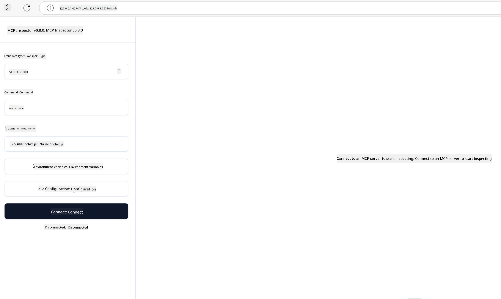
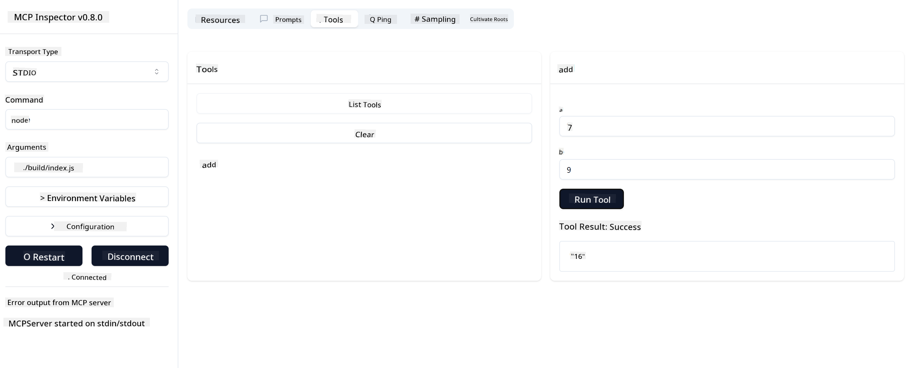

<!--
CO_OP_TRANSLATOR_METADATA:
{
  "original_hash": "d90651bcd1df019768921d531653638a",
  "translation_date": "2025-06-12T22:54:53+00:00",
  "source_file": "03-GettingStarted/01-first-server/README.md",
  "language_code": "en"
}
-->
### -2- Create project

Now that you have your SDK installed, let's move on to creating a project:

### -3- Create project files

### -4- Create server code

### -5- Adding a tool and a resource

Add a tool and a resource by including the following code:

### -6 Final code

Let's add the final code needed to start the server:

### -7- Test the server

Start the server with the following command:

### -8- Run using the inspector

The inspector is a great tool that can launch your server and let you interact with it to verify it works. Let’s get it started:

> [!NOTE]
> The command shown might look different in the "command" field as it contains the command specific to your runtime.

You should see the following user interface:

1. Connect to the server by clicking the Connect button.  
   Once connected, you should see this:

   

2. Select "Tools" and then "listTools". You should see "Add" appear. Click "Add" and fill in the parameter values.

   You should get the following response, which is the result from the "add" tool:

   

Congratulations, you’ve successfully created and run your first server!

### Official SDKs

MCP offers official SDKs for several languages:  
- [C# SDK](https://github.com/modelcontextprotocol/csharp-sdk) - Maintained in collaboration with Microsoft  
- [Java SDK](https://github.com/modelcontextprotocol/java-sdk) - Maintained in collaboration with Spring AI  
- [TypeScript SDK](https://github.com/modelcontextprotocol/typescript-sdk) - The official TypeScript implementation  
- [Python SDK](https://github.com/modelcontextprotocol/python-sdk) - The official Python implementation  
- [Kotlin SDK](https://github.com/modelcontextprotocol/kotlin-sdk) - The official Kotlin implementation  
- [Swift SDK](https://github.com/modelcontextprotocol/swift-sdk) - Maintained in collaboration with Loopwork AI  
- [Rust SDK](https://github.com/modelcontextprotocol/rust-sdk) - The official Rust implementation  

## Key Takeaways

- Setting up an MCP development environment is simple with language-specific SDKs  
- Building MCP servers involves creating and registering tools with clear schemas  
- Testing and debugging are critical for reliable MCP implementations  

## Samples

- [Java Calculator](../samples/java/calculator/README.md)  
- [.Net Calculator](../../../../03-GettingStarted/samples/csharp)  
- [JavaScript Calculator](../samples/javascript/README.md)  
- [TypeScript Calculator](../samples/typescript/README.md)  
- [Python Calculator](../../../../03-GettingStarted/samples/python)  

## Assignment

Create a simple MCP server with a tool of your choice:  
1. Implement the tool in your preferred language (.NET, Java, Python, or JavaScript).  
2. Define input parameters and return values.  
3. Run the inspector tool to verify the server works as expected.  
4. Test the implementation with various inputs.  

## Solution

[Solution](./solution/README.md)

## Additional Resources

- [Build Agents using Model Context Protocol on Azure](https://learn.microsoft.com/azure/developer/ai/intro-agents-mcp)  
- [Remote MCP with Azure Container Apps (Node.js/TypeScript/JavaScript)](https://learn.microsoft.com/samples/azure-samples/mcp-container-ts/mcp-container-ts/)  
- [.NET OpenAI MCP Agent](https://learn.microsoft.com/samples/azure-samples/openai-mcp-agent-dotnet/openai-mcp-agent-dotnet/)  

## What's next

Next: [Getting Started with MCP Clients](/03-GettingStarted/02-client/README.md)

**Disclaimer**:  
This document has been translated using the AI translation service [Co-op Translator](https://github.com/Azure/co-op-translator). While we strive for accuracy, please be aware that automated translations may contain errors or inaccuracies. The original document in its native language should be considered the authoritative source. For critical information, professional human translation is recommended. We are not liable for any misunderstandings or misinterpretations arising from the use of this translation.