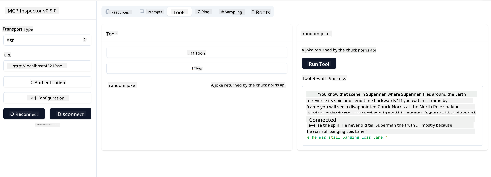

<!--
CO_OP_TRANSLATOR_METADATA:
{
  "original_hash": "d90ca3d326c48fab2ac0ebd3a9876f59",
  "translation_date": "2025-07-04T15:15:58+00:00",
  "source_file": "03-GettingStarted/05-sse-server/README.md",
  "language_code": "en"
}
-->
Now that we know a little bit more about SSE, let's build an SSE server next.

## Exercise: Creating an SSE Server

To create our server, we need to keep two things in mind:

- We need to use a web server to expose endpoints for connection and messages.
- Build our server like we normally do with tools, resources and prompts when we were using stdio.

### -1- Create a server instance

To create our server, we use the same types as with stdio. However, for the transport, we need to choose SSE.

Let's add the needed routes next.

### -2- Add routes

Let's add routes next that handle the connection and incoming messages:

Let's add capabilities to the server next.

### -3- Adding server capabilities

Now that we've got everything SSE specific defined, let's add server capabilities like tools, prompts and resources.

Your full code should look like so:

Great, we have a server using SSE, let's take it for a spin next.

## Exercise: Debugging an SSE Server with Inspector

Inspector is a great tool that we saw in a previous lesson [Creating your first server](/03-GettingStarted/01-first-server/README.md). Let's see if we can use the Inspector even here:

### -1- Running the inspector

To run the inspector, you first must have an SSE server running, so let's do that next:

1. Run the server

1. Run the inspector

    > ![NOTE]
    > Run this in a separate terminal window than the server is running in. Also note, you need to adjust the below command to fit the URL where your server runs.

    ```sh
    npx @modelcontextprotocol/inspector --cli http://localhost:8000/sse --method tools/list
    ```

    Running the inspector looks the same in all runtimes. Note how instead of passing a path to our server and a command for starting the server, we instead pass the URL where the server is running and we also specify the `/sse` route.

### -2- Trying out the tool

Connect to the server by selecting SSE in the dropdown and fill in the URL field where your server is running, for example http://localhost:4321/sse. Now click the "Connect" button. As before, select to list tools, select a tool and provide input values. You should see a result like below:



Great, you're able to work with the inspector, let's see how we can work with Visual Studio Code next.

## Assignment

Try building out your server with more capabilities. See [this page](https://api.chucknorris.io/) to, for example, add a tool that calls an API. You decide what the server should look like. Have fun :)

## Solution

[Solution](./solution/README.md) Here's a possible solution with working code.

## Key Takeaways

The key takeaways from this chapter are the following:

- SSE is the second supported transport next to stdio.
- To support SSE, you need to manage incoming connections and messages using a web framework.
- You can use both Inspector and Visual Studio Code to consume an SSE server, just like stdio servers. Note how it differs a little between stdio and SSE. For SSE, you need to start up the server separately and then run your inspector tool. For the inspector tool, there's also some differences in that you need to specify the URL.

## Samples 

- [Java Calculator](../samples/java/calculator/README.md)
- [.Net Calculator](../../../../03-GettingStarted/samples/csharp)
- [JavaScript Calculator](../samples/javascript/README.md)
- [TypeScript Calculator](../samples/typescript/README.md)
- [Python Calculator](../../../../03-GettingStarted/samples/python) 

## Additional Resources

- [SSE](https://developer.mozilla.org/en-US/docs/Web/API/Server-sent_events)

## What's Next

- Next: [HTTP Streaming with MCP (Streamable HTTP)](../06-http-streaming/README.md)

**Disclaimer**:  
This document has been translated using the AI translation service [Co-op Translator](https://github.com/Azure/co-op-translator). While we strive for accuracy, please be aware that automated translations may contain errors or inaccuracies. The original document in its native language should be considered the authoritative source. For critical information, professional human translation is recommended. We are not liable for any misunderstandings or misinterpretations arising from the use of this translation.