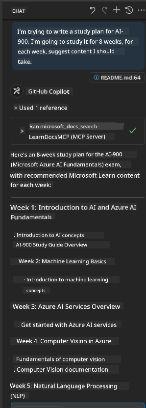

<!--
CO_OP_TRANSLATOR_METADATA:
{
  "original_hash": "4319d291c9d124ecafea52b3d04bfa0e",
  "translation_date": "2025-06-23T10:56:41+00:00",
  "source_file": "09-CaseStudy/docs-mcp/README.md",
  "language_code": "en"
}
-->
> For a detailed walkthrough with screenshots and a step-by-step guide, see [`README.md`](./solution/scenario3/README.md).

This approach is perfect for anyone creating technical courses, writing documentation, or developing code that requires frequent referencing.

## Key Takeaways

Integrating documentation directly into your tools is more than just a convenience—it transforms productivity. By connecting your client to the Microsoft Learn Docs MCP server, you can:

- Avoid switching contexts between your code and documentation
- Access up-to-date, context-aware documentation in real time
- Build smarter, more interactive developer tools

These skills will enable you to develop solutions that are not only efficient but also enjoyable to use.

## Additional Resources

To deepen your knowledge, check out these official resources:

- [Microsoft Learn Docs MCP Server (GitHub)](https://github.com/MicrosoftDocs/mcp)
- [Get started with Azure MCP Server (mcp-python)](https://learn.microsoft.com/en-us/azure/developer/azure-mcp-server/get-started#create-the-python-app)
- [What is the Azure MCP Server?](https://learn.microsoft.com/en-us/azure/developer/azure-mcp-server/)
- [Model Context Protocol (MCP) Introduction](https://modelcontextprotocol.io/introduction)
- [Add plugins from a MCP Server (Python)](https://learn.microsoft.com/en-us/semantic-kernel/concepts/plugins/adding-mcp-plugins)

**Disclaimer**:  
This document has been translated using the AI translation service [Co-op Translator](https://github.com/Azure/co-op-translator). While we strive for accuracy, please be aware that automated translations may contain errors or inaccuracies. The original document in its native language should be considered the authoritative source. For critical information, professional human translation is recommended. We are not liable for any misunderstandings or misinterpretations arising from the use of this translation.