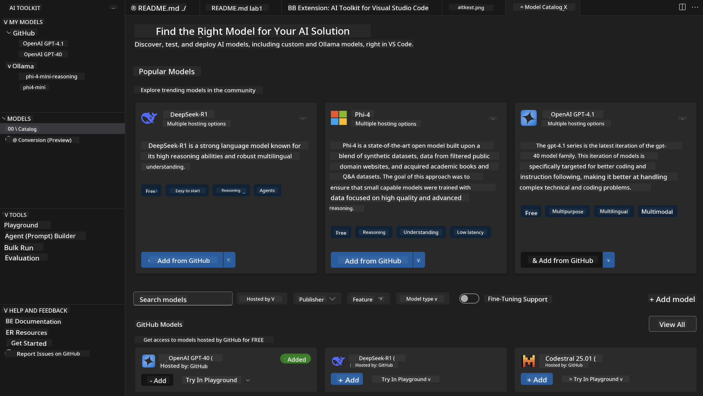
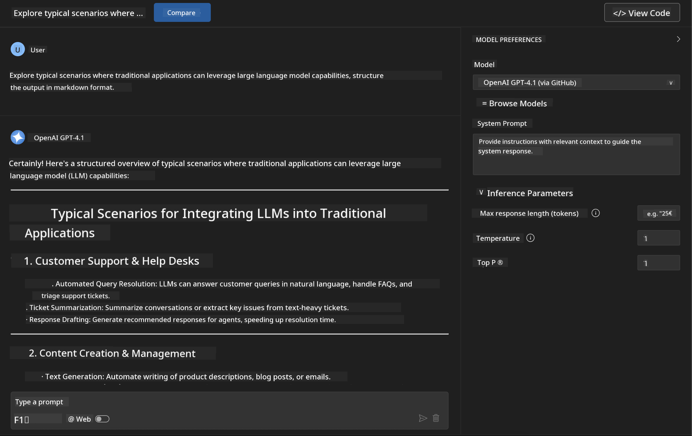
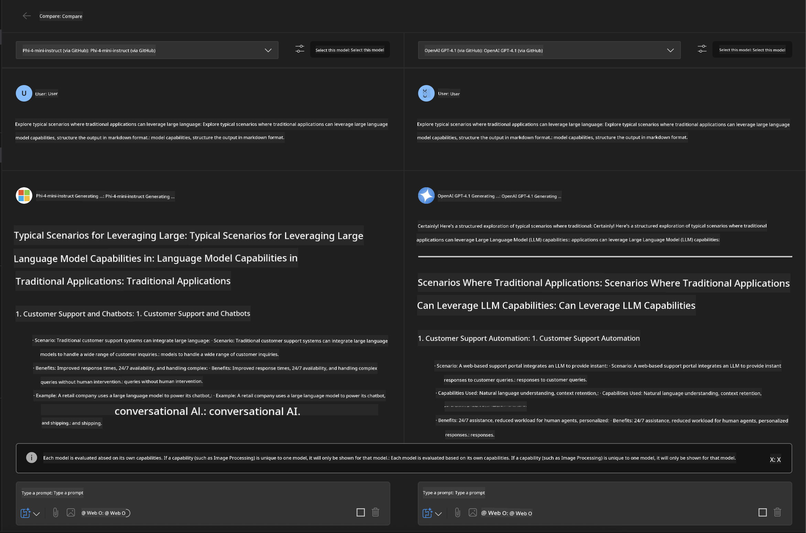
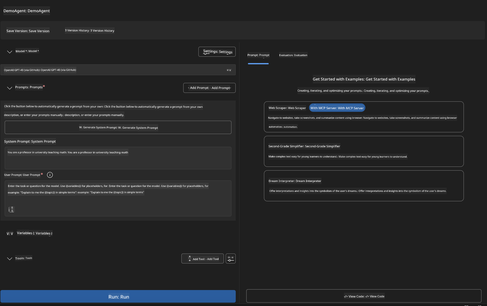
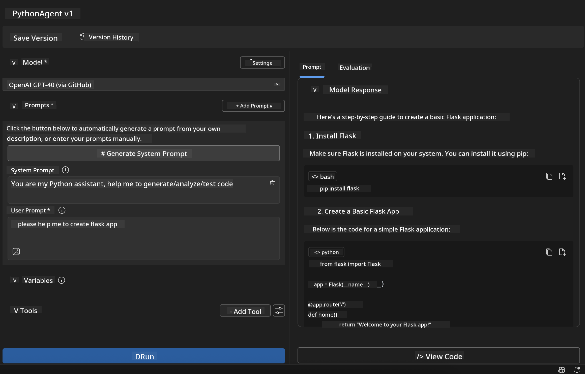

<!--
CO_OP_TRANSLATOR_METADATA:
{
  "original_hash": "2aa9dbc165e104764fa57e8a0d3f1c73",
  "translation_date": "2025-06-10T05:07:15+00:00",
  "source_file": "10-StreamliningAIWorkflowsBuildingAnMCPServerWithAIToolkit/lab1/README.md",
  "language_code": "en"
}
-->
# 🚀 Module 1: AI Toolkit Fundamentals

[]()
[]()
[]()

## 📋 Learning Objectives

By the end of this module, you will be able to:
- ✅ Install and configure AI Toolkit for Visual Studio Code
- ✅ Navigate the Model Catalog and understand different model sources
- ✅ Use the Playground for model testing and experimentation
- ✅ Create custom AI agents using Agent Builder
- ✅ Compare model performance across different providers
- ✅ Apply best practices for prompt engineering

## 🧠 Introduction to AI Toolkit (AITK)

The **AI Toolkit for Visual Studio Code** is Microsoft's flagship extension that turns VS Code into a full-featured AI development environment. It bridges the gap between AI research and practical application development, making generative AI accessible to developers of all skill levels.

### 🌟 Key Capabilities

| Feature | Description | Use Case |
|---------|-------------|----------|
| **🗂️ Model Catalog** | Access 100+ models from GitHub, ONNX, OpenAI, Anthropic, Google | Discover and select models |
| **🔌 BYOM Support** | Integrate your own models (local or remote) | Deploy custom models |
| **🎮 Interactive Playground** | Test models in real time with a chat interface | Quick prototyping and testing |
| **📎 Multi-Modal Support** | Work with text, images, and attachments | Build complex AI applications |
| **⚡ Batch Processing** | Run multiple prompts at once | Streamline testing workflows |
| **📊 Model Evaluation** | Built-in metrics (F1, relevance, similarity, coherence) | Assess model performance |

### 🎯 Why AI Toolkit Matters

- **🚀 Faster Development**: Go from idea to prototype in minutes  
- **🔄 Unified Workflow**: One interface for multiple AI providers  
- **🧪 Simple Experimentation**: Compare models without complicated setup  
- **📈 Production Ready**: Smooth transition from prototype to deployment  

## 🛠️ Prerequisites & Setup

### 📦 Install AI Toolkit Extension

**Step 1: Open Extensions Marketplace**  
1. Launch Visual Studio Code  
2. Go to the Extensions view (`Ctrl+Shift+X` or `Cmd+Shift+X`)  
3. Search for "AI Toolkit"  

**Step 2: Pick Your Version**  
- **🟢 Release**: Recommended for production  
- **🔶 Pre-release**: Early access to new features  

**Step 3: Install and Activate**


### ✅ Verification Checklist
- [ ] AI Toolkit icon appears in the VS Code sidebar  
- [ ] Extension is enabled and active  
- [ ] No installation errors in the output panel  

## 🧪 Hands-on Exercise 1: Exploring GitHub Models

**🎯 Objective**: Get familiar with the Model Catalog and test your first AI model  

### 📊 Step 1: Navigate the Model Catalog

The Model Catalog is your gateway to the AI ecosystem. It brings together models from various providers, making it easy to find and compare options.

**🔍 How to Navigate:**  

Click on **MODELS - Catalog** in the AI Toolkit sidebar



**💡 Pro Tip**: Look for models with features that suit your needs (e.g., code generation, creative writing, analysis).

**⚠️ Note**: GitHub-hosted models are free to use but have limits on request and token rates. To access non-GitHub models (like those hosted via Azure AI or other endpoints), you’ll need to provide the correct API key or authentication.

### 🚀 Step 2: Add and Configure Your First Model

**Model Selection Tips:**  
- **GPT-4.1**: Ideal for complex reasoning and analysis  
- **Phi-4-mini**: Lightweight, fast responses for simple tasks  

**🔧 How to Configure:**  
1. Select **OpenAI GPT-4.1** from the catalog  
2. Click **Add to My Models** to register it for use  
3. Choose **Try in Playground** to open the testing environment  
4. Wait for the model to initialize (first-time setup may take a moment)  


**⚙️ Model Parameters Explained:**  
- **Temperature**: Controls creativity (0 = predictable, 1 = creative)  
- **Max Tokens**: Maximum length of the response  
- **Top-p**: Nucleus sampling to diversify responses  

### 🎯 Step 3: Master the Playground Interface

The Playground is your AI testing lab. Here’s how to get the most out of it:

**🎨 Prompt Engineering Tips:**  
1. **Be Specific**: Clear, detailed instructions get better results  
2. **Provide Context**: Add relevant background information  
3. **Use Examples**: Show the model what you want through examples  
4. **Iterate**: Refine your prompts based on initial feedback  

**🧪 Testing Scenarios:**  
```markdown
# Example 1: Code Generation
"Write a Python function that calculates the factorial of a number using recursion. Include error handling and docstrings."

# Example 2: Creative Writing
"Write a professional email to a client explaining a project delay, maintaining a positive tone while being transparent about challenges."

# Example 3: Data Analysis
"Analyze this sales data and provide insights: [paste your data]. Focus on trends, anomalies, and actionable recommendations."
```



### 🏆 Challenge Exercise: Model Performance Comparison

**🎯 Goal**: Compare different models using the same prompts to see their strengths  

**📋 Instructions:**  
1. Add **Phi-4-mini** to your workspace  
2. Use the same prompt for both GPT-4.1 and Phi-4-mini  


3. Compare their response quality, speed, and accuracy  
4. Record your observations in the results section  



**💡 What to Look For:**  
- When to choose LLM vs SLM  
- Trade-offs between cost and performance  
- Unique strengths of different models  

## 🤖 Hands-on Exercise 2: Building Custom Agents with Agent Builder

**🎯 Objective**: Build specialized AI agents tailored to specific tasks and workflows  

### 🏗️ Step 1: Understanding Agent Builder

Agent Builder is where AI Toolkit really stands out. It lets you create AI assistants designed for particular purposes by combining large language models with custom instructions, parameters, and specialized knowledge.

**🧠 Agent Architecture Components:**  
- **Core Model**: The main LLM (GPT-4, Groks, Phi, etc.)  
- **System Prompt**: Sets the agent’s personality and behavior  
- **Parameters**: Fine-tuned settings for best performance  
- **Tools Integration**: Connect external APIs and MCP services  
- **Memory**: Conversation context and session persistence  



### ⚙️ Step 2: Agent Configuration Deep Dive

**🎨 Crafting Effective System Prompts:**  
```markdown
# Template Structure:
## Role Definition
You are a [specific role] with expertise in [domain].

## Capabilities
- List specific abilities
- Define scope of knowledge
- Clarify limitations

## Behavior Guidelines
- Response style (formal, casual, technical)
- Output format preferences
- Error handling approach

## Examples
Provide 2-3 examples of ideal interactions
```

*You can also use Generate System Prompt to let AI help you create and optimize prompts*

**🔧 Parameter Optimization:**  
| Parameter | Recommended Range | Use Case |
|-----------|------------------|----------|
| **Temperature** | 0.1-0.3 | Technical or factual answers |
| **Temperature** | 0.7-0.9 | Creative or brainstorming tasks |
| **Max Tokens** | 500-1000 | Short, concise responses |
| **Max Tokens** | 2000-4000 | Detailed explanations |

### 🐍 Step 3: Practical Exercise - Python Programming Agent

**🎯 Mission**: Build a specialized Python coding assistant  

**📋 Configuration Steps:**  

1. **Model Selection**: Choose **Claude 3.5 Sonnet** (great for coding)  

2. **System Prompt Design:**  
```markdown
# Python Programming Expert Agent

## Role
You are a senior Python developer with 10+ years of experience. You excel at writing clean, efficient, and well-documented Python code.

## Capabilities
- Write production-ready Python code
- Debug complex issues
- Explain code concepts clearly
- Suggest best practices and optimizations
- Provide complete working examples

## Response Format
- Always include docstrings
- Add inline comments for complex logic
- Suggest testing approaches
- Mention relevant libraries when applicable

## Code Quality Standards
- Follow PEP 8 style guidelines
- Use type hints where appropriate
- Handle exceptions gracefully
- Write readable, maintainable code
```

3. **Parameter Settings:**  
   - Temperature: 0.2 (for consistent, reliable code)  
   - Max Tokens: 2000 (for detailed explanations)  
   - Top-p: 0.9 (balanced creativity)  



### 🧪 Step 4: Testing Your Python Agent

**Test Scenarios:**  
1. **Basic Function**: "Create a function to find prime numbers"  
2. **Complex Algorithm**: "Implement a binary search tree with insert, delete, and search methods"  
3. **Real-world Problem**: "Build a web scraper that handles rate limiting and retries"  
4. **Debugging**: "Fix this code [paste buggy code]"  

**🏆 Success Criteria:**  
- ✅ Code runs without errors  
- ✅ Includes proper documentation  
- ✅ Follows Python best practices  
- ✅ Provides clear explanations  
- ✅ Suggests improvements  

## 🎓 Module 1 Wrap-Up & Next Steps

### 📊 Knowledge Check

Test your understanding:  
- [ ] Can you explain the differences between models in the catalog?  
- [ ] Have you successfully created and tested a custom agent?  
- [ ] Do you know how to optimize parameters for various use cases?  
- [ ] Can you design effective system prompts?  

### 📚 Additional Resources

- **AI Toolkit Documentation**: [Official Microsoft Docs](https://github.com/microsoft/vscode-ai-toolkit)  
- **Prompt Engineering Guide**: [Best Practices](https://platform.openai.com/docs/guides/prompt-engineering)  
- **Models in AI Toolkit**: [Models in Development](https://github.com/microsoft/vscode-ai-toolkit/blob/main/doc/models.md)  

**🎉 Congratulations!** You’ve mastered the basics of AI Toolkit and are ready to build more advanced AI applications!  

### 🔜 Continue to Next Module

Ready to explore more advanced features? Proceed to **[Module 2: MCP with AI Toolkit Fundamentals](../lab2/README.md)** where you’ll learn how to:  
- Connect your agents to external tools using Model Context Protocol (MCP)  
- Build browser automation agents with Playwright  
- Integrate MCP servers with your AI Toolkit agents  
- Enhance your agents with external data and capabilities

**Disclaimer**:  
This document has been translated using the AI translation service [Co-op Translator](https://github.com/Azure/co-op-translator). While we strive for accuracy, please be aware that automated translations may contain errors or inaccuracies. The original document in its native language should be considered the authoritative source. For critical information, professional human translation is recommended. We are not liable for any misunderstandings or misinterpretations arising from the use of this translation.