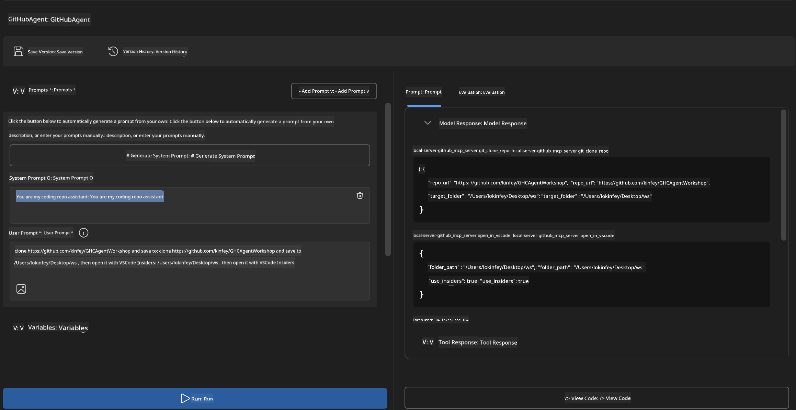

<!--
CO_OP_TRANSLATOR_METADATA:
{
  "original_hash": "f83bc722dc758efffd68667d6a1db470",
  "translation_date": "2025-06-10T06:38:52+00:00",
  "source_file": "10-StreamliningAIWorkflowsBuildingAnMCPServerWithAIToolkit/lab4/README.md",
  "language_code": "en"
}
-->
# 🐙 Module 4: Practical MCP Development - Custom GitHub Clone Server


> **⚡ Quick Start:** Build a production-ready MCP server that automates GitHub repository cloning and VS Code integration in just 30 minutes!

## 🎯 Learning Objectives

By the end of this lab, you will be able to:

- ✅ Create a custom MCP server for real-world development workflows
- ✅ Implement GitHub repository cloning functionality via MCP
- ✅ Integrate custom MCP servers with VS Code and Agent Builder
- ✅ Use GitHub Copilot Agent Mode with custom MCP tools
- ✅ Test and deploy custom MCP servers in production environments

## 📋 Prerequisites

- Completion of Labs 1-3 (MCP fundamentals and advanced development)
- GitHub Copilot subscription ([free signup available](https://github.com/github-copilot/signup))
- VS Code with AI Toolkit and GitHub Copilot extensions
- Git CLI installed and configured

## 🏗️ Project Overview

### **Real-World Development Challenge**
As developers, we often clone GitHub repositories and open them in VS Code or VS Code Insiders. This manual process involves:
1. Opening the terminal or command prompt
2. Navigating to the desired folder
3. Running the `git clone` command
4. Opening VS Code in the cloned directory

**Our MCP solution simplifies this into a single smart command!**

### **What You'll Build**
A **GitHub Clone MCP Server** (`git_mcp_server`) that offers:

| Feature | Description | Benefit |
|---------|-------------|---------|
| 🔄 **Smart Repository Cloning** | Clone GitHub repos with built-in validation | Automated error detection |
| 📁 **Intelligent Directory Management** | Safely check and create directories | Prevents accidental overwrites |
| 🚀 **Cross-Platform VS Code Integration** | Open projects in VS Code or Insiders | Smooth workflow transitions |
| 🛡️ **Robust Error Handling** | Manage network, permission, and path errors | Reliable for production use |

---

## 📖 Step-by-Step Implementation

### Step 1: Create GitHub Agent in Agent Builder

1. **Open Agent Builder** via the AI Toolkit extension
2. **Create a new agent** using the following setup:
   ```
   Agent Name: GitHubAgent
   ```

3. **Initialize the custom MCP server:**
   - Go to **Tools** → **Add Tool** → **MCP Server**
   - Choose **"Create A new MCP Server"**
   - Select the **Python template** for maximum flexibility
   - **Server Name:** `git_mcp_server`

### Step 2: Configure GitHub Copilot Agent Mode

1. **Open GitHub Copilot** in VS Code (Ctrl/Cmd + Shift + P → "GitHub Copilot: Open")
2. **Select Agent Model** in the Copilot interface
3. **Pick the Claude 3.7 model** for better reasoning abilities
4. **Enable MCP integration** to access your tools

> **💡 Pro Tip:** Claude 3.7 excels at understanding development workflows and handling errors.

### Step 3: Implement Core MCP Server Functionality

**Use this detailed prompt with GitHub Copilot Agent Mode:**

```
Create two MCP tools with the following comprehensive requirements:

🔧 TOOL A: clone_repository
Requirements:
- Clone any GitHub repository to a specified local folder
- Return the absolute path of the successfully cloned project
- Implement comprehensive validation:
  ✓ Check if target directory already exists (return error if exists)
  ✓ Validate GitHub URL format (https://github.com/user/repo)
  ✓ Verify git command availability (prompt installation if missing)
  ✓ Handle network connectivity issues
  ✓ Provide clear error messages for all failure scenarios

🚀 TOOL B: open_in_vscode
Requirements:
- Open specified folder in VS Code or VS Code Insiders
- Cross-platform compatibility (Windows/Linux/macOS)
- Use direct application launch (not terminal commands)
- Auto-detect available VS Code installations
- Handle cases where VS Code is not installed
- Provide user-friendly error messages

Additional Requirements:
- Follow MCP 1.9.3 best practices
- Include proper type hints and documentation
- Implement logging for debugging purposes
- Add input validation for all parameters
- Include comprehensive error handling
```

### Step 4: Test Your MCP Server

#### 4a. Test in Agent Builder

1. **Start the debug configuration** in Agent Builder
2. **Set your agent’s system prompt to:**

```
SYSTEM_PROMPT:
You are my intelligent coding repository assistant. You help developers efficiently clone GitHub repositories and set up their development environment. Always provide clear feedback about operations and handle errors gracefully.
```

3. **Run tests with realistic user scenarios:**

```
USER_PROMPT EXAMPLES:

Scenario : Basic Clone and Open
"Clone {Your GitHub Repo link such as https://github.com/kinfey/GHCAgentWorkshop
 } and save to {The global path you specify}, then open it with VS Code Insiders"
```



**Expected Results:**
- ✅ Successful cloning with confirmation of the path
- ✅ Automatic launch of VS Code
- ✅ Clear error messages for invalid inputs
- ✅ Proper handling of edge cases

#### 4b. Test in MCP Inspector


---

**🎉 Congratulations!** You’ve built a practical, production-ready MCP server that solves real development workflow challenges. Your custom GitHub clone server showcases how MCP can automate and improve developer productivity.

### 🏆 Achievement Unlocked:
- ✅ **MCP Developer** - Built a custom MCP server
- ✅ **Workflow Automator** - Streamlined development tasks  
- ✅ **Integration Expert** - Connected multiple development tools
- ✅ **Production Ready** - Created deployable solutions

---

## 🎓 Workshop Completion: Your Journey with Model Context Protocol

**Dear Workshop Participant,**

Congratulations on completing all four modules of the Model Context Protocol workshop! You’ve progressed from learning AI Toolkit basics to building production-ready MCP servers that address real-world development challenges.

### 🚀 Your Learning Path Recap:

**[Module 1](../lab1/README.md)**: You started with AI Toolkit fundamentals, model testing, and creating your first AI agent.

**[Module 2](../lab2/README.md)**: You explored MCP architecture, integrated Playwright MCP, and built your first browser automation agent.

**[Module 3](../lab3/README.md)**: You advanced to custom MCP server development with the Weather MCP server and mastered debugging tools.

**[Module 4](../lab4/README.md)**: You applied all your skills to create a practical GitHub repository workflow automation tool.

### 🌟 What You’ve Mastered:

- ✅ **AI Toolkit Ecosystem**: Models, agents, and integration patterns
- ✅ **MCP Architecture**: Client-server design, transport protocols, and security
- ✅ **Developer Tools**: From Playground to Inspector to production deployment
- ✅ **Custom Development**: Building, testing, and deploying your own MCP servers
- ✅ **Practical Applications**: Solving real-world workflow challenges with AI

### 🔮 Your Next Steps:

1. **Build Your Own MCP Server**: Use these skills to automate your unique workflows
2. **Join the MCP Community**: Share your projects and learn from others
3. **Explore Advanced Integration**: Connect MCP servers with enterprise systems
4. **Contribute to Open Source**: Help enhance MCP tools and documentation

Remember, this workshop is just the start. The Model Context Protocol ecosystem is rapidly evolving, and you’re now ready to be at the forefront of AI-powered development tools.

**Thank you for your participation and dedication to learning!**

We hope this workshop has inspired ideas that will transform how you build and interact with AI tools throughout your development journey.

**Happy coding!**

---

**Disclaimer**:  
This document has been translated using the AI translation service [Co-op Translator](https://github.com/Azure/co-op-translator). While we strive for accuracy, please be aware that automated translations may contain errors or inaccuracies. The original document in its native language should be considered the authoritative source. For critical information, professional human translation is recommended. We are not liable for any misunderstandings or misinterpretations arising from the use of this translation.