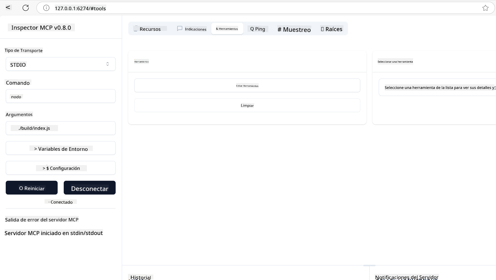
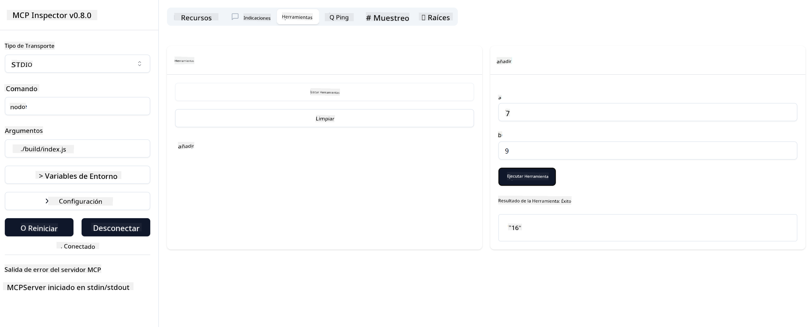

<!--
CO_OP_TRANSLATOR_METADATA:
{
  "original_hash": "bf05718d019040cf0c7d4ccc6d6a1a88",
  "translation_date": "2025-06-13T05:50:01+00:00",
  "source_file": "03-GettingStarted/01-first-server/README.md",
  "language_code": "es"
}
-->
### -2- Crear proyecto

Ahora que tienes instalado tu SDK, vamos a crear un proyecto a continuación:

### -3- Crear archivos del proyecto

### -4- Crear código del servidor

### -5- Agregar una herramienta y un recurso

Agrega una herramienta y un recurso añadiendo el siguiente código:

### -6 Código final

Agreguemos el último código que necesitamos para que el servidor pueda iniciarse:

### -7- Probar el servidor

Inicia el servidor con el siguiente comando:

### -8- Ejecutar usando el inspector

El inspector es una gran herramienta que puede iniciar tu servidor y te permite interactuar con él para que puedas probar que funciona. Vamos a iniciarlo:

> [!NOTE]
> puede que se vea diferente en el campo "command" ya que contiene el comando para ejecutar un servidor con tu runtime específico/

Deberías ver la siguiente interfaz de usuario:

1. Conéctate al servidor seleccionando el botón Connect  
   Una vez conectado al servidor, deberías ver lo siguiente:

   

2. Selecciona "Tools" y "listTools", deberías ver que aparece "Add", selecciona "Add" y completa los valores de los parámetros.

   Deberías ver la siguiente respuesta, es decir, un resultado de la herramienta "add":

   

¡Felicidades, has logrado crear y ejecutar tu primer servidor!

### SDKs oficiales

MCP proporciona SDKs oficiales para varios lenguajes:
- [C# SDK](https://github.com/modelcontextprotocol/csharp-sdk) - Mantenido en colaboración con Microsoft
- [Java SDK](https://github.com/modelcontextprotocol/java-sdk) - Mantenido en colaboración con Spring AI
- [TypeScript SDK](https://github.com/modelcontextprotocol/typescript-sdk) - La implementación oficial en TypeScript
- [Python SDK](https://github.com/modelcontextprotocol/python-sdk) - La implementación oficial en Python
- [Kotlin SDK](https://github.com/modelcontextprotocol/kotlin-sdk) - La implementación oficial en Kotlin
- [Swift SDK](https://github.com/modelcontextprotocol/swift-sdk) - Mantenido en colaboración con Loopwork AI
- [Rust SDK](https://github.com/modelcontextprotocol/rust-sdk) - La implementación oficial en Rust

## Puntos clave

- Configurar un entorno de desarrollo MCP es sencillo con SDKs específicos para cada lenguaje
- Construir servidores MCP implica crear y registrar herramientas con esquemas claros
- Probar y depurar es fundamental para implementaciones MCP confiables

## Ejemplos

- [Java Calculator](../samples/java/calculator/README.md)
- [.Net Calculator](../../../../03-GettingStarted/samples/csharp)
- [JavaScript Calculator](../samples/javascript/README.md)
- [TypeScript Calculator](../samples/typescript/README.md)
- [Python Calculator](../../../../03-GettingStarted/samples/python)

## Tarea

Crea un servidor MCP simple con una herramienta de tu elección:
1. Implementa la herramienta en tu lenguaje preferido (.NET, Java, Python o JavaScript).
2. Define los parámetros de entrada y los valores de retorno.
3. Ejecuta la herramienta inspector para asegurar que el servidor funciona como se espera.
4. Prueba la implementación con diferentes entradas.

## Solución

[Solución](./solution/README.md)

## Recursos adicionales

- [Construir agentes usando Model Context Protocol en Azure](https://learn.microsoft.com/azure/developer/ai/intro-agents-mcp)
- [MCP remoto con Azure Container Apps (Node.js/TypeScript/JavaScript)](https://learn.microsoft.com/samples/azure-samples/mcp-container-ts/mcp-container-ts/)
- [Agente MCP OpenAI en .NET](https://learn.microsoft.com/samples/azure-samples/openai-mcp-agent-dotnet/openai-mcp-agent-dotnet/)

## Qué sigue

Siguiente: [Primeros pasos con clientes MCP](/03-GettingStarted/02-client/README.md)

**Aviso Legal**:  
Este documento ha sido traducido utilizando el servicio de traducción automática [Co-op Translator](https://github.com/Azure/co-op-translator). Aunque nos esforzamos por la precisión, tenga en cuenta que las traducciones automáticas pueden contener errores o inexactitudes. El documento original en su idioma nativo debe considerarse la fuente autorizada. Para información crítica, se recomienda una traducción profesional realizada por humanos. No nos responsabilizamos por malentendidos o interpretaciones erróneas que puedan derivarse del uso de esta traducción.