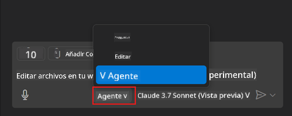
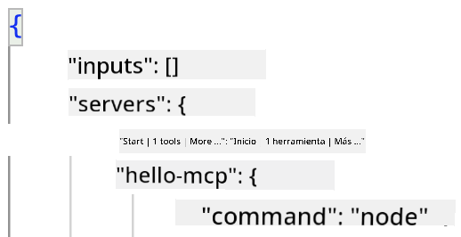

<!--
CO_OP_TRANSLATOR_METADATA:
{
  "original_hash": "8ea28e5e566edd5969337fd0b191ba3f",
  "translation_date": "2025-07-16T22:08:57+00:00",
  "source_file": "03-GettingStarted/04-vscode/README.md",
  "language_code": "es"
}
-->
# Consumir un servidor desde el modo Agente de GitHub Copilot

Visual Studio Code y GitHub Copilot pueden actuar como cliente y consumir un MCP Server. ¿Por qué querríamos hacer eso, te preguntarás? Pues significa que cualquier función que tenga el MCP Server ahora puede usarse desde tu IDE. Imagina, por ejemplo, agregar el servidor MCP de GitHub; esto permitiría controlar GitHub mediante indicaciones en lugar de escribir comandos específicos en la terminal. O imagina cualquier cosa en general que pueda mejorar tu experiencia como desarrollador, todo controlado por lenguaje natural. ¿Ves la ventaja, verdad?

## Resumen

Esta lección explica cómo usar Visual Studio Code y el modo Agente de GitHub Copilot como cliente para tu MCP Server.

## Objetivos de aprendizaje

Al finalizar esta lección, podrás:

- Consumir un MCP Server a través de Visual Studio Code.
- Ejecutar capacidades como herramientas mediante GitHub Copilot.
- Configurar Visual Studio Code para encontrar y gestionar tu MCP Server.

## Uso

Puedes controlar tu MCP Server de dos maneras diferentes:

- Interfaz de usuario, verás cómo se hace más adelante en este capítulo.
- Terminal, es posible controlar cosas desde la terminal usando el ejecutable `code`:

  Para agregar un MCP Server a tu perfil de usuario, usa la opción de línea de comandos --add-mcp y proporciona la configuración del servidor en formato JSON como {\"name\":\"server-name\",\"command\":...}.

  ```
  code --add-mcp "{\"name\":\"my-server\",\"command\": \"uvx\",\"args\": [\"mcp-server-fetch\"]}"
  ```

### Capturas de pantalla




Hablemos más sobre cómo usamos la interfaz visual en las siguientes secciones.

## Enfoque

Así es como debemos abordar esto a grandes rasgos:

- Configurar un archivo para localizar nuestro MCP Server.
- Iniciar/Conectarse a dicho servidor para que liste sus capacidades.
- Usar esas capacidades a través de la interfaz de GitHub Copilot Chat.

Perfecto, ahora que entendemos el flujo, intentemos usar un MCP Server a través de Visual Studio Code con un ejercicio.

## Ejercicio: Consumir un servidor

En este ejercicio, configuraremos Visual Studio Code para que encuentre tu MCP Server y pueda usarse desde la interfaz de GitHub Copilot Chat.

### -0- Paso previo, habilitar el descubrimiento de MCP Server

Puede que necesites habilitar el descubrimiento de MCP Servers.

1. Ve a `Archivo -> Preferencias -> Configuración` en Visual Studio Code.

1. Busca "MCP" y habilita `chat.mcp.discovery.enabled` en el archivo settings.json.

### -1- Crear archivo de configuración

Comienza creando un archivo de configuración en la raíz de tu proyecto, necesitarás un archivo llamado MCP.json y colocarlo en una carpeta llamada .vscode. Debe verse así:

```text
.vscode
|-- mcp.json
```

A continuación, veamos cómo agregar una entrada de servidor.

### -2- Configurar un servidor

Agrega el siguiente contenido a *mcp.json*:

```json
{
    "inputs": [],
    "servers": {
       "hello-mcp": {
           "command": "node",
           "args": [
               "build/index.js"
           ]
       }
    }
}
```

Aquí tienes un ejemplo sencillo de cómo iniciar un servidor escrito en Node.js; para otros entornos, indica el comando correcto para iniciar el servidor usando `command` y `args`.

### -3- Iniciar el servidor

Ahora que has agregado una entrada, vamos a iniciar el servidor:

1. Localiza tu entrada en *mcp.json* y asegúrate de encontrar el ícono de "play":

    

1. Haz clic en el ícono de "play", deberías ver que el ícono de herramientas en GitHub Copilot Chat aumenta el número de herramientas disponibles. Si haces clic en dicho ícono, verás una lista de herramientas registradas. Puedes marcar o desmarcar cada herramienta según si quieres que GitHub Copilot las use como contexto:

  

1. Para ejecutar una herramienta, escribe un prompt que sepas que coincidirá con la descripción de una de tus herramientas, por ejemplo un prompt como "add 22 to 1":

  

  Deberías ver una respuesta que diga 23.

## Tarea

Intenta agregar una entrada de servidor a tu archivo *mcp.json* y asegúrate de poder iniciar/detener el servidor. También verifica que puedas comunicarte con las herramientas de tu servidor a través de la interfaz de GitHub Copilot Chat.

## Solución

[Solution](./solution/README.md)

## Puntos clave

Los puntos clave de este capítulo son los siguientes:

- Visual Studio Code es un excelente cliente que te permite consumir varios MCP Servers y sus herramientas.
- La interfaz de GitHub Copilot Chat es cómo interactúas con los servidores.
- Puedes solicitar al usuario entradas como claves API que se pueden pasar al MCP Server al configurar la entrada del servidor en el archivo *mcp.json*.

## Ejemplos

- [Java Calculator](../samples/java/calculator/README.md)
- [.Net Calculator](../../../../03-GettingStarted/samples/csharp)
- [JavaScript Calculator](../samples/javascript/README.md)
- [TypeScript Calculator](../samples/typescript/README.md)
- [Python Calculator](../../../../03-GettingStarted/samples/python)

## Recursos adicionales

- [Visual Studio docs](https://code.visualstudio.com/docs/copilot/chat/mcp-servers)

## Qué sigue

- Siguiente: [Creando un servidor SSE](../05-sse-server/README.md)

**Aviso legal**:  
Este documento ha sido traducido utilizando el servicio de traducción automática [Co-op Translator](https://github.com/Azure/co-op-translator). Aunque nos esforzamos por la precisión, tenga en cuenta que las traducciones automáticas pueden contener errores o inexactitudes. El documento original en su idioma nativo debe considerarse la fuente autorizada. Para información crítica, se recomienda una traducción profesional realizada por humanos. No nos hacemos responsables de malentendidos o interpretaciones erróneas derivadas del uso de esta traducción.