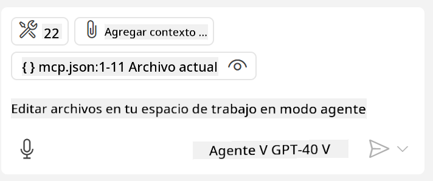

<!--
CO_OP_TRANSLATOR_METADATA:
{
  "original_hash": "54e9ffc5dba01afcb8880a9949fd1881",
  "translation_date": "2025-07-04T15:24:22+00:00",
  "source_file": "03-GettingStarted/04-vscode/README.md",
  "language_code": "es"
}
-->
Hablemos más sobre cómo usar la interfaz visual en las siguientes secciones.

## Enfoque

Así es como debemos abordar esto a un nivel general:

- Configurar un archivo para encontrar nuestro MCP Server.
- Iniciar/Conectarse a dicho servidor para que liste sus capacidades.
- Usar esas capacidades a través de la interfaz de GitHub Copilot Chat.

Genial, ahora que entendemos el flujo, intentemos usar un MCP Server a través de Visual Studio Code mediante un ejercicio.

## Ejercicio: Consumir un servidor

En este ejercicio, configuraremos Visual Studio Code para encontrar tu MCP server y que pueda ser usado desde la interfaz de GitHub Copilot Chat.

### -0- Paso previo, habilitar el descubrimiento de MCP Server

Puede que necesites habilitar el descubrimiento de MCP Servers.

1. Ve a `Archivo -> Preferencias -> Configuración` en Visual Studio Code.

1. Busca "MCP" y habilita `chat.mcp.discovery.enabled` en el archivo settings.json.

### -1- Crear archivo de configuración

Comienza creando un archivo de configuración en la raíz de tu proyecto, necesitarás un archivo llamado MCP.json y colocarlo en una carpeta llamada .vscode. Debe verse así:

```text
.vscode
|-- mcp.json
```

A continuación, veamos cómo agregar una entrada de servidor.

### -2- Configurar un servidor

Agrega el siguiente contenido a *mcp.json*:

```json
{
    "inputs": [],
    "servers": {
       "hello-mcp": {
           "command": "node",
           "args": [
               "build/index.js"
           ]
       }
    }
}
```

Aquí tienes un ejemplo simple de cómo iniciar un servidor escrito en Node.js, para otros entornos de ejecución indica el comando adecuado para iniciar el servidor usando `command` y `args`.

### -3- Iniciar el servidor

Ahora que has agregado una entrada, vamos a iniciar el servidor:

1. Ubica tu entrada en *mcp.json* y asegúrate de encontrar el ícono de "play":

    

1. Haz clic en el ícono de "play", deberías ver que el ícono de herramientas en GitHub Copilot Chat aumenta el número de herramientas disponibles. Si haces clic en dicho ícono de herramientas, verás una lista de herramientas registradas. Puedes marcar o desmarcar cada herramienta dependiendo de si quieres que GitHub Copilot las use como contexto:

  

1. Para ejecutar una herramienta, escribe un prompt que sepas que coincidirá con la descripción de una de tus herramientas, por ejemplo un prompt como "add 22 to 1":

  

  Deberías ver una respuesta que dice 23.

## Tarea

Intenta agregar una entrada de servidor a tu archivo *mcp.json* y asegúrate de poder iniciar/detener el servidor. También verifica que puedas comunicarte con las herramientas en tu servidor a través de la interfaz de GitHub Copilot Chat.

## Solución

[Solución](./solution/README.md)

## Puntos clave

Los puntos clave de este capítulo son los siguientes:

- Visual Studio Code es un gran cliente que te permite consumir varios MCP Servers y sus herramientas.
- La interfaz de GitHub Copilot Chat es cómo interactúas con los servidores.
- Puedes solicitar al usuario entradas como claves API que pueden ser pasadas al MCP Server al configurar la entrada del servidor en el archivo *mcp.json*.

## Ejemplos

- [Calculadora en Java](../samples/java/calculator/README.md)
- [Calculadora en .Net](../../../../03-GettingStarted/samples/csharp)
- [Calculadora en JavaScript](../samples/javascript/README.md)
- [Calculadora en TypeScript](../samples/typescript/README.md)
- [Calculadora en Python](../../../../03-GettingStarted/samples/python)

## Recursos adicionales

- [Documentación de Visual Studio](https://code.visualstudio.com/docs/copilot/chat/mcp-servers)

## Qué sigue

- Siguiente: [Creando un servidor SSE](../05-sse-server/README.md)

**Aviso legal**:  
Este documento ha sido traducido utilizando el servicio de traducción automática [Co-op Translator](https://github.com/Azure/co-op-translator). Aunque nos esforzamos por la precisión, tenga en cuenta que las traducciones automáticas pueden contener errores o inexactitudes. El documento original en su idioma nativo debe considerarse la fuente autorizada. Para información crítica, se recomienda una traducción profesional realizada por humanos. No nos hacemos responsables de malentendidos o interpretaciones erróneas derivadas del uso de esta traducción.