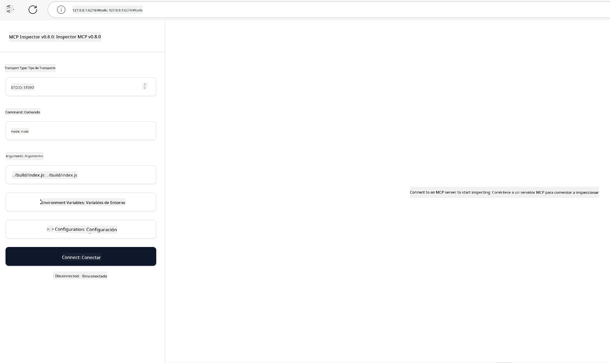

<!--
CO_OP_TRANSLATOR_METADATA:
{
  "original_hash": "717f34718a773f6cf52d8445e40a96bf",
  "translation_date": "2025-05-16T15:22:24+00:00",
  "source_file": "03-GettingStarted/07-testing/README.md",
  "language_code": "es"
}
-->
## Pruebas y Depuración

Antes de comenzar a probar tu servidor MCP, es importante entender las herramientas disponibles y las mejores prácticas para depurar. Las pruebas efectivas aseguran que tu servidor se comporte como se espera y te ayudan a identificar y resolver problemas rápidamente. La siguiente sección describe los enfoques recomendados para validar tu implementación MCP.

## Visión General

Esta lección cubre cómo seleccionar el enfoque de prueba adecuado y la herramienta de prueba más efectiva.

## Objetivos de Aprendizaje

Al final de esta lección, podrás:

- Describir varios enfoques para realizar pruebas.
- Usar diferentes herramientas para probar tu código de manera efectiva.

## Pruebas de Servidores MCP

MCP proporciona herramientas para ayudarte a probar y depurar tus servidores:

- **MCP Inspector**: Una herramienta de línea de comandos que puede ejecutarse tanto como herramienta CLI como visual.
- **Pruebas manuales**: Puedes usar una herramienta como curl para realizar solicitudes web, aunque cualquier herramienta capaz de hacer peticiones HTTP servirá.
- **Pruebas unitarias**: Es posible usar tu framework de pruebas preferido para probar las funciones tanto del servidor como del cliente.

### Uso de MCP Inspector

Hemos descrito el uso de esta herramienta en lecciones anteriores, pero hablemos un poco a nivel general. Es una herramienta construida en Node.js y puedes usarla ejecutando el archivo `npx`, que descargará e instalará la herramienta temporalmente y se limpiará automáticamente una vez que termine de ejecutar tu solicitud.

El [MCP Inspector](https://github.com/modelcontextprotocol/inspector) te ayuda a:

- **Descubrir Capacidades del Servidor**: Detecta automáticamente recursos, herramientas y prompts disponibles.
- **Probar la Ejecución de Herramientas**: Prueba diferentes parámetros y observa las respuestas en tiempo real.
- **Ver Metadatos del Servidor**: Examina la información del servidor, esquemas y configuraciones.

Una ejecución típica de la herramienta se ve así:

```bash
npx @modelcontextprotocol/inspector node build/index.js
```

El comando anterior inicia un MCP y su interfaz visual, lanzando una interfaz web local en tu navegador. Puedes esperar ver un panel que muestra tus servidores MCP registrados, sus herramientas, recursos y prompts disponibles. La interfaz te permite probar interactivamente la ejecución de herramientas, inspeccionar metadatos del servidor y ver respuestas en tiempo real, facilitando la validación y depuración de tus implementaciones MCP.

Así es como puede verse: 

También puedes ejecutar esta herramienta en modo CLI, para lo cual agregas el atributo `--cli`. Aquí tienes un ejemplo de cómo ejecutar la herramienta en modo "CLI", que lista todas las herramientas en el servidor:

```sh
npx @modelcontextprotocol/inspector --cli node build/index.js --method tools/list
```

### Pruebas Manuales

Además de usar la herramienta inspector para probar las capacidades del servidor, otro enfoque similar es ejecutar un cliente capaz de usar HTTP, como por ejemplo curl.

Con curl, puedes probar servidores MCP directamente usando solicitudes HTTP:

```bash
# Example: Test server metadata
curl http://localhost:3000/v1/metadata

# Example: Execute a tool
curl -X POST http://localhost:3000/v1/tools/execute \
  -H "Content-Type: application/json" \
  -d '{"name": "calculator", "parameters": {"expression": "2+2"}}'
```

Como puedes ver en el ejemplo de uso de curl, usas una solicitud POST para invocar una herramienta con un payload que consiste en el nombre de la herramienta y sus parámetros. Usa el enfoque que mejor se adapte a ti. En general, las herramientas CLI suelen ser más rápidas de usar y se prestan a ser automatizadas, lo cual puede ser útil en un entorno CI/CD.

### Pruebas Unitarias

Crea pruebas unitarias para tus herramientas y recursos para asegurarte de que funcionan como se espera. Aquí tienes un ejemplo de código para pruebas.

```python
import pytest

from mcp.server.fastmcp import FastMCP
from mcp.shared.memory import (
    create_connected_server_and_client_session as create_session,
)

# Mark the whole module for async tests
pytestmark = pytest.mark.anyio


async def test_list_tools_cursor_parameter():
    """Test that the cursor parameter is accepted for list_tools.

    Note: FastMCP doesn't currently implement pagination, so this test
    only verifies that the cursor parameter is accepted by the client.
    """

 server = FastMCP("test")

    # Create a couple of test tools
    @server.tool(name="test_tool_1")
    async def test_tool_1() -> str:
        """First test tool"""
        return "Result 1"

    @server.tool(name="test_tool_2")
    async def test_tool_2() -> str:
        """Second test tool"""
        return "Result 2"

    async with create_session(server._mcp_server) as client_session:
        # Test without cursor parameter (omitted)
        result1 = await client_session.list_tools()
        assert len(result1.tools) == 2

        # Test with cursor=None
        result2 = await client_session.list_tools(cursor=None)
        assert len(result2.tools) == 2

        # Test with cursor as string
        result3 = await client_session.list_tools(cursor="some_cursor_value")
        assert len(result3.tools) == 2

        # Test with empty string cursor
        result4 = await client_session.list_tools(cursor="")
        assert len(result4.tools) == 2
    
```

El código anterior realiza lo siguiente:

- Utiliza el framework pytest, que permite crear pruebas como funciones y usar sentencias assert.
- Crea un servidor MCP con dos herramientas diferentes.
- Usa la sentencia `assert` para verificar que se cumplen ciertas condiciones.

Consulta el [archivo completo aquí](https://github.com/modelcontextprotocol/python-sdk/blob/main/tests/client/test_list_methods_cursor.py)

Con el archivo anterior, puedes probar tu propio servidor para asegurarte de que las capacidades se crean como deberían.

Todos los SDK principales tienen secciones de pruebas similares, por lo que puedes adaptarte a tu entorno de ejecución elegido.

## Ejemplos

- [Java Calculator](../samples/java/calculator/README.md)
- [.Net Calculator](../../../../03-GettingStarted/samples/csharp)
- [JavaScript Calculator](../samples/javascript/README.md)
- [TypeScript Calculator](../samples/typescript/README.md)
- [Python Calculator](../../../../03-GettingStarted/samples/python)

## Recursos Adicionales

- [Python SDK](https://github.com/modelcontextprotocol/python-sdk)

## Qué Sigue

- Siguiente: [Deployment](/03-GettingStarted/08-deployment/README.md)

**Aviso legal**:  
Este documento ha sido traducido utilizando el servicio de traducción automática [Co-op Translator](https://github.com/Azure/co-op-translator). Aunque nos esforzamos por la precisión, tenga en cuenta que las traducciones automáticas pueden contener errores o inexactitudes. El documento original en su idioma nativo debe considerarse la fuente autorizada. Para información crítica, se recomienda la traducción profesional realizada por humanos. No nos hacemos responsables por malentendidos o interpretaciones erróneas derivadas del uso de esta traducción.