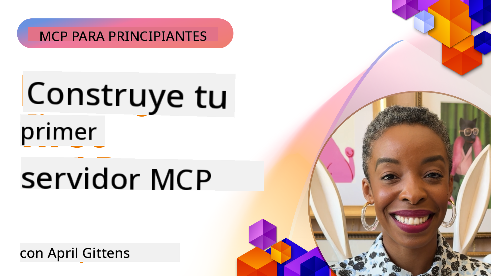

<!--
CO_OP_TRANSLATOR_METADATA:
{
  "original_hash": "858362ce0118de3fec0f9114bf396101",
  "translation_date": "2025-07-29T00:52:33+00:00",
  "source_file": "03-GettingStarted/README.md",
  "language_code": "es"
}
-->
## Comenzando  

_(Haz clic en la imagen de arriba para ver el video de esta lección)_

Esta sección consta de varias lecciones:

- **1 Tu primer servidor**, en esta primera lección, aprenderás a crear tu primer servidor y a inspeccionarlo con la herramienta de inspección, una forma valiosa de probar y depurar tu servidor, [a la lección](01-first-server/README.md)

- **2 Cliente**, en esta lección, aprenderás a escribir un cliente que pueda conectarse a tu servidor, [a la lección](02-client/README.md)

- **3 Cliente con LLM**, una forma aún mejor de escribir un cliente es añadiendo un LLM para que pueda "negociar" con tu servidor sobre qué hacer, [a la lección](03-llm-client/README.md)

- **4 Consumir un servidor en modo Agente de GitHub Copilot en Visual Studio Code**. Aquí veremos cómo ejecutar nuestro servidor MCP desde Visual Studio Code, [a la lección](04-vscode/README.md)

- **5 Consumir desde un SSE (Server Sent Events)**. SSE es un estándar para la transmisión de servidor a cliente, que permite a los servidores enviar actualizaciones en tiempo real a los clientes a través de HTTP, [a la lección](05-sse-server/README.md)

- **6 Transmisión HTTP con MCP (HTTP Streamable)**. Aprende sobre la transmisión HTTP moderna, notificaciones de progreso y cómo implementar servidores y clientes MCP escalables y en tiempo real utilizando HTTP Streamable, [a la lección](06-http-streaming/README.md)

- **7 Utilizar AI Toolkit para VSCode** para consumir y probar tus clientes y servidores MCP, [a la lección](07-aitk/README.md)

- **8 Pruebas**. Aquí nos enfocaremos especialmente en cómo podemos probar nuestro servidor y cliente de diferentes maneras, [a la lección](08-testing/README.md)

- **9 Despliegue**. Este capítulo analizará diferentes formas de desplegar tus soluciones MCP, [a la lección](09-deployment/README.md)

El Protocolo de Contexto de Modelo (MCP) es un protocolo abierto que estandariza cómo las aplicaciones proporcionan contexto a los LLMs. Piensa en MCP como un puerto USB-C para aplicaciones de IA: proporciona una forma estandarizada de conectar modelos de IA a diferentes fuentes de datos y herramientas.

## Objetivos de Aprendizaje

Al final de esta lección, serás capaz de:

- Configurar entornos de desarrollo para MCP en C#, Java, Python, TypeScript y JavaScript
- Construir y desplegar servidores MCP básicos con características personalizadas (recursos, prompts y herramientas)
- Crear aplicaciones host que se conecten a servidores MCP
- Probar y depurar implementaciones de MCP
- Comprender los desafíos comunes de configuración y sus soluciones
- Conectar tus implementaciones MCP a servicios populares de LLM

## Configuración de tu Entorno MCP

Antes de comenzar a trabajar con MCP, es importante preparar tu entorno de desarrollo y comprender el flujo de trabajo básico. Esta sección te guiará a través de los pasos iniciales de configuración para garantizar un inicio sin problemas con MCP.

### Requisitos Previos

Antes de sumergirte en el desarrollo con MCP, asegúrate de tener:

- **Entorno de Desarrollo**: Para el lenguaje que elijas (C#, Java, Python, TypeScript o JavaScript)
- **IDE/Editor**: Visual Studio, Visual Studio Code, IntelliJ, Eclipse, PyCharm o cualquier editor de código moderno
- **Gestores de Paquetes**: NuGet, Maven/Gradle, pip o npm/yarn
- **Claves API**: Para cualquier servicio de IA que planees usar en tus aplicaciones host

### SDKs Oficiales

En los próximos capítulos verás soluciones construidas utilizando Python, TypeScript, Java y .NET. Aquí están todos los SDKs oficialmente soportados.

MCP proporciona SDKs oficiales para múltiples lenguajes:
- [C# SDK](https://github.com/modelcontextprotocol/csharp-sdk) - Mantenido en colaboración con Microsoft
- [Java SDK](https://github.com/modelcontextprotocol/java-sdk) - Mantenido en colaboración con Spring AI
- [TypeScript SDK](https://github.com/modelcontextprotocol/typescript-sdk) - La implementación oficial en TypeScript
- [Python SDK](https://github.com/modelcontextprotocol/python-sdk) - La implementación oficial en Python
- [Kotlin SDK](https://github.com/modelcontextprotocol/kotlin-sdk) - La implementación oficial en Kotlin
- [Swift SDK](https://github.com/modelcontextprotocol/swift-sdk) - Mantenido en colaboración con Loopwork AI
- [Rust SDK](https://github.com/modelcontextprotocol/rust-sdk) - La implementación oficial en Rust

## Puntos Clave

- Configurar un entorno de desarrollo MCP es sencillo con SDKs específicos para cada lenguaje
- Construir servidores MCP implica crear y registrar herramientas con esquemas claros
- Los clientes MCP se conectan a servidores y modelos para aprovechar capacidades extendidas
- Probar y depurar son esenciales para implementaciones MCP confiables
- Las opciones de despliegue van desde desarrollo local hasta soluciones basadas en la nube

## Práctica

Contamos con un conjunto de ejemplos que complementan los ejercicios que verás en todos los capítulos de esta sección. Además, cada capítulo también tiene sus propios ejercicios y tareas.

- [Calculadora en Java](./samples/java/calculator/README.md)
- [Calculadora en .Net](../../../03-GettingStarted/samples/csharp)
- [Calculadora en JavaScript](./samples/javascript/README.md)
- [Calculadora en TypeScript](./samples/typescript/README.md)
- [Calculadora en Python](../../../03-GettingStarted/samples/python)

## Recursos Adicionales

- [Construir Agentes usando el Protocolo de Contexto de Modelo en Azure](https://learn.microsoft.com/azure/developer/ai/intro-agents-mcp)
- [MCP remoto con Azure Container Apps (Node.js/TypeScript/JavaScript)](https://learn.microsoft.com/samples/azure-samples/mcp-container-ts/mcp-container-ts/)
- [Agente MCP de OpenAI en .NET](https://learn.microsoft.com/samples/azure-samples/openai-mcp-agent-dotnet/openai-mcp-agent-dotnet/)

## Qué sigue

Siguiente: [Creando tu primer servidor MCP](01-first-server/README.md)

**Descargo de responsabilidad**:  
Este documento ha sido traducido utilizando el servicio de traducción automática [Co-op Translator](https://github.com/Azure/co-op-translator). Aunque nos esforzamos por garantizar la precisión, tenga en cuenta que las traducciones automatizadas pueden contener errores o imprecisiones. El documento original en su idioma nativo debe considerarse como la fuente autorizada. Para información crítica, se recomienda una traducción profesional realizada por humanos. No nos hacemos responsables de ningún malentendido o interpretación errónea que surja del uso de esta traducción.