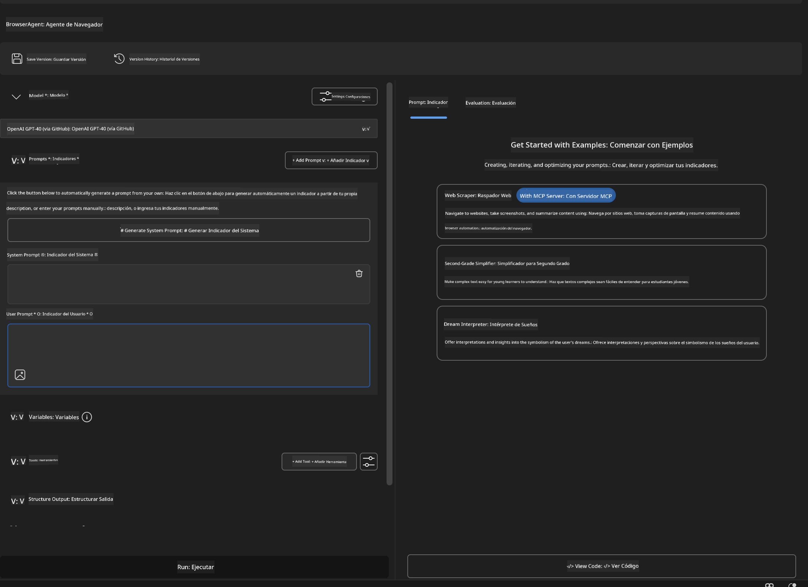
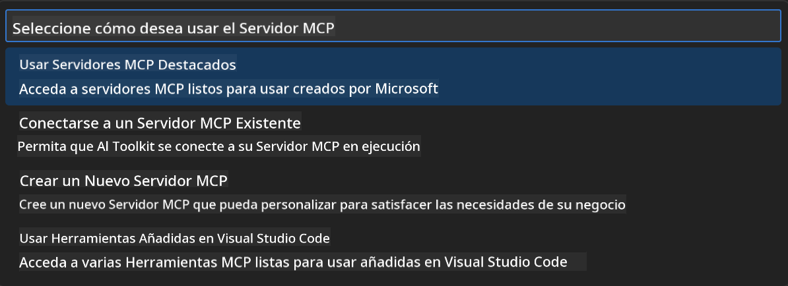
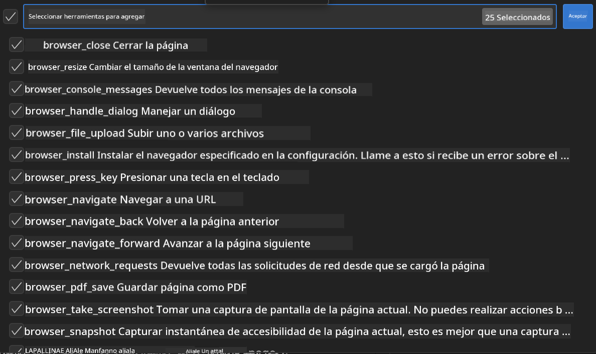
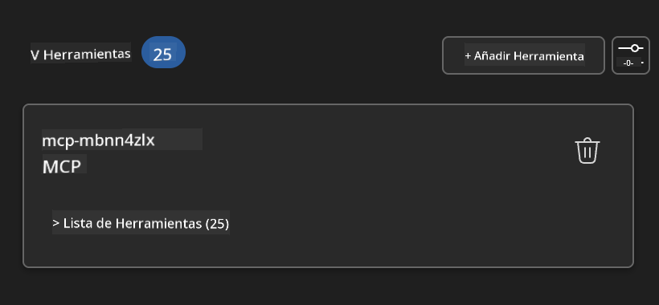
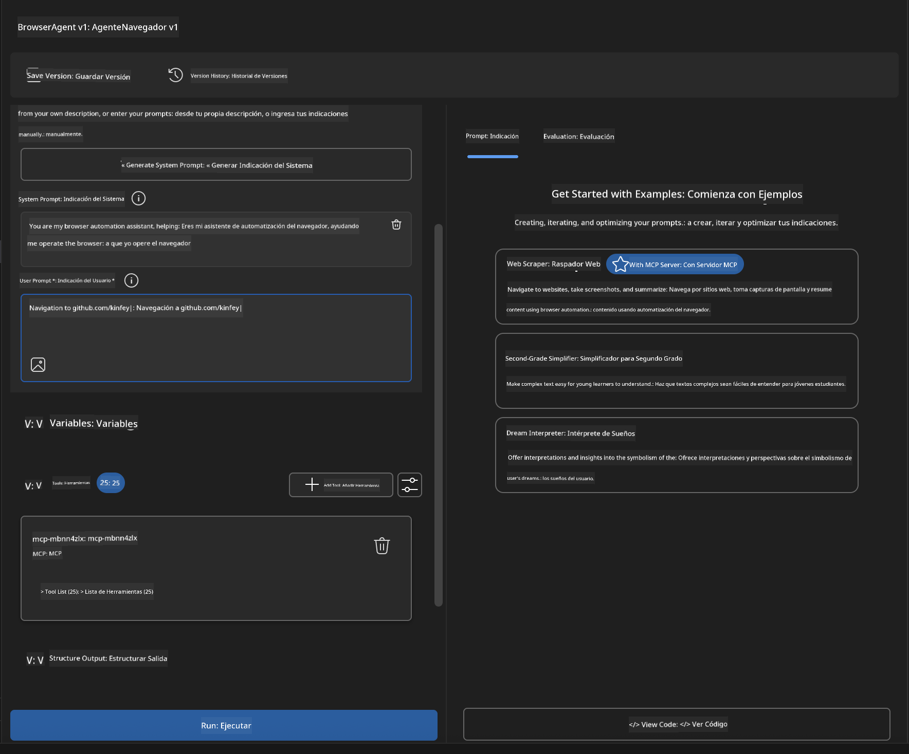
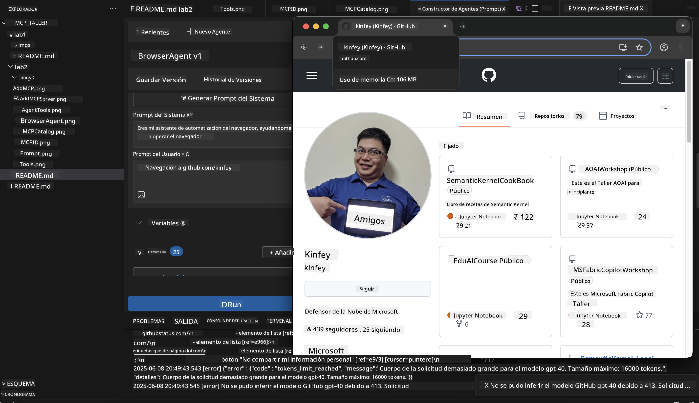
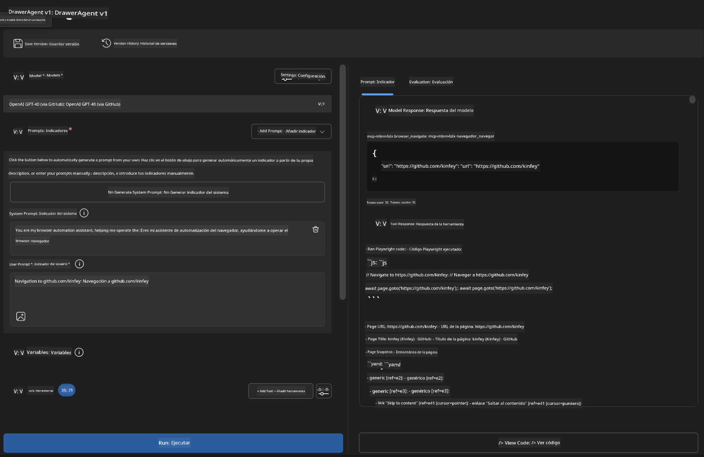
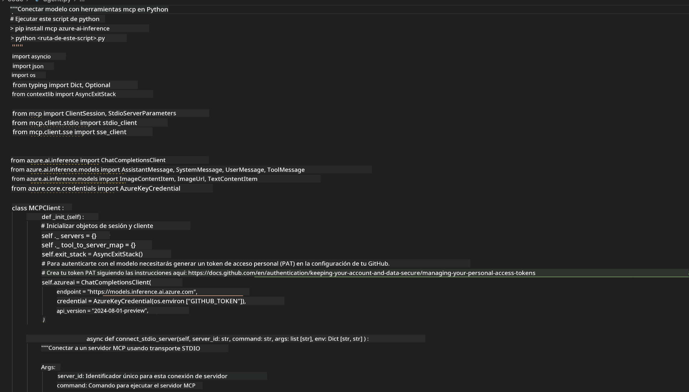

<!--
CO_OP_TRANSLATOR_METADATA:
{
  "original_hash": "a22b7dd11cd7690f99f9195877cafdc3",
  "translation_date": "2025-06-10T05:34:54+00:00",
  "source_file": "10-StreamliningAIWorkflowsBuildingAnMCPServerWithAIToolkit/lab2/README.md",
  "language_code": "es"
}
-->
# 🌐 Módulo 2: Fundamentos de MCP con AI Toolkit

[]()
[]()
[]()

## 📋 Objetivos de Aprendizaje

Al finalizar este módulo, podrás:
- ✅ Comprender la arquitectura y beneficios del Model Context Protocol (MCP)
- ✅ Explorar el ecosistema de servidores MCP de Microsoft
- ✅ Integrar servidores MCP con AI Toolkit Agent Builder
- ✅ Crear un agente funcional de automatización de navegador usando Playwright MCP
- ✅ Configurar y probar las herramientas MCP dentro de tus agentes
- ✅ Exportar y desplegar agentes potenciados por MCP para producción

## 🎯 Continuando desde el Módulo 1

En el Módulo 1, dominamos los conceptos básicos de AI Toolkit y creamos nuestro primer Agente en Python. Ahora vamos a **potenciar** tus agentes conectándolos con herramientas y servicios externos a través del revolucionario **Model Context Protocol (MCP)**.

Piensa en esto como actualizar de una calculadora básica a una computadora completa: tus agentes de IA obtendrán la capacidad de:
- 🌐 Navegar e interactuar con sitios web
- 📁 Acceder y manipular archivos
- 🔧 Integrarse con sistemas empresariales
- 📊 Procesar datos en tiempo real desde APIs

## 🧠 Entendiendo el Model Context Protocol (MCP)

### 🔍 ¿Qué es MCP?

Model Context Protocol (MCP) es el **"USB-C para aplicaciones de IA"**: un estándar abierto revolucionario que conecta Modelos de Lenguaje Grande (LLMs) con herramientas externas, fuentes de datos y servicios. Así como USB-C eliminó el caos de cables al ofrecer un conector universal, MCP elimina la complejidad de integración de IA con un protocolo estandarizado.

### 🎯 El Problema que Resuelve MCP

**Antes de MCP:**
- 🔧 Integraciones personalizadas para cada herramienta
- 🔄 Dependencia de proveedores con soluciones propietarias  
- 🔒 Vulnerabilidades de seguridad por conexiones improvisadas
- ⏱️ Meses de desarrollo para integraciones básicas

**Con MCP:**
- ⚡ Integración de herramientas plug-and-play
- 🔄 Arquitectura independiente del proveedor
- 🛡️ Mejores prácticas de seguridad integradas
- 🚀 Minutos para añadir nuevas capacidades

### 🏗️ Profundizando en la Arquitectura MCP

MCP sigue una **arquitectura cliente-servidor** que crea un ecosistema seguro y escalable:

```mermaid
graph TB
    A[AI Application/Agent] --> B[MCP Client]
    B --> C[MCP Server 1: Files]
    B --> D[MCP Server 2: Web APIs]
    B --> E[MCP Server 3: Database]
    B --> F[MCP Server N: Custom Tools]
    
    C --> G[Local File System]
    D --> H[External APIs]
    E --> I[Database Systems]
    F --> J[Enterprise Systems]
```

**🔧 Componentes Clave:**

| Componente | Rol | Ejemplos |
|------------|-----|----------|
| **MCP Hosts** | Aplicaciones que consumen servicios MCP | Claude Desktop, VS Code, AI Toolkit |
| **MCP Clients** | Manejadores del protocolo (1:1 con servidores) | Integrados en aplicaciones host |
| **MCP Servers** | Exponen capacidades vía protocolo estándar | Playwright, Files, Azure, GitHub |
| **Capa de Transporte** | Métodos de comunicación | stdio, HTTP, WebSockets |

## 🏢 Ecosistema de Servidores MCP de Microsoft

Microsoft lidera el ecosistema MCP con una suite completa de servidores empresariales que responden a necesidades reales de negocio.

### 🌟 Servidores MCP Destacados de Microsoft

#### 1. ☁️ Azure MCP Server  
**🔗 Repositorio**: [azure/azure-mcp](https://github.com/azure/azure-mcp)  
**🎯 Propósito**: Gestión integral de recursos Azure con integración de IA

**✨ Características Clave:**  
- Provisión declarativa de infraestructura  
- Monitoreo de recursos en tiempo real  
- Recomendaciones para optimización de costos  
- Verificación de cumplimiento de seguridad  

**🚀 Casos de Uso:**  
- Infraestructura como Código con asistencia IA  
- Escalado automático de recursos  
- Optimización de costos en la nube  
- Automatización de flujos DevOps  

#### 2. 📊 Microsoft Dataverse MCP  
**📚 Documentación**: [Microsoft Dataverse Integration](https://go.microsoft.com/fwlink/?linkid=2320176)  
**🎯 Propósito**: Interfaz en lenguaje natural para datos empresariales

**✨ Características Clave:**  
- Consultas de base de datos en lenguaje natural  
- Comprensión del contexto empresarial  
- Plantillas personalizadas para prompts  
- Gobernanza de datos empresariales  

**🚀 Casos de Uso:**  
- Reportes de inteligencia de negocio  
- Análisis de datos de clientes  
- Insights de pipeline de ventas  
- Consultas de datos para cumplimiento  

#### 3. 🌐 Playwright MCP Server  
**🔗 Repositorio**: [microsoft/playwright-mcp](https://github.com/microsoft/playwright-mcp)  
**🎯 Propósito**: Automatización de navegador y capacidades de interacción web

**✨ Características Clave:**  
- Automatización multiplataforma (Chrome, Firefox, Safari)  
- Detección inteligente de elementos  
- Captura de pantalla y generación de PDF  
- Monitoreo de tráfico de red  

**🚀 Casos de Uso:**  
- Flujos de pruebas automatizadas  
- Web scraping y extracción de datos  
- Monitoreo UI/UX  
- Automatización de análisis competitivo  

#### 4. 📁 Files MCP Server  
**🔗 Repositorio**: [microsoft/files-mcp-server](https://github.com/microsoft/files-mcp-server)  
**🎯 Propósito**: Operaciones inteligentes en sistemas de archivos

**✨ Características Clave:**  
- Gestión declarativa de archivos  
- Sincronización de contenido  
- Integración con control de versiones  
- Extracción de metadatos  

**🚀 Casos de Uso:**  
- Gestión documental  
- Organización de repositorios de código  
- Flujos de publicación de contenido  
- Manejo de archivos en pipelines de datos  

#### 5. 📝 MarkItDown MCP Server  
**🔗 Repositorio**: [microsoft/markitdown](https://github.com/microsoft/markitdown)  
**🎯 Propósito**: Procesamiento y manipulación avanzada de Markdown

**✨ Características Clave:**  
- Análisis avanzado de Markdown  
- Conversión de formatos (MD ↔ HTML ↔ PDF)  
- Análisis de estructura de contenido  
- Procesamiento de plantillas  

**🚀 Casos de Uso:**  
- Flujos de documentación técnica  
- Sistemas de gestión de contenido  
- Generación de reportes  
- Automatización de bases de conocimiento  

#### 6. 📈 Clarity MCP Server  
**📦 Paquete**: [@microsoft/clarity-mcp-server](https://www.npmjs.com/package/@microsoft/clarity-mcp-server)  
**🎯 Propósito**: Análisis web e insights sobre comportamiento de usuarios

**✨ Características Clave:**  
- Análisis de mapas de calor  
- Grabación de sesiones de usuario  
- Métricas de rendimiento  
- Análisis de embudos de conversión  

**🚀 Casos de Uso:**  
- Optimización de sitios web  
- Investigación de experiencia de usuario  
- Análisis A/B testing  
- Paneles de inteligencia de negocio  

### 🌍 Ecosistema Comunitario

Más allá de los servidores de Microsoft, el ecosistema MCP incluye:  
- **🐙 GitHub MCP**: Gestión de repositorios y análisis de código  
- **🗄️ MCPs de bases de datos**: Integraciones con PostgreSQL, MySQL, MongoDB  
- **☁️ MCPs de proveedores cloud**: Herramientas para AWS, GCP, Digital Ocean  
- **📧 MCPs de comunicación**: Integraciones con Slack, Teams, Email  

## 🛠️ Laboratorio Práctico: Creando un Agente de Automatización de Navegador

**🎯 Objetivo del Proyecto**: Crear un agente inteligente de automatización de navegador usando el servidor Playwright MCP que pueda navegar sitios web, extraer información y realizar interacciones web complejas.

### 🚀 Fase 1: Configuración Inicial del Agente

#### Paso 1: Inicializa tu Agente  
1. **Abre AI Toolkit Agent Builder**  
2. **Crea un Nuevo Agente** con la siguiente configuración:  
   - **Nombre**: `BrowserAgent`
   - **Model**: Choose GPT-4o 




### 🔧 Phase 2: MCP Integration Workflow

#### Step 3: Add MCP Server Integration
1. **Navigate to Tools Section** in Agent Builder
2. **Click "Add Tool"** to open the integration menu
3. **Select "MCP Server"** from available options


**🔍 Understanding Tool Types:**
- **Built-in Tools**: Pre-configured AI Toolkit functions
- **MCP Servers**: External service integrations
- **Custom APIs**: Your own service endpoints
- **Function Calling**: Direct model function access

#### Step 4: MCP Server Selection
1. **Choose "MCP Server"** option to proceed


2. **Browse MCP Catalog** to explore available integrations



### 🎮 Phase 3: Playwright MCP Configuration

#### Step 5: Select and Configure Playwright
1. **Click "Use Featured MCP Servers"** to access Microsoft's verified servers
2. **Select "Playwright"** from the featured list
3. **Accept Default MCP ID** or customize for your environment


#### Step 6: Enable Playwright Capabilities
**🔑 Critical Step**: Select **ALL** available Playwright methods for maximum functionality



**🛠️ Essential Playwright Tools:**
- **Navigation**: `goto`, `goBack`, `goForward`, `reload`
- **Interaction**: `click`, `fill`, `press`, `hover`, `drag`
- **Extraction**: `textContent`, `innerHTML`, `getAttribute`
- **Validation**: `isVisible`, `isEnabled`, `waitForSelector`
- **Capture**: `screenshot`, `pdf`, `video`
- **Network**: `setExtraHTTPHeaders`, `route`, `waitForResponse`

#### Paso 7: Verifica el Éxito de la Integración  
**✅ Indicadores de Éxito:**  
- Todas las herramientas aparecen en la interfaz de Agent Builder  
- No hay mensajes de error en el panel de integración  
- El estado del servidor Playwright muestra "Connected"



**🔧 Solución de Problemas Comunes:**  
- **Conexión Fallida**: Revisa la conexión a internet y la configuración del firewall  
- **Herramientas Faltantes**: Asegúrate de haber seleccionado todas las capacidades durante la configuración  
- **Errores de Permisos**: Verifica que VS Code tenga los permisos necesarios en el sistema  

### 🎯 Fase 4: Ingeniería Avanzada de Prompts

#### Paso 8: Diseña Prompts Inteligentes para el Sistema  
Crea prompts sofisticados que aprovechen al máximo las capacidades de Playwright:

```markdown
# Web Automation Expert System Prompt

## Core Identity
You are an advanced web automation specialist with deep expertise in browser automation, web scraping, and user experience analysis. You have access to Playwright tools for comprehensive browser control.

## Capabilities & Approach
### Navigation Strategy
- Always start with screenshots to understand page layout
- Use semantic selectors (text content, labels) when possible
- Implement wait strategies for dynamic content
- Handle single-page applications (SPAs) effectively

### Error Handling
- Retry failed operations with exponential backoff
- Provide clear error descriptions and solutions
- Suggest alternative approaches when primary methods fail
- Always capture diagnostic screenshots on errors

### Data Extraction
- Extract structured data in JSON format when possible
- Provide confidence scores for extracted information
- Validate data completeness and accuracy
- Handle pagination and infinite scroll scenarios

### Reporting
- Include step-by-step execution logs
- Provide before/after screenshots for verification
- Suggest optimizations and alternative approaches
- Document any limitations or edge cases encountered

## Ethical Guidelines
- Respect robots.txt and rate limiting
- Avoid overloading target servers
- Only extract publicly available information
- Follow website terms of service
```

#### Paso 9: Crea Prompts Dinámicos para el Usuario  
Diseña prompts que demuestren varias capacidades:

**🌐 Ejemplo de Análisis Web:**  
```markdown
Navigate to github.com/kinfey and provide a comprehensive analysis including:
1. Repository structure and organization
2. Recent activity and contribution patterns  
3. Documentation quality assessment
4. Technology stack identification
5. Community engagement metrics
6. Notable projects and their purposes

Include screenshots at key steps and provide actionable insights.
```



### 🚀 Fase 5: Ejecución y Pruebas

#### Paso 10: Ejecuta tu Primera Automatización  
1. **Haz clic en "Run"** para iniciar la secuencia de automatización  
2. **Monitorea la Ejecución en Tiempo Real**:  
   - El navegador Chrome se abre automáticamente  
   - El agente navega al sitio web objetivo  
   - Se capturan capturas de pantalla en cada paso importante  
   - Los resultados del análisis se transmiten en tiempo real  



#### Paso 11: Analiza Resultados e Insights  
Revisa el análisis completo en la interfaz de Agent Builder:



### 🌟 Fase 6: Capacidades Avanzadas y Despliegue

#### Paso 12: Exporta y Despliega en Producción  
Agent Builder soporta múltiples opciones de despliegue:



## 🎓 Resumen del Módulo 2 y Próximos Pasos

### 🏆 Logro Desbloqueado: Maestro en Integración MCP

**✅ Habilidades Dominadas:**  
- [ ] Comprensión de la arquitectura y beneficios de MCP  
- [ ] Navegación por el ecosistema de servidores MCP de Microsoft  
- [ ] Integración de Playwright MCP con AI Toolkit  
- [ ] Creación de agentes sofisticados de automatización de navegador  
- [ ] Ingeniería avanzada de prompts para automatización web  

### 📚 Recursos Adicionales

- **🔗 Especificación MCP**: [Documentación Oficial del Protocolo](https://modelcontextprotocol.io/)  
- **🛠️ API de Playwright**: [Referencia Completa de Métodos](https://playwright.dev/docs/api/class-playwright)  
- **🏢 Servidores MCP de Microsoft**: [Guía de Integración Empresarial](https://github.com/microsoft/mcp-servers)  
- **🌍 Ejemplos Comunitarios**: [Galería de Servidores MCP](https://github.com/modelcontextprotocol/servers)  

**🎉 ¡Felicidades!** Has dominado con éxito la integración MCP y ahora puedes construir agentes de IA listos para producción con capacidades de herramientas externas.

### 🔜 Continúa al Próximo Módulo

¿Listo para llevar tus habilidades MCP al siguiente nivel? Avanza a **[Módulo 3: Desarrollo Avanzado de MCP con AI Toolkit](../lab3/README.md)** donde aprenderás a:  
- Crear tus propios servidores MCP personalizados  
- Configurar y usar el último SDK Python de MCP  
- Configurar MCP Inspector para depuración  
- Dominar flujos avanzados de desarrollo de servidores MCP  
- Construir un servidor MCP de clima desde cero

**Descargo de responsabilidad**:  
Este documento ha sido traducido utilizando el servicio de traducción automática [Co-op Translator](https://github.com/Azure/co-op-translator). Aunque nos esforzamos por la precisión, tenga en cuenta que las traducciones automáticas pueden contener errores o inexactitudes. El documento original en su idioma nativo debe considerarse la fuente autorizada. Para información crítica, se recomienda una traducción profesional realizada por humanos. No nos hacemos responsables de ningún malentendido o interpretación errónea derivada del uso de esta traducción.