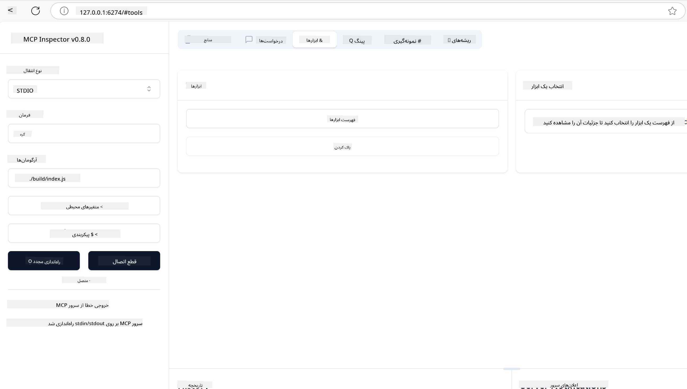
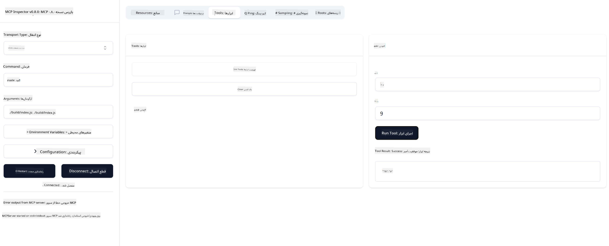

<!--
CO_OP_TRANSLATOR_METADATA:
{
  "original_hash": "bf05718d019040cf0c7d4ccc6d6a1a88",
  "translation_date": "2025-06-13T05:51:36+00:00",
  "source_file": "03-GettingStarted/01-first-server/README.md",
  "language_code": "fa"
}
-->
### -2- ایجاد پروژه

حالا که SDK خود را نصب کرده‌اید، بیایید پروژه‌ای ایجاد کنیم:

### -3- ایجاد فایل‌های پروژه

### -4- نوشتن کد سرور

### -5- افزودن ابزار و منبع

با افزودن کد زیر یک ابزار و یک منبع اضافه کنید:

### -6- کد نهایی

بیایید آخرین کدی که برای راه‌اندازی سرور نیاز داریم را اضافه کنیم:

### -7- تست سرور

سرور را با دستور زیر راه‌اندازی کنید:

### -8- اجرا با استفاده از Inspector

Inspector ابزاری عالی است که می‌تواند سرور شما را راه‌اندازی کند و به شما امکان می‌دهد با آن تعامل داشته باشید تا مطمئن شوید همه چیز درست کار می‌کند. بیایید آن را راه‌اندازی کنیم:

> [!NOTE]
> ممکن است در قسمت "command" کمی متفاوت به نظر برسد چون شامل دستور اجرای سرور با runtime خاص شما است.

شما باید رابط کاربری زیر را مشاهده کنید:

1. با انتخاب دکمه Connect به سرور متصل شوید  
   پس از اتصال به سرور، باید تصویر زیر را ببینید:

   

2. گزینه‌های "Tools" و "listTools" را انتخاب کنید، باید گزینه "Add" ظاهر شود، روی "Add" کلیک کنید و مقادیر پارامترها را وارد کنید.

   شما باید پاسخ زیر را ببینید، یعنی نتیجه‌ای از ابزار "add":

   

تبریک می‌گوییم، شما موفق شدید اولین سرور خود را ایجاد و اجرا کنید!

### SDKهای رسمی

MCP SDKهای رسمی برای زبان‌های مختلف ارائه می‌دهد:  
- [C# SDK](https://github.com/modelcontextprotocol/csharp-sdk) - با همکاری مایکروسافت نگهداری می‌شود  
- [Java SDK](https://github.com/modelcontextprotocol/java-sdk) - با همکاری Spring AI نگهداری می‌شود  
- [TypeScript SDK](https://github.com/modelcontextprotocol/typescript-sdk) - پیاده‌سازی رسمی TypeScript  
- [Python SDK](https://github.com/modelcontextprotocol/python-sdk) - پیاده‌سازی رسمی Python  
- [Kotlin SDK](https://github.com/modelcontextprotocol/kotlin-sdk) - پیاده‌سازی رسمی Kotlin  
- [Swift SDK](https://github.com/modelcontextprotocol/swift-sdk) - با همکاری Loopwork AI نگهداری می‌شود  
- [Rust SDK](https://github.com/modelcontextprotocol/rust-sdk) - پیاده‌سازی رسمی Rust  

## نکات کلیدی

- راه‌اندازی محیط توسعه MCP با SDKهای مخصوص هر زبان ساده است  
- ساخت سرورهای MCP شامل ایجاد و ثبت ابزارها با اسکیمای مشخص است  
- تست و اشکال‌زدایی برای پیاده‌سازی‌های قابل اطمینان MCP ضروری است  

## نمونه‌ها

- [ماشین حساب Java](../samples/java/calculator/README.md)  
- [ماشین حساب .Net](../../../../03-GettingStarted/samples/csharp)  
- [ماشین حساب JavaScript](../samples/javascript/README.md)  
- [ماشین حساب TypeScript](../samples/typescript/README.md)  
- [ماشین حساب Python](../../../../03-GettingStarted/samples/python)  

## تمرین

یک سرور ساده MCP با ابزاری که خودتان انتخاب می‌کنید بسازید:  
1. ابزار را در زبان مورد علاقه خود (.NET، Java، Python، یا JavaScript) پیاده‌سازی کنید.  
2. پارامترهای ورودی و مقادیر بازگشتی را تعریف کنید.  
3. ابزار inspector را اجرا کنید تا مطمئن شوید سرور به درستی کار می‌کند.  
4. پیاده‌سازی را با ورودی‌های مختلف تست کنید.  

## راه‌حل

[راه‌حل](./solution/README.md)

## منابع بیشتر

- [ساخت Agentها با استفاده از Model Context Protocol در Azure](https://learn.microsoft.com/azure/developer/ai/intro-agents-mcp)  
- [MCP از راه دور با Azure Container Apps (Node.js/TypeScript/JavaScript)](https://learn.microsoft.com/samples/azure-samples/mcp-container-ts/mcp-container-ts/)  
- [Agent MCP OpenAI در .NET](https://learn.microsoft.com/samples/azure-samples/openai-mcp-agent-dotnet/openai-mcp-agent-dotnet/)  

## گام بعدی

بعدی: [شروع کار با کلاینت‌های MCP](/03-GettingStarted/02-client/README.md)

**سلب مسئولیت**:  
این سند با استفاده از سرویس ترجمه هوش مصنوعی [Co-op Translator](https://github.com/Azure/co-op-translator) ترجمه شده است. در حالی که ما در تلاش برای دقت هستیم، لطفاً توجه داشته باشید که ترجمه‌های خودکار ممکن است شامل خطاها یا نادرستی‌هایی باشند. سند اصلی به زبان مادری آن باید به عنوان منبع معتبر در نظر گرفته شود. برای اطلاعات حیاتی، توصیه می‌شود از ترجمه حرفه‌ای انسانی استفاده شود. ما مسئول هیچ گونه سوء تفاهم یا تفسیر نادرستی که از استفاده از این ترجمه ناشی شود، نیستیم.