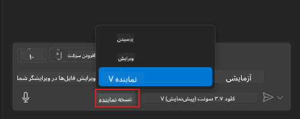
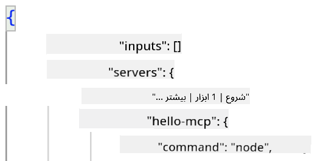
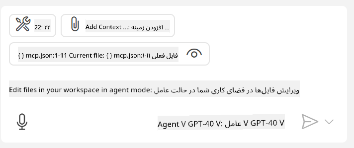

<!--
CO_OP_TRANSLATOR_METADATA:
{
  "original_hash": "8ea28e5e566edd5969337fd0b191ba3f",
  "translation_date": "2025-07-16T22:29:22+00:00",
  "source_file": "03-GettingStarted/04-vscode/README.md",
  "language_code": "fa"
}
-->
# استفاده از سرور در حالت GitHub Copilot Agent

Visual Studio Code و GitHub Copilot می‌توانند به عنوان یک کلاینت عمل کرده و از یک MCP Server استفاده کنند. ممکن است بپرسید چرا باید این کار را انجام دهیم؟ خب، این یعنی هر ویژگی که MCP Server دارد، حالا می‌تواند مستقیماً در محیط توسعه شما مورد استفاده قرار گیرد. تصور کنید که سرور MCP گیت‌هاب را اضافه کنید، این امکان را می‌دهد که به جای تایپ دستورات خاص در ترمینال، از طریق دستورات طبیعی با گیت‌هاب تعامل داشته باشید. یا به طور کلی هر چیزی که بتواند تجربه توسعه‌دهنده را بهبود بخشد و همه این‌ها با زبان طبیعی کنترل شود. حالا متوجه مزیت این موضوع شدید، درست است؟

## مرور کلی

این درس نحوه استفاده از Visual Studio Code و حالت Agent در GitHub Copilot را به عنوان کلاینت برای MCP Server شما آموزش می‌دهد.

## اهداف یادگیری

در پایان این درس، شما قادر خواهید بود:

- از طریق Visual Studio Code یک MCP Server را مصرف کنید.
- قابلیت‌هایی مانند ابزارها را از طریق GitHub Copilot اجرا کنید.
- Visual Studio Code را برای پیدا کردن و مدیریت MCP Server خود پیکربندی کنید.

## نحوه استفاده

شما می‌توانید MCP Server خود را به دو روش مختلف کنترل کنید:

- رابط کاربری، که در ادامه این فصل خواهید دید چگونه انجام می‌شود.
- ترمینال، امکان کنترل از طریق ترمینال با استفاده از دستور `code` وجود دارد:

  برای افزودن یک MCP Server به پروفایل کاربری خود، از گزینه خط فرمان --add-mcp استفاده کنید و پیکربندی سرور را به صورت JSON به شکل {\"name\":\"server-name\",\"command\":...} ارائه دهید.

  ```
  code --add-mcp "{\"name\":\"my-server\",\"command\": \"uvx\",\"args\": [\"mcp-server-fetch\"]}"
  ```

### تصاویر صفحه

  
  


در بخش‌های بعدی بیشتر درباره استفاده از رابط گرافیکی صحبت خواهیم کرد.

## رویکرد

در سطح کلی، باید به این صورت پیش برویم:

- یک فایل پیکربندی برای پیدا کردن MCP Server خود تنظیم کنیم.
- سرور را راه‌اندازی یا به آن متصل شویم تا قابلیت‌هایش را فهرست کند.
- از این قابلیت‌ها از طریق رابط گفتگوی GitHub Copilot استفاده کنیم.

عالی است، حالا که روند کار را فهمیدیم، بیایید با یک تمرین، استفاده از MCP Server را از طریق Visual Studio Code امتحان کنیم.

## تمرین: استفاده از سرور

در این تمرین، Visual Studio Code را طوری پیکربندی می‌کنیم که MCP Server شما را پیدا کند تا بتوانید از طریق رابط گفتگوی GitHub Copilot با آن کار کنید.

### -0- مرحله پیش‌نیاز، فعال‌سازی کشف MCP Server

ممکن است نیاز باشد کشف MCP Serverها را فعال کنید.

1. به مسیر `File -> Preferences -> Settings` در Visual Studio Code بروید.

1. عبارت "MCP" را جستجو کنید و گزینه `chat.mcp.discovery.enabled` را در فایل settings.json فعال کنید.

### -1- ایجاد فایل پیکربندی

ابتدا یک فایل پیکربندی در ریشه پروژه خود ایجاد کنید، به فایلی به نام MCP.json نیاز دارید که باید در پوشه‌ای به نام .vscode قرار گیرد. باید به شکل زیر باشد:

```text
.vscode
|-- mcp.json
```

حالا ببینیم چگونه می‌توانیم یک ورودی سرور اضافه کنیم.

### -2- پیکربندی سرور

محتوای زیر را به *mcp.json* اضافه کنید:

```json
{
    "inputs": [],
    "servers": {
       "hello-mcp": {
           "command": "node",
           "args": [
               "build/index.js"
           ]
       }
    }
}
```

مثال ساده بالا نشان می‌دهد چگونه یک سرور نوشته شده با Node.js را راه‌اندازی کنیم، برای سایر محیط‌های اجرایی، دستور مناسب برای راه‌اندازی سرور را با استفاده از `command` و `args` مشخص کنید.

### -3- راه‌اندازی سرور

حالا که ورودی را اضافه کردید، بیایید سرور را راه‌اندازی کنیم:

1. ورودی خود را در *mcp.json* پیدا کنید و مطمئن شوید آیکون "play" را می‌بینید:

    

1. روی آیکون "play" کلیک کنید، باید ببینید که آیکون ابزارها در GitHub Copilot Chat تعداد ابزارهای در دسترس را افزایش می‌دهد. اگر روی این آیکون کلیک کنید، فهرستی از ابزارهای ثبت شده را مشاهده خواهید کرد. می‌توانید هر ابزار را بسته به اینکه می‌خواهید GitHub Copilot از آن‌ها به عنوان زمینه استفاده کند، فعال یا غیرفعال کنید:

  

1. برای اجرای یک ابزار، متنی را تایپ کنید که می‌دانید با توضیحات یکی از ابزارهای شما مطابقت دارد، مثلاً متنی مانند "add 22 to 1":

  

  باید پاسخی با مقدار 23 دریافت کنید.

## تمرین عملی

سعی کنید یک ورودی سرور به فایل *mcp.json* خود اضافه کنید و مطمئن شوید که می‌توانید سرور را راه‌اندازی و متوقف کنید. همچنین مطمئن شوید که می‌توانید از طریق رابط گفتگوی GitHub Copilot با ابزارهای سرور خود ارتباط برقرار کنید.

## راه‌حل

[راه‌حل](./solution/README.md)

## نکات کلیدی

نکات مهم این فصل عبارتند از:

- Visual Studio Code یک کلاینت عالی است که به شما امکان می‌دهد چندین MCP Server و ابزارهای آن‌ها را مصرف کنید.
- رابط گفتگوی GitHub Copilot راه تعامل شما با سرورها است.
- می‌توانید از کاربر ورودی‌هایی مانند کلیدهای API درخواست کنید که هنگام پیکربندی ورودی سرور در فایل *mcp.json* به MCP Server ارسال می‌شوند.

## نمونه‌ها

- [ماشین حساب جاوا](../samples/java/calculator/README.md)  
- [ماشین حساب .Net](../../../../03-GettingStarted/samples/csharp)  
- [ماشین حساب جاوااسکریپت](../samples/javascript/README.md)  
- [ماشین حساب تایپ‌اسکریپت](../samples/typescript/README.md)  
- [ماشین حساب پایتون](../../../../03-GettingStarted/samples/python)

## منابع بیشتر

- [مستندات Visual Studio](https://code.visualstudio.com/docs/copilot/chat/mcp-servers)

## مرحله بعد

- بعدی: [ساخت یک SSE Server](../05-sse-server/README.md)

**سلب مسئولیت**:  
این سند با استفاده از سرویس ترجمه هوش مصنوعی [Co-op Translator](https://github.com/Azure/co-op-translator) ترجمه شده است. در حالی که ما در تلاش برای دقت هستیم، لطفاً توجه داشته باشید که ترجمه‌های خودکار ممکن است حاوی خطاها یا نادرستی‌هایی باشند. سند اصلی به زبان بومی خود باید به عنوان منبع معتبر در نظر گرفته شود. برای اطلاعات حیاتی، ترجمه حرفه‌ای انسانی توصیه می‌شود. ما مسئول هیچ گونه سوءتفاهم یا تفسیر نادرستی که از استفاده از این ترجمه ناشی شود، نیستیم.