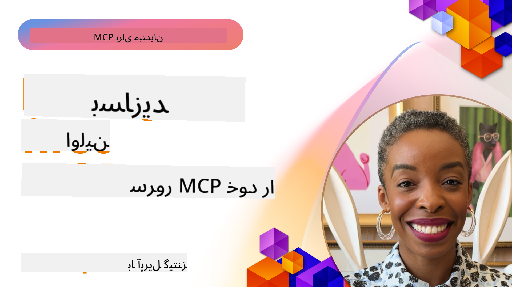

<!--
CO_OP_TRANSLATOR_METADATA:
{
  "original_hash": "858362ce0118de3fec0f9114bf396101",
  "translation_date": "2025-07-29T01:16:11+00:00",
  "source_file": "03-GettingStarted/README.md",
  "language_code": "fa"
}
-->
## شروع به کار  

_(برای مشاهده ویدئوی این درس، روی تصویر بالا کلیک کنید)_

این بخش شامل چند درس است:

- **1 اولین سرور شما**، در این درس اول، یاد می‌گیرید چگونه اولین سرور خود را ایجاد کنید و با ابزار بازرس آن را بررسی کنید، که راهی ارزشمند برای آزمایش و رفع اشکال سرور شماست، [به درس](01-first-server/README.md)

- **2 کلاینت**، در این درس یاد می‌گیرید چگونه یک کلاینت بنویسید که بتواند به سرور شما متصل شود، [به درس](02-client/README.md)

- **3 کلاینت با LLM**، یک روش بهتر برای نوشتن کلاینت این است که یک LLM به آن اضافه کنید تا بتواند با سرور شما "مذاکره" کند که چه کاری انجام دهد، [به درس](03-llm-client/README.md)

- **4 استفاده از حالت Agent GitHub Copilot در Visual Studio Code**. در اینجا، اجرای سرور MCP خود را از داخل Visual Studio Code بررسی می‌کنیم، [به درس](04-vscode/README.md)

- **5 استفاده از SSE (رویدادهای ارسال‌شده توسط سرور)** SSE یک استاندارد برای استریم سرور به کلاینت است که به سرورها اجازه می‌دهد به‌روزرسانی‌های لحظه‌ای را از طریق HTTP به کلاینت‌ها ارسال کنند، [به درس](05-sse-server/README.md)

- **6 استریم HTTP با MCP (HTTP قابل استریم)**. درباره استریم مدرن HTTP، اعلان‌های پیشرفت، و نحوه پیاده‌سازی سرورها و کلاینت‌های MCP مقیاس‌پذیر و لحظه‌ای با استفاده از HTTP قابل استریم بیاموزید، [به درس](06-http-streaming/README.md)

- **7 استفاده از ابزارهای هوش مصنوعی برای VSCode** برای استفاده و آزمایش کلاینت‌ها و سرورهای MCP خود، [به درس](07-aitk/README.md)

- **8 آزمایش**. در اینجا به‌ویژه بر نحوه آزمایش سرور و کلاینت خود به روش‌های مختلف تمرکز خواهیم کرد، [به درس](08-testing/README.md)

- **9 استقرار**. این فصل به روش‌های مختلف استقرار راه‌حل‌های MCP شما می‌پردازد، [به درس](09-deployment/README.md)

پروتکل Model Context Protocol (MCP) یک پروتکل باز است که استانداردی برای نحوه ارائه زمینه توسط برنامه‌ها به LLM‌ها فراهم می‌کند. MCP را مانند یک پورت USB-C برای برنامه‌های هوش مصنوعی تصور کنید - این پروتکل یک روش استاندارد برای اتصال مدل‌های هوش مصنوعی به منابع داده و ابزارهای مختلف ارائه می‌دهد.

## اهداف آموزشی

در پایان این درس، شما قادر خواهید بود:

- محیط‌های توسعه برای MCP را در زبان‌های C#، Java، Python، TypeScript و JavaScript تنظیم کنید
- سرورهای MCP پایه با ویژگی‌های سفارشی (منابع، درخواست‌ها و ابزارها) بسازید و مستقر کنید
- برنامه‌های میزبان ایجاد کنید که به سرورهای MCP متصل شوند
- پیاده‌سازی‌های MCP را آزمایش و رفع اشکال کنید
- چالش‌های رایج در تنظیمات را درک کرده و راه‌حل‌های آن‌ها را بیابید
- پیاده‌سازی‌های MCP خود را به خدمات محبوب LLM متصل کنید

## تنظیم محیط MCP شما

قبل از شروع کار با MCP، مهم است که محیط توسعه خود را آماده کنید و جریان کاری پایه را درک کنید. این بخش شما را از مراحل اولیه تنظیم راهنمایی می‌کند تا شروعی روان با MCP داشته باشید.

### پیش‌نیازها

قبل از شروع توسعه MCP، مطمئن شوید که موارد زیر را دارید:

- **محیط توسعه**: برای زبان انتخابی شما (C#، Java، Python، TypeScript یا JavaScript)
- **IDE/ویرایشگر**: Visual Studio، Visual Studio Code، IntelliJ، Eclipse، PyCharm یا هر ویرایشگر کد مدرن
- **مدیران بسته**: NuGet، Maven/Gradle، pip یا npm/yarn
- **کلیدهای API**: برای هر سرویس هوش مصنوعی که قصد دارید در برنامه‌های میزبان خود استفاده کنید

### SDKهای رسمی

در فصل‌های آینده، راه‌حل‌هایی را خواهید دید که با استفاده از Python، TypeScript، Java و .NET ساخته شده‌اند. در اینجا تمام SDKهای رسمی پشتیبانی‌شده آورده شده است.

MCP SDKهای رسمی برای زبان‌های مختلف ارائه می‌دهد:
- [C# SDK](https://github.com/modelcontextprotocol/csharp-sdk) - با همکاری Microsoft نگهداری می‌شود
- [Java SDK](https://github.com/modelcontextprotocol/java-sdk) - با همکاری Spring AI نگهداری می‌شود
- [TypeScript SDK](https://github.com/modelcontextprotocol/typescript-sdk) - پیاده‌سازی رسمی TypeScript
- [Python SDK](https://github.com/modelcontextprotocol/python-sdk) - پیاده‌سازی رسمی Python
- [Kotlin SDK](https://github.com/modelcontextprotocol/kotlin-sdk) - پیاده‌سازی رسمی Kotlin
- [Swift SDK](https://github.com/modelcontextprotocol/swift-sdk) - با همکاری Loopwork AI نگهداری می‌شود
- [Rust SDK](https://github.com/modelcontextprotocol/rust-sdk) - پیاده‌سازی رسمی Rust

## نکات کلیدی

- تنظیم محیط توسعه MCP با استفاده از SDKهای مخصوص زبان آسان است
- ساخت سرورهای MCP شامل ایجاد و ثبت ابزارها با طرح‌های واضح است
- کلاینت‌های MCP به سرورها و مدل‌ها متصل می‌شوند تا قابلیت‌های گسترده‌تری را بهره‌برداری کنند
- آزمایش و رفع اشکال برای پیاده‌سازی‌های قابل‌اعتماد MCP ضروری است
- گزینه‌های استقرار از توسعه محلی تا راه‌حل‌های مبتنی بر ابر متغیر است

## تمرین

ما مجموعه‌ای از نمونه‌ها داریم که تمرین‌های موجود در تمام فصل‌های این بخش را تکمیل می‌کند. علاوه بر این، هر فصل تمرین‌ها و تکالیف خاص خود را دارد.

- [ماشین حساب Java](./samples/java/calculator/README.md)
- [ماشین حساب .Net](../../../03-GettingStarted/samples/csharp)
- [ماشین حساب JavaScript](./samples/javascript/README.md)
- [ماشین حساب TypeScript](./samples/typescript/README.md)
- [ماشین حساب Python](../../../03-GettingStarted/samples/python)

## منابع اضافی

- [ساخت Agentها با Model Context Protocol در Azure](https://learn.microsoft.com/azure/developer/ai/intro-agents-mcp)
- [MCP از راه دور با Azure Container Apps (Node.js/TypeScript/JavaScript)](https://learn.microsoft.com/samples/azure-samples/mcp-container-ts/mcp-container-ts/)
- [.NET OpenAI MCP Agent](https://learn.microsoft.com/samples/azure-samples/openai-mcp-agent-dotnet/openai-mcp-agent-dotnet/)

## مرحله بعدی

بعدی: [ایجاد اولین سرور MCP شما](01-first-server/README.md)

**سلب مسئولیت**:  
این سند با استفاده از سرویس ترجمه هوش مصنوعی [Co-op Translator](https://github.com/Azure/co-op-translator) ترجمه شده است. در حالی که ما تلاش می‌کنیم دقت را حفظ کنیم، لطفاً توجه داشته باشید که ترجمه‌های خودکار ممکن است حاوی خطاها یا نادرستی‌هایی باشند. سند اصلی به زبان اصلی آن باید به عنوان منبع معتبر در نظر گرفته شود. برای اطلاعات حساس، ترجمه حرفه‌ای انسانی توصیه می‌شود. ما هیچ مسئولیتی در قبال سوءتفاهم‌ها یا تفسیرهای نادرست ناشی از استفاده از این ترجمه نداریم.