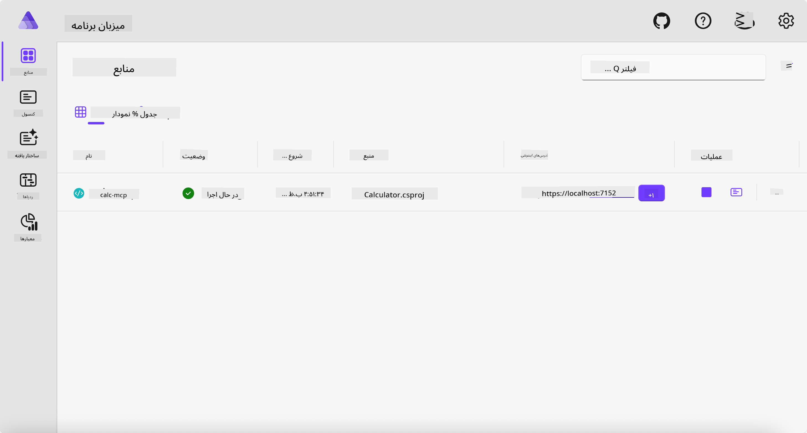

<!--
CO_OP_TRANSLATOR_METADATA:
{
  "original_hash": "0bc7bd48f55f1565f1d95ccb2c16f728",
  "translation_date": "2025-06-18T07:46:51+00:00",
  "source_file": "04-PracticalImplementation/samples/csharp/README.md",
  "language_code": "fa"
}
-->
# نمونه

مثال قبلی نشان می‌دهد چگونه از یک پروژه محلی .NET با نوع `stdio` استفاده کنیم و چطور سرور را به صورت محلی در یک کانتینر اجرا کنیم. این راه‌حل در بسیاری از مواقع مناسب است. اما گاهی مفید است که سرور به صورت راه دور، مثلاً در یک محیط ابری، اجرا شود. در اینجا نوع `http` وارد عمل می‌شود.

اگر به راه‌حل در پوشه `04-PracticalImplementation` نگاه کنید، ممکن است پیچیده‌تر از نمونه قبلی به نظر برسد. اما در واقع اینطور نیست. اگر دقیق‌تر به پروژه `src/Calculator` نگاه کنید، خواهید دید که بیشتر کد همان کد نمونه قبلی است. تنها تفاوت این است که از کتابخانه متفاوت `ModelContextProtocol.AspNetCore` برای مدیریت درخواست‌های HTTP استفاده می‌کنیم. همچنین متد `IsPrime` را خصوصی کرده‌ایم، فقط برای نشان دادن اینکه می‌توانید متدهای خصوصی در کد خود داشته باشید. بقیه کد همانند قبل است.

سایر پروژه‌ها از [.NET Aspire](https://learn.microsoft.com/dotnet/aspire/get-started/aspire-overview) هستند. داشتن .NET Aspire در راه‌حل، تجربه توسعه‌دهنده را هنگام توسعه و تست بهبود می‌بخشد و به مشاهده‌پذیری کمک می‌کند. برای اجرای سرور لازم نیست، اما داشتن آن در راه‌حل شما یک روش خوب است.

## اجرای سرور به صورت محلی

1. از VS Code (با افزونه C# DevKit)، به پوشه `04-PracticalImplementation/samples/csharp` بروید.
1. دستور زیر را برای شروع سرور اجرا کنید:

   ```bash
    dotnet watch run --project ./src/AppHost
   ```

1. وقتی مرورگر وب داشبورد .NET Aspire را باز کرد، آدرس URL نوع `http` را یادداشت کنید. باید چیزی شبیه `http://localhost:5058/` باشد.

   

## تست Streamable HTTP با MCP Inspector

اگر Node.js نسخه 22.7.5 یا بالاتر دارید، می‌توانید از MCP Inspector برای تست سرور خود استفاده کنید.

سرور را اجرا کنید و دستور زیر را در ترمینال وارد کنید:

```bash
npx @modelcontextprotocol/inspector http://localhost:5058
```


- گزینه `Streamable HTTP` as the Transport type.
- In the Url field, enter the URL of the server noted earlier, and append `/mcp` را انتخاب کنید. باید نوع `http` باشد (نه `https`) something like `http://localhost:5058/mcp`.
- select the Connect button.

A nice thing about the Inspector is that it provide a nice visibility on what is happening.

- Try listing the available tools
- Try some of them, it should works just like before.

## Test MCP Server with GitHub Copilot Chat in VS Code

To use the Streamable HTTP transport with GitHub Copilot Chat, change the configuration of the `calc-mcp` سرور قبلی که به این شکل ایجاد شده بود:

```jsonc
// .vscode/mcp.json
{
  "servers": {
    "calc-mcp": {
      "type": "http",
      "url": "http://localhost:5058/mcp"
    }
  }
}
```

چند تست انجام دهید:

- درخواست "3 عدد اول بعد از 6780" را بدهید. توجه کنید که Copilot از ابزار جدید `NextFivePrimeNumbers` استفاده می‌کند و فقط 3 عدد اول اول را برمی‌گرداند.
- درخواست "7 عدد اول بعد از 111" را بدهید تا ببینید چه اتفاقی می‌افتد.
- درخواست "جان 24 آبنبات دارد و می‌خواهد آنها را بین 3 فرزندش تقسیم کند. هر کودک چند آبنبات دارد؟" را بدهید تا نتیجه را ببینید.

## استقرار سرور در Azure

بیایید سرور را در Azure مستقر کنیم تا افراد بیشتری بتوانند از آن استفاده کنند.

از ترمینال به پوشه `04-PracticalImplementation/samples/csharp` بروید و دستور زیر را اجرا کنید:

```bash
azd up
```

پس از پایان استقرار، باید پیامی مشابه این مشاهده کنید:


آدرس URL را بردارید و در MCP Inspector و GitHub Copilot Chat استفاده کنید.

```jsonc
// .vscode/mcp.json
{
  "servers": {
    "calc-mcp": {
      "type": "http",
      "url": "https://calc-mcp.gentleriver-3977fbcf.australiaeast.azurecontainerapps.io/mcp"
    }
  }
}
```

## مرحله بعدی چیست؟

ما انواع مختلفی از روش‌های انتقال و ابزارهای تست را امتحان می‌کنیم. همچنین سرور MCP خود را در Azure مستقر می‌کنیم. اما اگر سرور ما نیاز به دسترسی به منابع خصوصی داشته باشد، مثلاً یک پایگاه داده یا API خصوصی؟ در فصل بعد خواهیم دید چگونه می‌توانیم امنیت سرور خود را بهبود دهیم.

**سلب مسئولیت**:  
این سند با استفاده از سرویس ترجمه هوش مصنوعی [Co-op Translator](https://github.com/Azure/co-op-translator) ترجمه شده است. در حالی که ما در تلاش برای دقت هستیم، لطفاً توجه داشته باشید که ترجمه‌های خودکار ممکن است حاوی اشتباهات یا نواقصی باشند. سند اصلی به زبان بومی آن باید به عنوان منبع معتبر در نظر گرفته شود. برای اطلاعات حیاتی، ترجمه حرفه‌ای انسانی توصیه می‌شود. ما مسئول هیچ گونه سوء تفاهم یا تفسیر نادرستی که از استفاده این ترجمه ناشی شود، نیستیم.