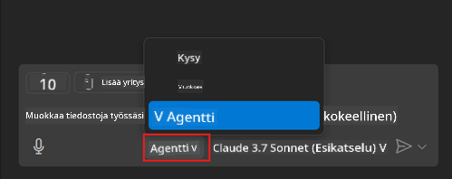
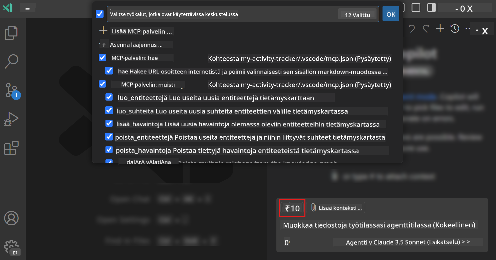

<!--
CO_OP_TRANSLATOR_METADATA:
{
  "original_hash": "8ea28e5e566edd5969337fd0b191ba3f",
  "translation_date": "2025-07-17T07:00:02+00:00",
  "source_file": "03-GettingStarted/04-vscode/README.md",
  "language_code": "fi"
}
-->
# Palvelimen käyttäminen GitHub Copilot Agent -tilasta

Visual Studio Code ja GitHub Copilot voivat toimia asiakkaana ja käyttää MCP-palvelinta. Saatat kysyä, miksi haluaisimme tehdä näin? No, se tarkoittaa, että kaikki MCP-palvelimen ominaisuudet ovat nyt käytettävissä suoraan IDE:ssäsi. Kuvittele esimerkiksi, että lisäät GitHubin MCP-palvelimen, jolloin voit ohjata GitHubia kehotteiden avulla sen sijaan, että kirjoittaisit tiettyjä komentoja terminaaliin. Tai ajattele mitä tahansa, mikä voisi parantaa kehittäjäkokemustasi, kaikki luonnollisella kielellä ohjattuna. Näetkö jo edut?

## Yleiskatsaus

Tässä oppitunnissa käydään läpi, miten Visual Studio Codea ja GitHub Copilotin Agent-tilaa käytetään asiakkaana MCP-palvelimellesi.

## Oppimistavoitteet

Tämän oppitunnin jälkeen osaat:

- Käyttää MCP-palvelinta Visual Studio Coden kautta.
- Suorittaa toimintoja, kuten työkaluja, GitHub Copilotin avulla.
- Määrittää Visual Studio Coden löytämään ja hallitsemaan MCP-palvelintasi.

## Käyttö

Voit ohjata MCP-palvelintasi kahdella eri tavalla:

- Käyttöliittymän kautta, näet myöhemmin tässä luvussa miten se tehdään.
- Terminaalin kautta, palvelinta voi ohjata terminaalista `code`-suoritettavalla komennolla:

  Lisääksesi MCP-palvelimen käyttäjäprofiiliisi, käytä --add-mcp komentorivivalintaa ja anna JSON-muotoinen palvelinkonfiguraatio muodossa {\"name\":\"server-name\",\"command\":...}.

  ```
  code --add-mcp "{\"name\":\"my-server\",\"command\": \"uvx\",\"args\": [\"mcp-server-fetch\"]}"
  ```

### Kuvakaappaukset





Keskustellaan seuraavaksi tarkemmin käyttöliittymän käytöstä.

## Lähestymistapa

Näin meidän tulee edetä yleisellä tasolla:

- Määritä tiedosto, joka löytää MCP-palvelimesi.
- Käynnistä/yhdistä palvelimeen, jotta se listaa ominaisuutensa.
- Käytä näitä ominaisuuksia GitHub Copilot Chat -käyttöliittymän kautta.

Hienoa, kun ymmärrämme prosessin, kokeillaan MCP-palvelimen käyttöä Visual Studio Coden kautta harjoituksen avulla.

## Harjoitus: Palvelimen käyttäminen

Tässä harjoituksessa määritämme Visual Studio Coden löytämään MCP-palvelimesi, jotta sitä voi käyttää GitHub Copilot Chat -käyttöliittymässä.

### -0- Esiaste, ota MCP-palvelinten haku käyttöön

Saatat joutua ottamaan MCP-palvelinten haun käyttöön.

1. Mene Visual Studio Codessa kohtaan `File -> Preferences -> Settings`.

1. Etsi "MCP" ja ota käyttöön `chat.mcp.discovery.enabled` settings.json-tiedostossa.

### -1- Luo konfiguraatiotiedosto

Aloita luomalla konfiguraatiotiedosto projektisi juureen. Tarvitset tiedoston nimeltä MCP.json, joka sijoitetaan .vscode-kansioon. Sen tulisi näyttää tältä:

```text
.vscode
|-- mcp.json
```

Seuraavaksi katsotaan, miten palvelinmerkintä lisätään.

### -2- Määritä palvelin

Lisää seuraava sisältö *mcp.json*-tiedostoon:

```json
{
    "inputs": [],
    "servers": {
       "hello-mcp": {
           "command": "node",
           "args": [
               "build/index.js"
           ]
       }
    }
}
```

Yllä on yksinkertainen esimerkki Node.js:llä kirjoitetun palvelimen käynnistämisestä. Muille ajoympäristöille määritä oikea käynnistyskomento `command`- ja `args`-kenttien avulla.

### -3- Käynnistä palvelin

Nyt kun olet lisännyt merkinnän, käynnistetään palvelin:

1. Etsi merkintäsi *mcp.json*-tiedostosta ja varmista, että löydät "play"-ikonin:

    

1. Klikkaa "play"-ikonia, GitHub Copilot Chatin työkalujen kuvakkeen pitäisi näyttää lisääntyneen käytettävissä olevien työkalujen määrän. Klikkaamalla työkalukuvaketta näet rekisteröityjen työkalujen listan. Voit valita tai poistaa valinnan työkaluista sen mukaan, haluatko GitHub Copilotin käyttävän niitä kontekstina:

  

1. Käyttääksesi työkalua, kirjoita kehotus, jonka tiedät vastaavan jonkin työkalusi kuvausta, esimerkiksi kehotus "add 22 to 1":

  

  Näet vastauksen, joka on 23.

## Tehtävä

Kokeile lisätä palvelinmerkintä *mcp.json*-tiedostoosi ja varmista, että voit käynnistää ja pysäyttää palvelimen. Varmista myös, että voit kommunikoida palvelimesi työkalujen kanssa GitHub Copilot Chat -käyttöliittymän kautta.

## Ratkaisu

[Solution](./solution/README.md)

## Keskeiset opit

Tämän luvun tärkeimmät opit ovat:

- Visual Studio Code on erinomainen asiakas, jonka avulla voit käyttää useita MCP-palvelimia ja niiden työkaluja.
- GitHub Copilot Chat -käyttöliittymä on tapa, jolla kommunikoit palvelimien kanssa.
- Voit pyytää käyttäjältä syötteitä, kuten API-avaimia, jotka voidaan välittää MCP-palvelimelle määritettäessä palvelinmerkintää *mcp.json*-tiedostossa.

## Esimerkit

- [Java Calculator](../samples/java/calculator/README.md)
- [.Net Calculator](../../../../03-GettingStarted/samples/csharp)
- [JavaScript Calculator](../samples/javascript/README.md)
- [TypeScript Calculator](../samples/typescript/README.md)
- [Python Calculator](../../../../03-GettingStarted/samples/python)

## Lisäresurssit

- [Visual Studio docs](https://code.visualstudio.com/docs/copilot/chat/mcp-servers)

## Mitä seuraavaksi

- Seuraava: [SSE-palvelimen luominen](../05-sse-server/README.md)

**Vastuuvapauslauseke**:  
Tämä asiakirja on käännetty käyttämällä tekoälypohjaista käännöspalvelua [Co-op Translator](https://github.com/Azure/co-op-translator). Vaikka pyrimme tarkkuuteen, huomioithan, että automaattikäännöksissä saattaa esiintyä virheitä tai epätarkkuuksia. Alkuperäistä asiakirjaa sen alkuperäiskielellä tulee pitää virallisena lähteenä. Tärkeissä tiedoissa suositellaan ammattimaista ihmiskäännöstä. Emme ole vastuussa tämän käännöksen käytöstä aiheutuvista väärinymmärryksistä tai tulkinnoista.