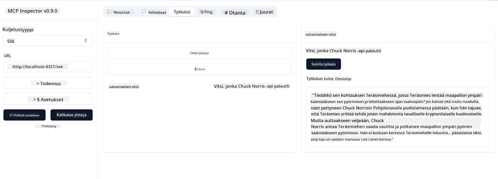

<!--
CO_OP_TRANSLATOR_METADATA:
{
  "original_hash": "3dd2f1e39277c31b0e57e29d165354d6",
  "translation_date": "2025-06-13T00:14:32+00:00",
  "source_file": "03-GettingStarted/05-sse-server/README.md",
  "language_code": "fi"
}
-->
Nyt kun tiedämme hieman enemmän SSE:stä, rakennetaan seuraavaksi SSE-palvelin.

## Harjoitus: SSE-palvelimen luominen

Palvelimen luomiseksi meidän täytyy pitää mielessä kaksi asiaa:

- Meidän täytyy käyttää web-palvelinta, joka tarjoaa päätepisteet yhteyksille ja viesteille.
- Rakennamme palvelimen kuten normaalisti, käyttäen työkaluja, resursseja ja kehotteita samalla tavalla kuin stdioa käyttäessämme.

### -1- Luo palvelininstanssi

Palvelimen luomiseksi käytämme samoja tyyppejä kuin stdio:ssa. Kuljetustavaksi valitaan kuitenkin SSE. 

Lisätään seuraavaksi tarvittavat reitit.

### -2- Lisää reitit

Lisätään reitit, jotka käsittelevät yhteyden muodostamisen ja saapuvat viestit:

Seuraavaksi lisätään palvelimen ominaisuuksia.

### -3- Palvelimen ominaisuuksien lisääminen

Nyt kun olemme määritelleet kaikki SSE-spesifiset asiat, lisätään palvelimelle ominaisuuksia kuten työkaluja, kehotteita ja resursseja.

Koko koodisi pitäisi näyttää tältä:

Hienoa, meillä on SSE-palvelin, kokeillaan sitä seuraavaksi.

## Harjoitus: SSE-palvelimen virheenkorjaus Inspectorilla

Inspector on loistava työkalu, jonka näimme aiemmassa oppitunnissa [Ensimmäisen palvelimen luominen](/03-GettingStarted/01-first-server/README.md). Katsotaan, voimmeko käyttää Inspectoria myös tässä:

### -1- Inspectorin käynnistäminen

Inspectoria käynnistääksesi sinun täytyy ensin saada SSE-palvelin käyntiin, tehdään se nyt:

1. Käynnistä palvelin

1. Käynnistä inspector

    > ![NOTE]
    > Käynnistä tämä eri komentoriviltä kuin missä palvelin on käynnissä. Huomaa myös, että sinun täytyy muokata alla olevaa komentoa vastaamaan URL-osoitetta, jossa palvelimesi toimii.

    ```sh
    npx @modelcontextprotocol/inspector --cli http://localhost:8000/sse --method tools/list
    ```

Inspectorin käynnistäminen näyttää samalta kaikissa suoritusympäristöissä. Huomaa, että sen sijaan että antaisit polun palvelimellesi ja komennon palvelimen käynnistämiseksi, annat URL-osoitteen, jossa palvelin toimii, ja määrität myös `/sse`-reitteen.

### -2- Työkalun kokeilu

Yhdistä palvelimeen valitsemalla SSE pudotusvalikosta ja täytä url-kenttään palvelimesi osoite, esimerkiksi http:localhost:4321/sse. Klikkaa sitten "Connect"-painiketta. Valitse kuten ennenkin listaa työkaluja, valitse työkalu ja anna syötteet. Näet tuloksen kuten alla:



Hienoa, pystyt työskentelemään inspectorin kanssa, katsotaan seuraavaksi miten Visual Studio Code toimii.

## Tehtävä

Yritä rakentaa palvelimesi lisäämällä siihen enemmän ominaisuuksia. Katso esimerkiksi [tämä sivu](https://api.chucknorris.io/) ja lisää työkalu, joka kutsuu APIa. Sinä päätät, miltä palvelimesi näyttää. Hauskaa :)

## Ratkaisu

[Ratkaisu](./solution/README.md) Tässä on mahdollinen ratkaisu toimivalla koodilla.

## Tärkeimmät opit

Tämän luvun tärkeimmät asiat ovat:

- SSE on toinen tuettu kuljetustapa stdion lisäksi.
- SSE:n tukemiseksi sinun täytyy hallita saapuvia yhteyksiä ja viestejä web-kehyksen avulla.
- Voit käyttää sekä Inspectoria että Visual Studio Codea SSE-palvelimen kuluttamiseen, aivan kuten stdio-palvelimien kanssa. Huomaa, että stdio ja SSE eroavat hieman siinä, miten niitä käytetään. SSE:n kohdalla palvelin täytyy käynnistää erikseen ja sitten suorittaa inspector-työkalu. Inspector-työkalussa on myös eroavaisuuksia, sillä sinun täytyy määrittää URL-osoite.

## Esimerkit

- [Java Calculator](../samples/java/calculator/README.md)
- [.Net Calculator](../../../../03-GettingStarted/samples/csharp)
- [JavaScript Calculator](../samples/javascript/README.md)
- [TypeScript Calculator](../samples/typescript/README.md)
- [Python Calculator](../../../../03-GettingStarted/samples/python)

## Lisäresurssit

- [SSE](https://developer.mozilla.org/en-US/docs/Web/API/Server-sent_events)

## Mitä seuraavaksi

- Seuraavaksi: [HTTP Streaming MCP:n kanssa (Streamable HTTP)](/03-GettingStarted/06-http-streaming/README.md)

**Vastuuvapauslauseke**:  
Tämä asiakirja on käännetty käyttämällä tekoälypohjaista käännöspalvelua [Co-op Translator](https://github.com/Azure/co-op-translator). Vaikka pyrimme tarkkuuteen, huomioithan, että automaattiset käännökset saattavat sisältää virheitä tai epätarkkuuksia. Alkuperäistä asiakirjaa sen alkuperäisellä kielellä tulisi pitää auktoritatiivisena lähteenä. Tärkeiden tietojen osalta suositellaan ammattimaista ihmiskäännöstä. Emme ole vastuussa tämän käännöksen käytöstä aiheutuvista väärinymmärryksistä tai virhetulkinnoista.