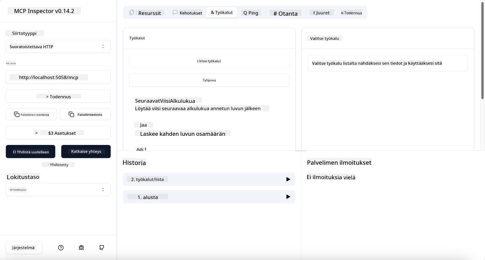

<!--
CO_OP_TRANSLATOR_METADATA:
{
  "original_hash": "0bc7bd48f55f1565f1d95ccb2c16f728",
  "translation_date": "2025-06-18T07:51:13+00:00",
  "source_file": "04-PracticalImplementation/samples/csharp/README.md",
  "language_code": "fi"
}
-->
# Esimerkki

Edellinen esimerkki näyttää, miten paikallista .NET-projektia käytetään `stdio`-tyypin kanssa. Ja miten palvelin ajetaan paikallisesti kontissa. Tämä on hyvä ratkaisu monissa tilanteissa. Kuitenkin palvelimen ajaminen etänä, esimerkiksi pilviympäristössä, voi olla hyödyllistä. Tässä kohtaa `http`-tyyppi tulee mukaan kuvaan.

Kun katsoo `04-PracticalImplementation`-kansion ratkaisua, se saattaa näyttää paljon monimutkaisemmalta kuin edellinen. Mutta todellisuudessa se ei ole. Jos tarkastelet tarkasti projektia `src/Calculator`, näet, että koodi on pääosin sama kuin edellisessä esimerkissä. Ainoa ero on, että käytämme eri kirjastoa `ModelContextProtocol.AspNetCore` HTTP-pyyntöjen käsittelyyn. Lisäksi muutamme metodin `IsPrime` yksityiseksi, vain osoittaaksemme, että koodissasi voi olla yksityisiä metodeja. Muut koodin osat ovat samat kuin aiemmin.

Muut projektit ovat [.NET Aspire](https://learn.microsoft.com/dotnet/aspire/get-started/aspire-overview) -alustalta. .NET Aspire ratkaisussa parantaa kehittäjän kokemusta kehityksen ja testauksen aikana sekä auttaa havaittavuudessa. Se ei ole välttämätöntä palvelimen ajamiseksi, mutta on hyvä käytäntö sisällyttää se ratkaisuun.

## Käynnistä palvelin paikallisesti

1. Siirry VS Codessa (C# DevKit -laajennuksen kanssa) hakemistoon `04-PracticalImplementation/samples/csharp`.
1. Suorita seuraava komento käynnistääksesi palvelimen:

   ```bash
    dotnet watch run --project ./src/AppHost
   ```

1. Kun selain avaa .NET Aspire -hallintapaneelin, huomaa `http` URL-osoite. Sen pitäisi olla jotakin muotoa `http://localhost:5058/`.

   

## Testaa Streamable HTTP MCP Inspectorilla

Jos sinulla on Node.js 22.7.5 tai uudempi, voit käyttää MCP Inspectoria palvelimesi testaamiseen.

Käynnistä palvelin ja suorita seuraava komento terminaalissa:

```bash
npx @modelcontextprotocol/inspector http://localhost:5058
```



- Valitse `Streamable HTTP` as the Transport type.
- In the Url field, enter the URL of the server noted earlier, and append `/mcp`. Sen pitäisi olla `http` (ei `https`) something like `http://localhost:5058/mcp`.
- select the Connect button.

A nice thing about the Inspector is that it provide a nice visibility on what is happening.

- Try listing the available tools
- Try some of them, it should works just like before.

## Test MCP Server with GitHub Copilot Chat in VS Code

To use the Streamable HTTP transport with GitHub Copilot Chat, change the configuration of the `calc-mcp` palvelin, joka luotiin aiemmin näyttämään tältä:

```jsonc
// .vscode/mcp.json
{
  "servers": {
    "calc-mcp": {
      "type": "http",
      "url": "http://localhost:5058/mcp"
    }
  }
}
```

Tee muutama testi:

- Kysy "3 alkulukua luvun 6780 jälkeen". Huomaa, että Copilot käyttää uusia työkaluja `NextFivePrimeNumbers` ja palauttaa vain ensimmäiset 3 alkulukua.
- Kysy "7 alkulukua luvun 111 jälkeen" nähdäksesi, mitä tapahtuu.
- Kysy "Johnilla on 24 tikkaria ja hän haluaa jakaa ne tasan kolmelle lapselleen. Kuinka monta tikkaria jokaisella lapsella on?", nähdäksesi mitä tapahtuu.

## Julkaise palvelin Azureen

Julkaistaan palvelin Azureen, jotta useammat ihmiset voivat käyttää sitä.

Siirry terminaalissa kansioon `04-PracticalImplementation/samples/csharp` ja suorita seuraava komento:

```bash
azd up
```

Kun julkaisu on valmis, näet viestin, joka näyttää tältä:


Ota URL talteen ja käytä sitä MCP Inspectorissa ja GitHub Copilot Chatissa.

```jsonc
// .vscode/mcp.json
{
  "servers": {
    "calc-mcp": {
      "type": "http",
      "url": "https://calc-mcp.gentleriver-3977fbcf.australiaeast.azurecontainerapps.io/mcp"
    }
  }
}
```

## Mitä seuraavaksi?

Kokeilemme eri siirtotyyppejä ja testausvälineitä. Julkaisemme myös MCP-palvelimesi Azureen. Mutta entä jos palvelimemme tarvitsee pääsyn yksityisiin resursseihin? Esimerkiksi tietokantaan tai yksityiseen APIin? Seuraavassa luvussa näemme, miten voimme parantaa palvelimemme turvallisuutta.

**Vastuuvapauslauseke**:  
Tämä asiakirja on käännetty tekoälypohjaisella käännöspalvelulla [Co-op Translator](https://github.com/Azure/co-op-translator). Vaikka pyrimme tarkkuuteen, huomioithan, että automaattiset käännökset saattavat sisältää virheitä tai epätarkkuuksia. Alkuperäistä asiakirjaa sen alkuperäiskielellä tulee pitää virallisena lähteenä. Tärkeissä tiedoissa suositellaan ammattimaista ihmiskäännöstä. Emme ole vastuussa tämän käännöksen käytöstä aiheutuvista väärinymmärryksistä tai virhetulkinnoista.